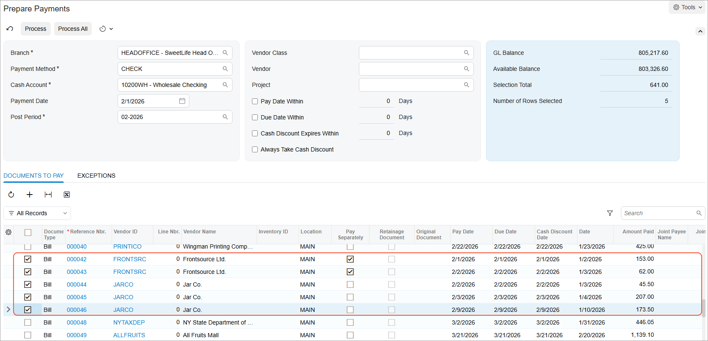

# Multiple Bill Payments: Process Activity {#_288a0987-6f7e-4464-b700-3ba8912bc6b8 .task}

The following activity will walk you through the process of creating and releasing a payment of multiple bills.

**Attention:** This activity is based on the *U100* dataset. If you are using another dataset or if any system settings have been changed in *U100*, these changes can affect the workflow of the activity and the results of the processing. To avoid issues, restore the *U100* dataset to its initial state.

## Story {#section_evk_njv_vxb .section}

Suppose that the SweetLife Fruits &amp; Jams company occasionally buys glass jars and packaging for its products from the Jar Co. company \(*JARCO*\). Several bills for Jar Co. were entered in the system and the company wants to pay all of them with one payment. Also, another vendor, Frontsource Ltd. \(*FRONTSRC*\), has asked SweetLife to pay its bills in separate payments, and there are two bills in the amount of $153 and $62 that should be paid along with the Jar Co. bills.

Acting as a SweetLife accountant, you need to prepare a payment to pay bills in the amount of $45.50, $207, and $173.50 for the *JARCO* vendor and the two $153 and $62 bills for the *FRONTSRC* vendor.

## Configuration Overview {#section_hvk_njv_vxb .section}

For the purposes of this activity, the following features have been enabled on the [Enable/Disable Features](CS_10_00_00.md) \(CS100000\) form:

-   *Standard Financials*, which provides the standard financial functionality
-   *Multibranch Support*, which supports multiple branches in your instance of Acumatica ERP
-   *Multicompany Support*, which supports multiple companies within one tenant.

On the [Accounts Payable Preferences](AP_10_10_00.md) \(AP101000\) form, the **Hold Documents on Entry** check box has been selected in the **Data Entry Settings** section.

On the [Vendors](AP_30_30_00.md) \(AP303000\) form, the *JARCO \(Jar Co.\)* and *FRONTSRC \(Frontsource Ltd.\)* vendors have been defined. These vendors have the *CHECK* payment method specified as the default one.

## Process Overview {#section_lvk_njv_vxb .section}

In this activity, you will use the [Prepare Payments](AP_50_30_00.md) \(AP503000\) form to prepare one payment for multiple bills for each vendor, and review the available balance of the bank account. You will then print the payments on the [Process Payments / Print Checks](AP_50_50_00.md) \(AP505000\) form and release the payments on the [Release Payments](AP_50_52_00.md) \(AP505200\) form.

## System Preparation {#section_nvk_njv_vxb .section}

To prepare the system, do the following:

1.  Launch the Acumatica ERP website, and sign in to a company with the *U100* dataset preloaded. To sign in as an accountant, use the following credentials:
    -   Username: *johnson*
    -   Password: *123*
2.  In the info area, in the upper-right corner of the top pane of the Acumatica ERP screen, click the Business Date menu button and select *2/1/2026*. For simplicity, in this process activity, you will create and process all documents in the system on this business date.
3.  On the Company and Branch Selection menu, also on the top pane of the Acumatica ERP screen, make sure that the *SweetLife Head Office and Wholesale Center* branch is selected. If it is not selected, click the Company and Branch Selection menu to view the list of branches that you have access to, and then click *SweetLife Head Office and Wholesale Center*.

## Step 1: Selecting the Bills to be Paid {#section_pvk_njv_vxb .section}

To select the bills to be paid, do the following:

1.  Open the [Prepare Payments](AP_50_30_00.md) \(AP503000\) form.
2.  In the Summary area of the form, specify the following selection criteria to filter the data shown in the table:
    -   **Branch**: *HEADOFFICE* \(inserted by default based on the selected branch\)
    -   **Payment Method**: *CHECK*
    -   **Cash Account**: *10200WH - Wholesale Checking*
    -   **Payment Date**: *2/1/2026* \(the current business date, which is inserted by default\)
    -   **Vendor**: Empty
    -   **Pay Date Within**: Cleared
3.  In the table, review the three AP bills of the *JARCO* vendor in the amounts of $45.50, $207, and $173.50, as well as the two bills for the *FRONTSRC* vendor in the amounts of $153 and $62. Notice that the two bills for *FRONTSRC* have the check box selected in the **Pay Separately** column.
4.  Click the unlabeled check box in the row of each of the bills, and review the informational **Selection Total** and **Number of Rows Selected** boxes in the Summary area. These values show that there are 5 rows selected to be paid in the total amount of $641, as shown in the following screenshot.

## Step 2: Preparing the Payments {#section_rvk_njv_vxb .section}

To prepare the payments, do the following:

1.  While you are still on the [Prepare Payments](AP_50_30_00.md) \(AP503000\) form, click **Process** on the form toolbar.
2.  On the [Process Payments / Print Checks](AP_50_50_00.md) \(AP505000\) form, which is opened with the payments listed in the table and selected, click **Process**.

    A separate browser tab is opened showing the printable version of the checks. Notice that the *JARCO* bills are paid with one payment and the bills for *FRONTSRC* are paid by two separate payments.

3.  Review the printable version of the checks, and close the browser tab. \(For the purposes of this process activity, you do not need to actually print the checks.\)

    **Tip:** In a production setting, you would click **Print** on the form toolbar to print the checks before closing the browser tab.

## Step 3: Releasing the Payments and Reviewing the GL Batches {#section_vvk_njv_vxb .section}

To release the payments and review the GL batches, do the following:

1.  On the [Release Payments](AP_50_52_00.md) \(AP505200\) form, which the system has opened, notice that the system has added rows with the payments and selected the unlabeled check boxes for them. On the form toolbar, click **Process**.
2.  In the **Processing** pop-up window, which is opened, click the **Processed** tab, and click the link in the **Reference Nbr.** column for the *JARCO* payment to open the payment on the [Checks and Payments](AP_30_20_00.md) \(AP302000\) form.
3.  On the **Application History** tab of the [Checks and Payments](AP_30_20_00.md) form, make sure the three bills to which the payment has been applied are listed in the table.
4.  On the **Financial** tab, click the link in the **Batch Nbr.** box to review the consolidated batch generated by the system, which is opened on the [Journal Transactions](GL_30_10_00.md) \(GL301000\) form.
5.  In the **Processing** pop-up window, click the link in the **Reference Nbr.** column for one of the *FRONTSRC* payments.
6.  On the **Application History** tab of the [Checks and Payments](AP_30_20_00.md) form, notice that the payment has been applied to one bill.

**Parent topic:**[Paying Multiple AP Bills](../UserGuide/Finance_PayingMultipleBills_Mapref.md)

