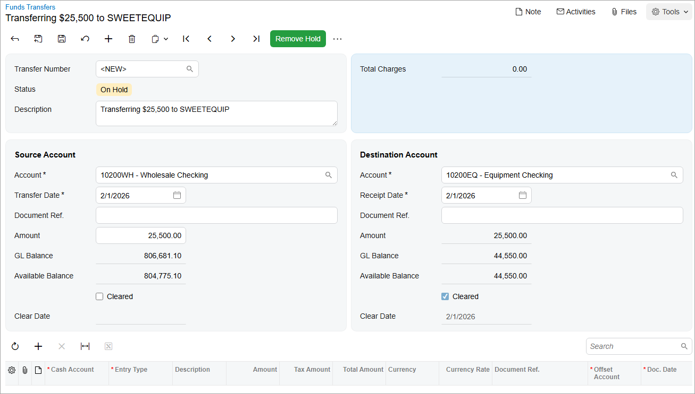

# Funds Transfers: Process Activity {#_0ceddeea-ec98-4631-9e45-4851b0ae47a5 .task}

In this activity, you will learn how to record a funds transfer from one checking account to another.

**Attention:** This activity is based on the *U100* dataset. If you are using another dataset or if any system settings have been changed in *U100*, these changes can affect the workflow of the activity and the results of the processing. To avoid issues, restore the *U100* dataset to its initial state.

## Story {#section_vhc_kjv_vxb .section}

In February 2026, one of SweetLife's branches, the Service and Equipment Sales Center, is planning on purchasing additional juicer equipment and parts. As the SweetLife accountant, you have approved the expenditures in the amount of $70,000 for these items, which is roughly $25,000 more than the amount available in the *10200EQ - Equipment Checking* cash account. To increase the available balance of the *10200EQ* cash account, you need to transfer $25,000 from the *10200WH - Wholesale Checking* account.

## Process Overview {#section_xhc_kjv_vxb .section}

In this activity, you will first review the available balances of the *10200WH* and *10200EQ* cash accounts on the [Cash Account Summary](CA_63_30_00.md) \(CA633000\) report form. Then on the [Funds Transfers](CA_30_10_00.md) \(CA301000\) form, you will record a funds transfer in the amount of $25,500 from the *10200WH* cash account to the *10200EQ* cash account. Finally, you will review the balances of both accounts on the [Cash Account Details](CA_30_30_00.md) \(CA303000\) form to make sure the transfer is recorded correctly.

## System Preparation {#section_zhc_kjv_vxb .section}

To prepare the system, do the following:

1.  Launch the Acumatica ERP website, and sign in to a company with the *U100* dataset preloaded. To sign in as an accountant, use the following credentials:
    -   Username: *johnson*
    -   Password: *123*
2.  In the info area, in the upper-right corner of the top pane of the Acumatica ERP screen, click the Business Date menu button and select *2/1/2026*. For simplicity, in this activity, you will create and process all documents in the system on this business date.
3.  On the Company and Branch Selection menu, also on the top pane of the Acumatica ERP screen, make sure that the *SweetLife Head Office and Wholesale Center* branch is selected. If it is not selected, click the Company and Branch Selection menu button to view the list of branches that you have access to, and then click *SweetLife Head Office and Wholesale Center*.
4.  On the [Cash Management Preferences](CA_10_10_00.md) \(CA101000\) form, in the **Posting and Release Settings** section, make sure that the **Automatically Post to GL on Release** check box is selected.

## Step 1: Reviewing the Balances of the Source and Destination Cash Accounts {#section_b3c_kjv_vxb .section}

To review the balances of the cash accounts, do the following:

1.  Open the [Cash Account Summary](CA_63_30_00.md) \(CA633000\) report form.
2.  On the **Report Parameters** tab, specify the following parameters:
    -   **Company/Branch**: *SWEETLIFE*
    -   **From Date**: *1/1/2026*
    -   **To Date**: *2/1/2026*
    -   **Include Non-Cleared Transactions**: Selected
    -   **Hide Details**: Selected
3.  On the report form toolbar, click **Run Report**.
4.  In the report, review the ending balances of the *10200WH* cash account and the *10200EQ* cash account.

## Step 2: Processing a Funds Transfer {#section_d3c_kjv_vxb .section}

To process a funds transfer from the *10200WH* cash account to the *10200EQ* cash account, do the following:

1.  Open the [Funds Transfers](CA_30_10_00.md) \(CA301000\) form.
2.  On the form toolbar, click **Add New Record**, and in the **Description** box of the Summary area, type `Transferring $25,500 to SWEETEQUIP`.
3.  In the **Source Account** section, specify the following settings:

    -   **Account**: *10200WH - Wholesale Checking*
    -   **Transfer Date**: *2/1/2026*
    -   **Amount**: `25500`
    These settings indicate that $25,500 will be transferred from the *10200WH - Wholesale Checking* account on February 1, 2026.

    Because this is an internal funds transfer that does not affect bank accounts, you have not indicated the reference number of the source document.

4.  In the **Destination Account** section, specify the following settings:

    -   **Account**: *10200EQ - Equipment Checking*
    -   **Receipt Date**: *2/1/2026*
    These settings indicate that the funds will be transferred to the *10200EQ* account, which is defined as the checking account for the SweetLife Service and Equipment Sales Center, as shown in the following screenshot.

    

5.  On the form toolbar, click **Save** to save the funds transfer.
6.  On the form toolbar, click **Remove Hold**, and then click **Release** to release the funds transfer.
7.  Click the link in the **Batch Number** box, and review the transaction, which the system has opened on the [Journal Transactions](GL_30_10_00.md) \(GL301000\) form.

    In the **Module** box, *CA* means that the batch was generated from the cash management subledger. Notice that the batch contains a credit entry for the *HEADOFFICE* branch and a debit entry for *SWEETEQUIP*, whereas the GL account for both branches is the same: *10200*.

    The system has posted the batch to the general ledger on release of the funds transfer because during the system preparation, you selected the **Automatically Post to GL on Release** check box on the [Cash Management Preferences](CA_10_10_00.md) \(CA101000\) form.

## Step 3: Reviewing the Balances of the Cash Accounts {#section_k3c_kjv_vxb .section}

To see how the funds transfer is reflected in the cash accounts, do the following:

1.  Open the [Cash Account Details](CA_30_30_00.md) \(CA303000\) inquiry form.
2.  In the Selection area, specify the following settings:
    -   **Cash Account**: *10200EQ*
    -   **Start Date**: *2/1/2026*
    -   **End Date**: *2/1/2026*
3.  In the table, notice the transaction of the *Transfer In* type. This type means that the cash account balance was increased in the amount displayed in the **Receipt** column.
4.  In the **Ending Balance** column in the table for the transaction of the *Transfer In* type, notice the ending balance of the selected cash account, which was increased in the amount of the receipt.
5.  In the Selection area, change the **Cash Account** to *10200WH*.
6.  In the table, notice the transaction of the *Transfer Out* type. This type means that the cash account balance was decreased in the amount displayed in the **Disbursement** column.
7.  In the **Ending Balance** column in the table for the transaction of the *Transfer Out* type, notice the ending balance of the selected cash account, which was decreased in the amount of the disbursement.

**Parent topic:**[Performing Funds Transfers](../UserGuide/Finance_Processing_Funds_Transfers_Mapref.md)

