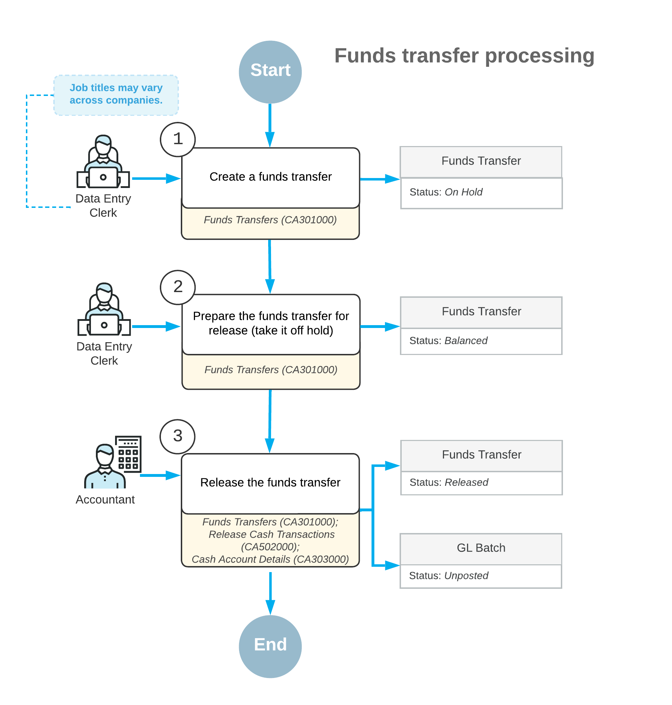

# Funds Transfers: General Information {#_febb97f8-db1c-4fa5-ad2b-edce2eee1b40 .concept}

In Acumatica ERP, you can record cash transfers from one bank account to another, or between cash accounts that are linked to the same GL account and that represent the same bank account. When you record a funds transfer, you can also register a charge associated with it. For example, when you move funds between different bank accounts, you can immediately record a service fee associated with the transfer.

## Learning Objectives {#section_icc_kjv_vxb .section}

You will learn how to record a funds transfer between cash accounts.

## Applicable Scenarios {#section_kcc_kjv_vxb .section}

You record a funds transfer when you need to redistribute funds between different companies or branches of your organization. You can also move funds from one bank account to another—for example, when you want to deposit funds from one of the company's checking accounts to a company savings account.

## Processing of a Funds Transfer {#section_mcc_kjv_vxb .section}

To process a funds transfer, you first create it on the [Funds Transfers](CA_30_10_00.md) \(CA301000\) form. At any time after creation, you can release the transfer on any of the following forms:

-   [Funds Transfers](CA_30_10_00.md): You release the funds transfer you are viewing by clicking **Release** on the form toolbar.
-   [Release Cash Transactions](CA_50_20_00.md) \(CA502000\): You use this form to release a particular funds transfer or multiple funds transfers. On this form, funds transfers have the *Transfer* transaction type, and transactions that correspond to the same transfer have the same transaction number. To release all transactions of a particular funds transfer, you need to select only one transaction of it by selecting the unlabeled check box in the row of the transaction; when you release it by clicking **Release** on the form toolbar, the system releases the other transactions automatically.
-   [Cash Account Details](CA_30_30_00.md) \(CA303000\): You can use this form to release a particular funds transfer or multiple funds transfers. On this form, you start by selecting a cash account, which can be the source account or the destination account for your funds transfer. The system displays a list of transactions that includes the funds transfer transaction of the *Transfer Out* or *Transfer In* type, depending on whether the account you selected is a source or destination account, respectively. To release all transactions of the funds transfer, you need to select only one transaction of the funds transfer by selecting the unlabeled check box in the row of the transaction; when you click **Release** on the form toolbar, the system releases the other transactions automatically.

During processing, a funds transfer can have the following statuses.

|Status|Description|
|------|-----------|
|*On Hold*|The transfer is being edited and cannot be released.|
|*Balanced*|The transfer is balanced and can be released.|
|*Released*|The transfer has been released.|

## Addition of Expenses {#section_pcc_kjv_vxb .section}

You can record transfer expenses and charges in a funds transfer by adding a row to the table on the [Funds Transfers](CA_30_10_00.md) \(CA301000\) form and filling in the cash account, entry type, and any additional settings of the expense or charge. Before you record charges, make sure that an entry type is configured that provides the default details for the transaction, including the offset account and subaccount, if subaccounts are configured in your system. For more information, see [Registration of Finance Charges](CA__CON_FinCharges.md).

The expenses you record can include taxes. For the details about creating a funds transfer with taxable expenses, see [Processing Funds Transfers with Taxable Fees](Taxes_Processing_Funds_Transfers_with_Taxable_Expenses_Mapref.md).

## Process Diagram {#section_scc_kjv_vxb .section}

The following diagram illustrates the workflow of funds transfer processing.

**Parent topic:**[Performing Funds Transfers](../UserGuide/Finance_Processing_Funds_Transfers_Mapref.md)

