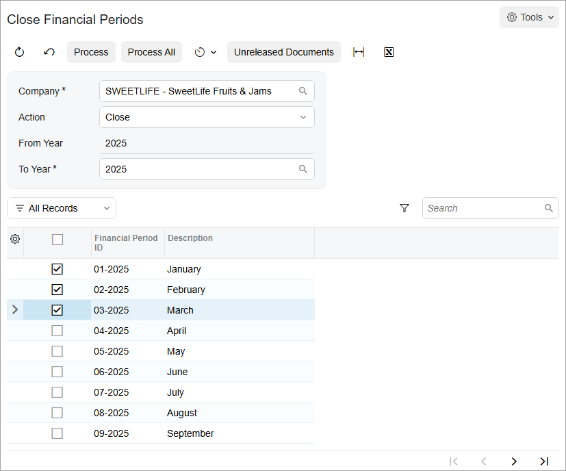

# Period-End Procedures: To Close a Period in AP {#_2ddac1fc-2426-4424-b432-e63a91382bff .task}

The following activity will walk you through the process of closing a financial period in accounts payable.

**Attention:** This activity is based on the *U100* dataset. If you are using another dataset or if any system settings have been changed in *U100*, these changes can affect the workflow of the activity and the results of the processing. To avoid issues, restore the *U100* dataset to its initial state.

## Story {#section_lgp_njv_vxb .section}

Suppose that it is the end of March 2025, all the documents of the SweetLife Fruits &amp; Jams company have been posted, and the financial period has to be closed to prevent system users from posting to this period.

Acting as the SweetLife accountant, you need to close the *03-2025* financial period in the accounts payable subledger.

## Configuration Overview {#section_ogp_njv_vxb .section}

For the purposes of this activity, the following features have been enabled on the [Enable/Disable Features](CS_10_00_00.md) \(CS100000\) form:

-   *Standard Financials*, which provides the standard financial functionality
-   *Multibranch Support*, which supports multiple branches in your instance of Acumatica ERP
-   *Multicompany Support*, which supports multiple companies within one tenant.

## Process Overview {#section_qgp_njv_vxb .section}

To close a period in the accounts payable subledger \(and the periods preceding it, if any are open\), you will use the [Close Financial Periods](AP_50_60_00.md) \(AP506000\) form.

## System Preparation {#section_sgp_njv_vxb .section}

To prepare the system, do the following:

1.  Launch the Acumatica ERP website, and sign in as an accountant by using the following credentials:
    -   Username: *johnson*
    -   Password: *123*
2.  On the Company and Branch Selection menu, also on the top pane of the Acumatica ERP screen, make sure that the *SweetLife Head Office and Wholesale Center* branch is selected. If it is not selected, click the Company and Branch Selection menu to view the list of branches that you have access to, and then click *SweetLife Head Office and Wholesale Center*.

## Step: Closing the Financial Period in the AP Subledger {#section_ugp_njv_vxb .section}

To close the *03-2025* financial period in the accounts payable subledger, do the following:

1.  Open the [Close Financial Periods](AP_50_60_00.md) \(AP506000\) form.
2.  In the Summary area, specify the following settings:
    -   **Company**: *SWEETLIFE* \(inserted by default\)
    -   **Action**: *Close*
    -   **To Year**: *2025*
3.  In the table, click the unlabeled check box in the row with the *03-2025* period.

    The check boxes for all the preceding periods are selected automatically and the periods will be closed as well, as shown in the following screenshot.

    

4.  On the form toolbar, click **Unreleased Documents** to review if there are any unreleased documents in the selected periods. If unreleased documents exist in the system, the Unreleased AP Documents report is opened in a pop-up window. \(If no unreleased documents exist, the system displays an appropriate message.\)
5.  Review the documents in the report \(if it has been opened\), and release them or reassign them to another financial period.
6.  Return to the [Close Financial Periods](AP_50_60_00.md) form. On the form toolbar, click **Process**. In the **Processing** pop-up window, which is opened, click **Close**.

    The *03-2025* period and all the preceding periods have been closed in the system.

**Parent topic:**[Performing Period-End Procedures](../UserGuide/Finance_Period-End_Procedures_AP_Mapref.md)

