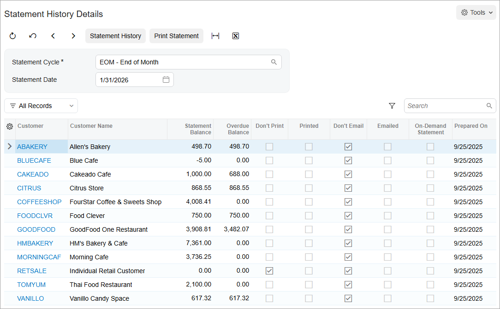

# Customer Statements: Process Activity {#_ee3b7697-9d47-4467-a6b7-7938d136aa11 .task}

The following activity will walk you through the process of preparing and printing customer statements.

**Attention:** This activity is based on the *U100* dataset. If you are using another dataset or if any system settings have been changed in *U100*, these changes can affect the workflow of the activity and the results of the processing. To avoid issues, restore the *U100* dataset to its initial state.

## Story {#section_g3d_hjv_vxb .section}

Suppose that at the end of each month, the accounting department of the SweetLife Fruits &amp; Jams company sends customer statements to its customers.

Acting as a SweetLife accountant, at the end of January 2026 you need to prepare and print the customer statements that you will later send to customers. You need to prepare customer statements based on the end-of-month \(EOM\) cycle, view the statement history, and then print the statements.

## Configuration Overview {#section_j3d_hjv_vxb .section}

For the purposes of this activity, the following features have been enabled on the [Enable/Disable Features](CS_10_00_00.md) \(CS100000\) form:

-   *Standard Financials*, which provides the standard financials functionality
-   *Multibranch Support*, which supports multiple branches in your instance of Acumatica ERP
-   *Multicompany Support*, which supports multiple companies within one tenant.

On the [Statement Cycles](AR_20_28_00.md) \(AR202800\) form, the *EOM* \(End of Month\) statement cycle has been configured and specified for the customers assigned to the *DEFAULT* customer class \(local customers\).

On the [Customers](AR_30_30_00.md) \(AR303000\) form, the *GOODFOOD \(GoodFood One Restaurant\)* customer has been configured.

On the [Customers](AR_30_30_00.md) form, for all customers that belong to the *DEFAULT* customer class, the **Print Statements** check box has been selected in the **Print and Email Settings** section on the **Billing** tab.

## Process Overview {#section_o3d_hjv_vxb .section}

In this activity, on the [Accounts Receivable Preferences](AR_10_10_00.md) \(AR101000\) form, you will review the consolidation settings used in generation of customer statements. You will prepare statements on the [Prepare Statements](AR_50_30_00.md) \(AR503000\) form, view the generated statements on the [Statement History Summary](AR_40_40_00.md) \(AR404000\) form, view the list of the customer statements on the [Statement History Details](AR_40_43_00.md) \(AR404300\) form, and then print the statements on the [Print Statements](AR_50_35_00.md) \(AR503500\) form.

## System Preparation {#section_q3d_hjv_vxb .section}

To prepare the system, do the following:

1.  Launch the Acumatica ERP website with the *U100* dataset. Sign in as an accountant by using the following credentials:
    -   Username: *johnson*
    -   Password: *123*
2.  In the info area, in the upper-right corner of the top pane of the Acumatica ERP screen, make sure that the business date in your system is set to *1/31/2026*. If a different date is displayed, click the Business Date menu button and select *1/31/2026*. For simplicity, in this activity, you will create and process all documents in the system on this business date.
3.  On the Company and Branch Selection menu, also on the top pane of the Acumatica ERP screen, make sure that the *SweetLife Head Office and Wholesale Center* branch is selected. If it is not selected, click the Company and Branch Selection menu to view the list of branches that you have access to, and then click *SweetLife Head Office and Wholesale Center*.

## Step 1: Reviewing Consolidation Settings {#section_s3d_hjv_vxb .section}

To review the consolidation settings that will be used in generating customer statements, do the following:

1.  Open the [Accounts Receivable Preferences](AR_10_10_00.md) \(AR101000\) form.
2.  On the **General** tab, make sure that *For Each Branch* is selected in the **Prepare Statements** box \(**Consolidation Settings** section\).

    This setting indicates that statements will be generated for each branch separately.

## Step 2: Preparing Customer Statements {#section_v3d_hjv_vxb .section}

To prepare customer statements, do the following:

1.  Open the [Prepare Statements](AR_50_30_00.md) \(AR503000\) form.
2.  In the **Prepare For** box, verify that *1/31/2026* is displayed. \(This is the date for which you are preparing statements.\)
3.  In the table, select the unlabeled check box for the *EOM* statement cycle, and on the form toolbar, click **Process**.
4.  In the **Processing** pop-up window, which is opened, click **Close**.

    The system has generated statements for the customer records that have the *EOM* statement cycle specified.

## Step 3: Viewing the Generated Statements {#section_y3d_hjv_vxb .section}

To view the generated customer statements, do the following:

1.  Open the [Statement History Summary](AR_40_40_00.md) \(AR404000\) form.
2.  In the **Statement Cycle ID** box, select *EOM*.
3.  In the **Date Range** boxes, verify that *1/1/2026* and *1/31/2026* are displayed.

    The table displays the number of statements that have been generated within the specified range of dates in the system. The number in the **Number of Documents** column shows the number of statements that have been generated.

4.  Click the link in the **Statement Cycle ID** box in the table row that corresponds to the *1/31/2026* date.
5.  On the [Statement History Details](AR_40_43_00.md) \(AR404300\) form, which is opened, view the customer statements that have been generated on *1/31/2026* for the *EOM* statement cycle, as shown in the following screenshot.

    

6.  Click the link for the *GOODFOOD* customer to view the list of the statements generated for the customer on the [Customer Statement History](AR_40_46_00.md) \(AR404600\) form.

    The cleared **Printed** check box means that this customer statement has not been printed yet.

## Step 4: Printing the Statements {#section_cjd_hjv_vxb .section}

To print the customer statements, do the following:

1.  Open the [Print Statements](AR_50_35_00.md) \(AR503500\) form.
2.  In the Selection area of the form, specify the following settings:
    -   **Actions**: *Print Statement* \(selected by default\)
    -   **Branch**: *HEADOFFICE* \(inserted by default\)
    -   **Statement Cycle**: *EOM*
    -   **Statement Date**: *1/31/2026*
3.  On the form toolbar, click **Process All** to print all the statements.

    The system prints each statement on a separate page.

**Parent topic:**[Preparing Customer Statements](../UserGuide/Finance_Preparing_Customer_Statements_Mapref.md)

