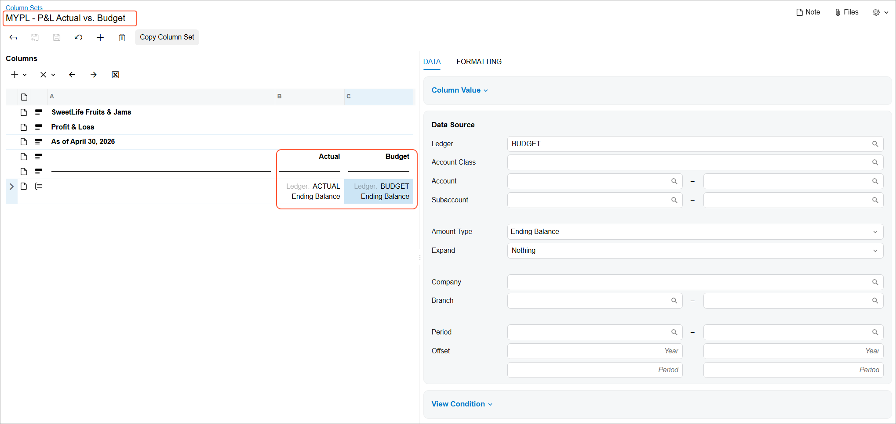
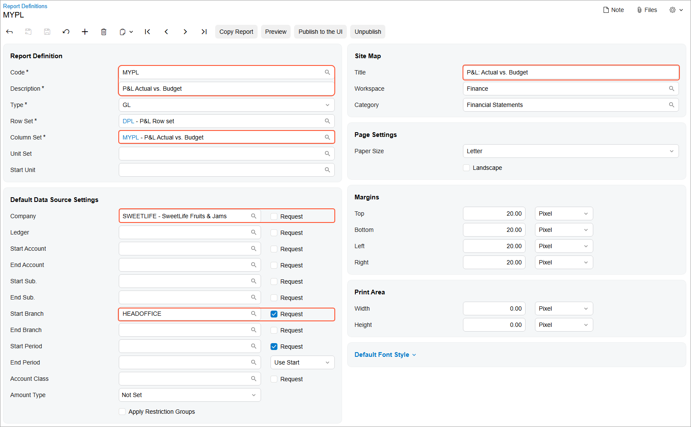
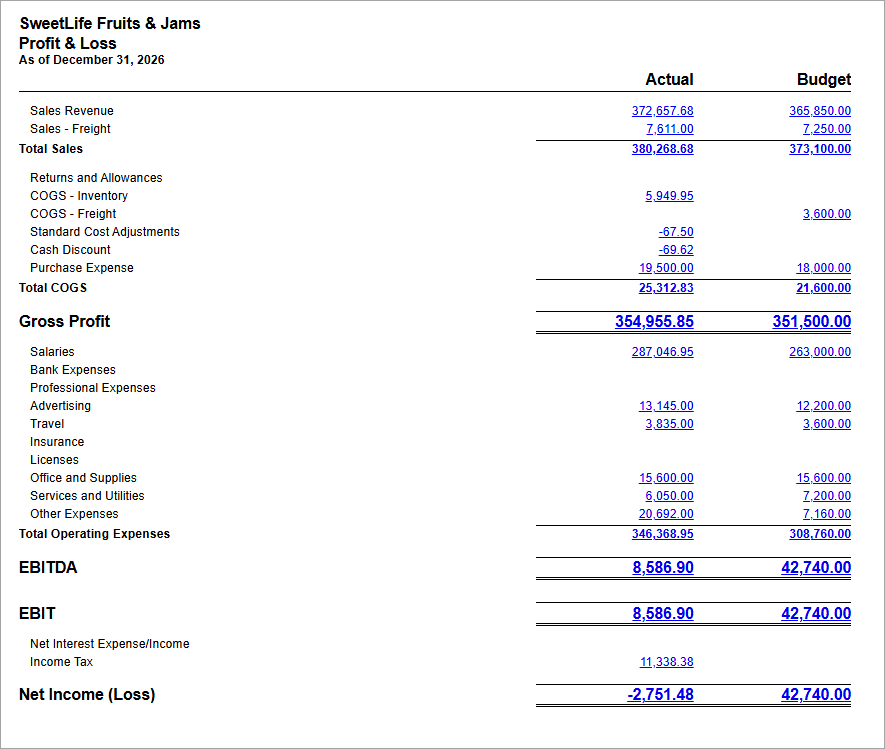

# Budget vs. Actual ARM Report: Process Activity {#_75f7ba19-2c0b-47b1-81e7-4a9f6e10da01 .task}

The following activity will walk you through the process of preparing and running an ARM report that compares budgeted and actual amounts.

## Story {#section_k3l_mjv_vxb .section}

Suppose that the management of the SweetLife Fruits &amp; Jams company wants to compare the budget for 2026 with the actual figures for this financial year.

Acting as a system administrator, you need to prepare and run the Budget vs. Actual ARM report.

## Configuration Overview {#section_n3l_mjv_vxb .section}

In the *U100* dataset, the following tasks have been performed for the purposes of this activity:

-   On the [Companies](CS_10_15_00.md) \(CS101500\) form, the *SWEETLIFE* company has been defined.
-   On the [Branches](CS_10_20_00.md) \(CS102000\) form, the *HEADOFFICE* branch of the *SWEETLIFE* company has been created.
-   On the [Ledgers](GL_20_15_00.md) \(GL201500\) form, a ledger with the *ACTUAL* name and the *Actual* type has been defined.
-   On the [Report Definitions](CS_20_60_00.md) \(CS206000\) form, the *DPL* report has been created.
-   On the [Column Sets](CS_20_60_20.md) \(CS206020\) form, the *DPLP* column set has been configured.

## Process Overview {#section_q3l_mjv_vxb .section}

In this activity, you will prepare the actual data for SweetLife by uploading an Excel file on the [Journal Transactions](GL_30_10_00.md) \(GL301000\) form. On the [Column Sets](CS_20_60_20.md) \(CS206020\) form, you will copy the column set of an existing ARM report and update its settings. On the [Report Definitions](CS_20_60_00.md) \(CS206000\) form, you will copy the report definition of an existing report, update the report, and publish it. Finally, you will run the *SweetLife: Actual vs. Budget \(RM000001\)* report and review it.

## System Preparation {#section_s3l_mjv_vxb .section}

Before you begin performing the steps of this activity, do the following:

1.  Launch the Acumatica ERP website with the *U100* dataset preloaded, and sign in as a system administrator Kimberly Gibbs by using the *gibbs* username and the *123* password.
2.  On the Company and Branch Selection menu on the top pane of the Acumatica ERP screen, make sure that the *SweetLife Head Office and Wholesale Center* branch is selected. If it is not selected, click the Company and Branch Selection menu button to view the list of branches that you have access to, and then click *SweetLife Head Office and Wholesale Center*.

## Step 1: Preparing the Actual Data of SweetLife for 2026 {#section_u3l_mjv_vxb .section}

To prepare the actual data of SweetLife for 2026, you need to open the remaining closed financial periods, and then create and release a list of transactions. Do the following:

1.  Open the [Manage Financial Periods](GL_50_30_00.md) \(GL503000\) form.
2.  In the Selection area, specify the following settings:
    -   **Company**: *SWEETLIFE*
    -   **Action**: *Open*
    -   **To Year**: *2026*
3.  In the table, select the check boxes next to *11-2026* and *12-2026*.
4.  On the form toolbar, click **Process**.
5.  On the [Journal Transactions](GL_30_10_00.md) \(GL301000\) form, add a new record.
6.  In the Summary area, specify the following settings:
    -   **Branch**: *HEADOFFICE*
    -   **Ledger**: *ACTUAL*
    -   **Transaction Date**: *12/31/2026*
    -   **Post Period**: *12-2026*
    -   **Description**: `Transactions for 2026`
7.  On the **Details** tab, click **Load Records from File** on the table toolbar.
8.  In Step 1 of the **Import Data** wizard that opens, click **Upload File**, and select the [HEADOFFICE\_2026\_Transactions.xlsx](Files/HEADOFFICE_2026_Transactions.xlsx) file.
9.  In Step 2 of the wizard, leave the default settings, and click **Next**.
10. In Step 3 of the wizard, leave all the default settings and click **Finish**.
11. On the form toolbar of the [Journal Transactions](GL_30_10_00.md) form, click **Remove Hold**.
12. On the form toolbar, click **Release**.

## Step 2: Copying and Updating the Column Set {#section_w3l_mjv_vxb .section}

To copy a column set of an existing ARM report and update its settings, do the following:

1.  Open the Column Sets \(CS2060P2\) form.
2.  In the **Code** column, click *DPLP*.

    This is the report definition code of the Profit and Loss report, whose column set you are going to copy.

3.  On the form toolbar of the [Column Sets](CS_20_60_20.md) \(CS206020\) form, which is opened, click **Copy Column Set**.
4.  In the **Copy Column Set** dialog box, which appears, enter `MYPL` in the **New Code** box.
5.  In the **Description** box, enter `P&L Actual vs. Budget` and click **Save**.
6.  On the form toolbar, click **Save** to save your changes.
7.  In the left pane, click **YTD** in column **B**.
8.  In the right pane, replace the *='YTD'* value with `='Actual'`.
9.  In the left pane, click **PTD** in column **C**.
10. In the right pane, replace the *='PTD'* value with `='Budget'`.
11. On the form toolbar, click **Save**.
12. In the left pane, click Ending Balance in column **B**. In the **Data Source** section on the **Data** tab, specify the following settings:
    -   **Ledger**: *ACTUAL*
    -   **Amount Type**: *Ending Balance*
13. On the form toolbar, click **Save**.
14. In the left pane, click Turnover in column **C**. In the **Data Source** section on the **Data** tab, specify the following settings:
    -   **Ledger**: *BUDGET*
    -   **Amount Type**: *Ending Balance*
15. On the form toolbar, click **Save** to save your changes. The following screenshot illustrates the changes to the column set.

    

## Step 3: Copying and Updating the Report Definition {#section_z3l_mjv_vxb .section}

To copy an existing report definition and update its settings, do the following:

1.  Open the [Report Definitions](CS_20_60_00.md) \(CS206000\) form.
2.  In the **Code** box, select *DPL*.
3.  On the form toolbar, click **Copy Report**.
4.  In the **Copy Report** dialog box, which opens, specify `MYPL` in the **New Code** box, and click **Save**. This closes the dialog box; you are now working with the copied version of the report with the *MYPL* code.
5.  On the form toolbar, click **Save** to save the changes.
6.  In the **Report Definition** section, specify the following settings:
    -   **Description**: `P&L Actual vs. Budget`
    -   **Column Set**: *MYPL - P&amp;L Actual vs. Budget*
7.  In the **Default Data Source Settings** section, specify the following settings:
    -   **Company**: *SWEETLIFE*
    -   **Request** \(right of the **Company** box\): Cleared
    -   **Request** \(right of the **Ledger** box\): Cleared
    -   **Start Branch**: *HEADOFFICE*
    -   **Request** \(right of the **Start Branch** box\): Selected
    -   **Request** \(right of the **Start Period** box\): Selected
8.  In the **Site Map** section, specify the following settings to add your report to the site map:
    -   **Title**: `P&L: Actual vs. Budget`
    -   **Workspace**: *Finance* \(copied from the predefined report\)
    -   **Category**: *Financial Statements* \(copied from the predefined report\)
9.  On the form toolbar, click **Save** to save your changes. The following screenshot illustrates the changes to the report definition.

    

## Step 4: Publishing the ARM Report { .section}

To publish the ARM report, do the following:

1.  While you are still viewing the report definition on the [Report Definitions](CS_20_60_00.md) \(CS206000\) form, on the form toolbar, click **Publish to the UI**.
2.  In the **Publish to the UI** dialog box, which opens, specify the following settings:
    -   **Site Map Title**: *P&amp;L: Actual vs. Budget* \(inserted automatically\)
    -   **Workspace**: *Finance* \(inserted automatically\)
    -   **Category**: *Financial Statements* \(inserted automatically\)
    -   **Screen ID**: *RM.00.00.01* \(inserted automatically\)
    -   **Set to Granted for All Roles**: Selected
3.  Click **Publish**.
4.  Refresh the page.

## Step 5: Running the ARM Report {#section_bjl_mjv_vxb .section}

To run the P&amp;L: Actual vs. Budget report, do the following:

1.  In the Acumatica ERP main menu, click the **Finance** workspace menu item to open the **Finance** workspace. Under the **Financial Statements** category, click *P&amp;L: Actual vs. Budget* to open the report form of the report that you have created.
2.  On the **Report Parameters** tab, specify the following parameters:
    -   **Start Branch**: *HEADOFFICE*
    -   **Financial Period**: *12-2026*
3.  On the form toolbar, click **Run Report**.
4.  In the report that is displayed, review the amounts in the **Actual** and **Budget** columns of the Profit &amp; Loss report generated for the SweetLife Fruits &amp; Jams company, as illustrated in the following screenshot.

    

**Parent topic:**[Preparing and Running a Budget vs Actual ARM Report](../UserGuide/Finance_Preparing_and_Running_Budget_ARM_Report_Mapref.md)

