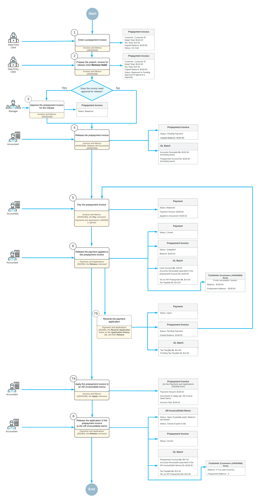

# AR Prepayment Invoices: General Information {#_bee18808-f7db-4b59-9956-b3c5c383851e .concept}

In some countries with value-added tax \(VAT\) regulations, companies are required to report taxes upon receiving prepayments from clients. Typically, prepayments should be reported in the company's tax filings for the period in which they were received.

In Acumatica ERP, with the *VAT Recognition on Prepayments* feature enabled on the [Enable/Disable Features](CS_10_00_00.md) \(CS100000\) form, you can create prepayment invoices with tax and taxable amounts and provide them to customers to request prepayment. Once a customer has paid a prepayment invoice, your company can use it for reporting taxes.

## Applicable Scenarios { .section}

You create a prepayment invoice if your company requires customers to make prepayments for sales orders and needs to provide customers with a document specifying the prepayment amount, as well as the taxable and tax amounts for each applicable tax. This process applies if prepayments are subject to tax reporting in the country where your company is operating.

## Overview of Prepayment Invoice Processing { .section}

This section provides an overview of processing of a prepayment invoice in Acumatica ERP. The processing of a prepayment invoice typically involves the actions and generated documents shown in the following diagram.

**Tip:** The amounts mentioned in the diagram are provided as examples. The tax total is calculated based on tax settings that define the calculation of the tax amount on a document basis when the tax is not included in the document amount.

First, a data entry clerk creates a new prepayment invoice on the [Invoices and Memos](AR_30_10_00.md) \(AR301000\) form \(see Item 1 in the diagram\). The prepayment invoice is assigned the *On Hold* status if the **Hold Documents on Entry** check box is selected on the [Accounts Receivable Preferences](AR_10_10_00.md) \(AR101000\) form or approvals have been set up for prepayment invoices. The system assigns the reference number to the prepayment invoice based on the numbering sequence specified in the **Prepayment Invoice Numbering Sequence** box on the [Accounts Receivable Preferences](AR_10_10_00.md) form.

Once the prepayment invoice is saved, the system calculates the total invoice amount including taxes and displays it in the **Unpaid Balance** box of the Summary area. The clerk clicks the **Remove Hold** button on the form toolbar to give the invoice the *Balanced* status \(Item 2\) so that it can be released. If the prepayment invoice requires approval, an assigned employee approves the prepayment invoice \(Item 3\) and the prepayment invoice is ready to be released. When the accountant releases the prepayment invoice \(Item 4\), the system assigns it the *Pending Payment* status and generates a batch to debit the Accounts Receivable account and credit the prepayment account in the amount of the prepayment invoice. The accountant can print the prepayment invoice or can send it to the customer by email by clicking **Print** or **Email** on the More menu of the [Invoices and Memos](AR_30_10_00.md) form.

Once the prepayment invoice is released, it can be paid. On the [Invoices and Memos](AR_30_10_00.md) form, an accountant clicks **Pay** on the form toolbar \(Item 5\). The system creates a payment application and opens it on the [Payments and Applications](AR_30_20_00.md) \(AR302000\) form. On the **Documents to Apply** tab of this form, the prepayment invoice is displayed. The prepayment invoice can be paid fully or partially as follows:

-   To pay the prepayment invoice in full, the accountant ensures that the system has inserted the amount of the unpaid balance of the prepayment invoice in the **Payment Amount** box of the Summary area and in the **Amount Paid \(Payment currency\)** column of the **Documents to Apply** tab of the [Payments and Applications](AR_30_20_00.md) form. The accountant releases the payment \(Item 6\).

    On release, the system generates a batch to debit the company's cash account and credit the Accounts Receivable account. The batch also includes tax transactions debiting the Pending Tax Payable account and crediting the Tax Payable account. The payment is assigned the *Closed* status. On the **Application History** tab of the current form, the system has added the line with the reference numbers of the prepayment invoice and of the generated GL batch. The prepayment invoice has been assigned the *Unapplied* status, which means that you can apply the prepayment invoice to AR invoices or debit memos issued to the customer specified in the prepayment invoice. For a fully paid prepayment invoice, the available balance is displayed in the **Balance** box \(which replaces the **Unpaid Balance** box once the prepayment invoice is paid\) in the Summary area of the [Invoices and Memos](AR_30_10_00.md) form. The system also updates the customer’s balance on the [Customers](AR_30_30_00.md) \(AR303000\) form.

-   To apply a partial payment to the prepayment invoice, the accountant specifies the payment amount in the **Payment Amount** box of the Summary area and in the **Amount Paid \(Payment currency\)** column on the **Documents to Apply** tab of the [Payments and Applications](AR_30_20_00.md) form; the accountant then releases the application \(Item 6\). The generated GL batch includes tax transactions, with tax amounts calculated based on the partially paid amount. The payment is assigned the *Closed* status. The system removes the line on the **Documents to Apply** tab and adds a new line with the prepayment invoice on the **Application History** tab. The prepayment invoice keeps the *Pending Payment* status. The remaining invoice amount is specified in the **Unpaid Balance** box of the Summary area on the [Invoices and Memos](AR_30_10_00.md) form.

    The unpaid balance of the prepayment invoice can be either paid or written off. To write off the unpaid balance of the invoice, the accountant clicks **Write Off Unpaid Balance** on the More menu of the [Invoices and Memos](AR_30_10_00.md) form. The system creates the document of the *Credit Memo* type and opens it on the current form. On release of the credit memo, the system generates a GL transaction, which debits the customer's prepayment account and credits the Accounts Receivable account. For details, see [AR Prepayment Invoices: Correction of a Prepayment Invoice](Finance_Prepayment_Invoices_Correction.md).

When the prepayment invoice has been fully paid, it can be applied to any number of accounts receivable invoices or debit memos. The accountant applies the prepayment invoice with the *Unapplied* status \(Item 7a\) to one AR invoice or debit memo in full or distributes the unapplied balance of the prepayment invoice to multiple invoices or debit memos of the customer. In the prepayment invoice, on the [Invoices and Memos](AR_30_10_00.md) form, the accountant clicks **Apply** on the form toolbar. The system opens the [Payments and Applications](AR_30_20_00.md) form with the prepayment invoice selected in the Summary area. On the **Documents to Apply** tab, the accountant selects one or more AR invoice or debit memos of the customer. In the **Amount Paid \(Payment currency\)** column of the tab, they specify the amount to be paid for the selected AR invoice or memo. Then on the form toolbar, they click **Release** \(Item 8\). On release, the system generates a batch to debit the prepayment account and credit the Accounts Receivable account. The batch also includes tax transactions debiting the Tax Payable account and crediting the Pending Tax Payable account.

The following impact on statuses and balances of prepayment invoices and AR invoices or debit memos can arise, depending on whether the AR invoice or debit memo is fully or partially paid and how much of the unapplied balance from the prepayment invoice is utilized \(an AR invoice is used in this example\):

-   If the part of the AR invoice balance has been specified in the **Amount Paid \(Payment currency\)** column on the **Documents to Apply** tab of the [Payments and Applications](AR_30_20_00.md) form and the application has been released, the AR invoice keeps the *Open* status, and its balance is decreased by the amount paid. If the AR invoice has been paid in full, the invoice’s status changes to *Closed*, and its balance is *0*.
-   If the full available balance of the prepayment invoice has been applied to an AR invoice or multiple AR invoices, the status of the prepayment invoice changes to *Closed* and its available balance is *0*. If a part of the available balance of the prepayment invoice has been applied to an AR invoice or multiple invoices, the prepayment invoice’s status remains *Unapplied*, and the remaining available balance specified in the **Available Balance** box of the Summary area of the [Payments and Applications](AR_30_20_00.md) form is decreased.

On the **Application History** tab of the current form, the system has added a line with the details of the AR invoice and the reference number of the generated GL batch. The GL batch contains the reversed tax entries posted on application of the payment to the prepayment invoice. The system updates the customer balance on the [Customers](AR_30_30_00.md) form.

**Important:** If a prepayment invoice has already been applied to an AR invoice or debit memo, the payment applied previously to the prepayment invoice cannot be reversed. To reverse a payment application, you must first reverse the application of the prepayment invoice to the AR invoice or debit memo, and then reverse the application of the payment to the prepayment invoice.

For details on the GL transactions generated on each stage of processing of a prepayment invoice, see [AR Prepayment Invoices: Generated Transactions](Finance_Prepayment_Invoices_Transactions.md).

**Parent topic:**[Processing Prepayment Invoices in AR](../UserGuide/Finance_Prepayment_Invoices_Mapref.md)

