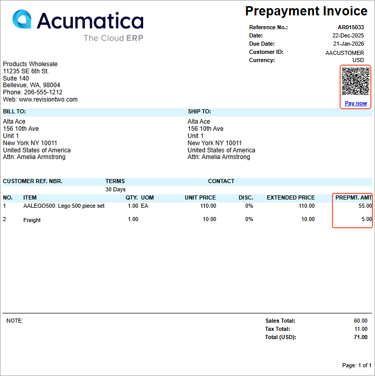

# AR Prepayment Invoices: Payment Links {#_ad0efc4a-5565-410b-9092-d2a8e9c0a88b .concept}

You can use Acumatica ERP’s payment link capabilities to send payment links for prepayment invoices, just as you can for other AR documents. You can easily create an open payment link for a released prepayment invoice with the *Pending Payment* status and share it with customers as a convenient **URL** or **QR code** directly on the printed invoice.

Once a payment is made, Acumatica ERP can automatically update or close the prepayment invoice if webhooks or a schedule are set up in the system. The system also keeps everything in sync if the document is voided or becomes unapplied, eliminating manual follow-up. To further simplify collections, you can automatically generate and send emails that include payment links, making it faster and easier for customers to pay.

**Attention:** This functionality is available when the *VAT Reporting*, *VAT Recognition on AP Prepayments*, and *VAT Recognition on AR Prepayments* features are enabled on the [Enable/Disable Features](CS_10_00_00.md) \(CS100000\) form.

For more information, see the noted topic:

-   About the configuration of payment links: [To Configure Acumatica Payments](AR__HOW_To_Configure_Acumatica_Payments.md)
-   About the creation and processing of payment links: [Processing of Payment Links](AR__con_Processing_Payment_Links.md)

## When You Can Create a Payment Link { .section}

Payment links can be created for released documents only. On the [Invoices and Memos](AR_30_10_00.md) \(AR301000\) and [Process Payment Links](AR_51_35_00.md) \(AR513500\) forms, you can create a payment link for a prepayment invoice with the *Pending Payment* status.

The table below shows the availability of payment links by document status.

|Status|Link Availability \([Invoices and Memos](AR_30_10_00.md) form\)|Link Availability \([Process Payment Links](AR_51_35_00.md) form\)|
|------|---------------------------------------------------------------|------------------------------------------------------------------|
|*Balanced* or another pre-release status|The **Create Payment Link** button on the **Payment Links** tab is unavailable.|The document doesn't appear in the table.|
|*Pending Payment* \(after release\)|The **Create Payment Link** button on the **Payment Links** tab is available.|The document appears in the table. The payment link stays open until the document is fully paid and all applications are released. Then the status changes to *Unapplied* or *Voided*, which closes the link.|
|*Unapplied*, *Closed*, and *Voided*|The **Create Payment Link** button on the **Payment Links** tab is unavailable.|The document doesn't appear in the table.|

Only one open payment link can exist per document. If a prepayment invoice is reassigned to the *Pending Payment* status— for example, if the applied payment was voided—the system automatically creates a new payment link.

## Creating and Syncing Payment Links { .section}

You can create and sync payment links for multiple documents at once or generate one payment link for an individual prepayment invoice, depending on your workflow.

The system takes care of this by automating the creation and update of payment links. It triggers the *AR Invoice Payment Link Create* and *Invoice Payment Link Update* business events, which were predefined on the [Business Events](SM_30_20_50.md) \(SM302050\) form.

If these business events are deactivated, you can manually create and update links on the [Process Payment Links](AR_51_35_00.md) \(AR513500\) and [Invoices and Memos](AR_30_10_00.md) \(AR301000\) forms.

## Updating and Closing Payment Links { .section}

You can update a payment link if the due date or the unpaid balance of the prepayment invoice changes—for example, when you release applications.

A payment link is closed in both the processing center and in Acumatica ERP if all of the following conditions are met:

-   The prepayment invoice is fully paid.
-   All applications are released regardless of whether the payment came from a payment link or from another applied payment or document.

## Paying Prepayment Invoices by Using Payment Links { .section}

The system notifies the customer about payment links created for prepayment invoices, as it does it for these links created for AR invoices.

Payment links will also appear on printed documents. To send a payment request, you can run the [Invoice/Memo](AR_64_10_00.md) \(AR641000\) report and share it with the customer. Once they receive this document, they can easily pay it by clicking a link. The printed report shows the payment link as a QR code and the *Pay now* link \(see below\).

When a customer clicks the link, the system opens a page in a new browser tab, where they can quickly complete their payment.

For prepayment invoices created from sales orders with prepayment percents of less than 100%, the details sent to the processing center take the prepayment percent into account. In the generated report, the **Prepmt. Amt** column shows the prepayment amount. If the prepayment percent is 100%, the amount in this column is the same as the amount in the **Extended Price** column.

**Parent topic:**[Processing Prepayment Invoices in AR](../UserGuide/Finance_Prepayment_Invoices_Mapref.md)

