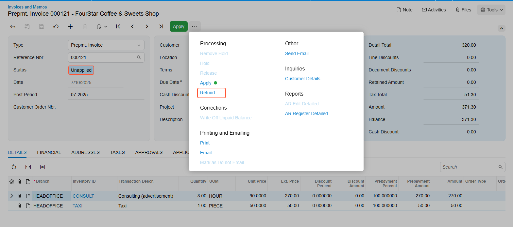
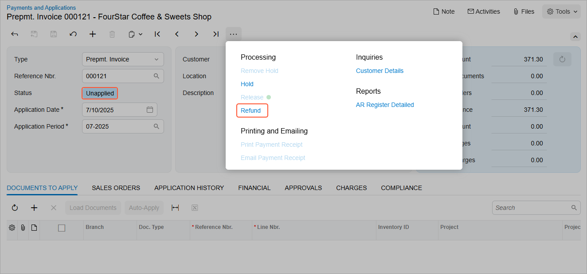
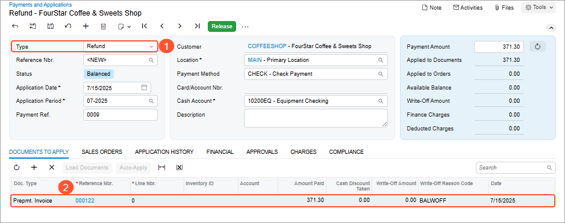
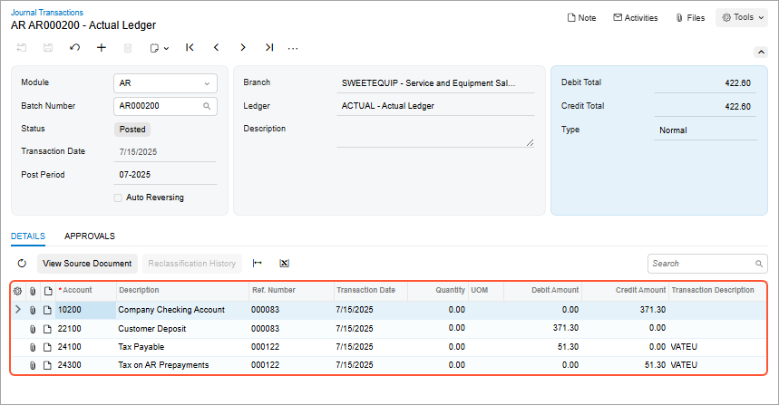
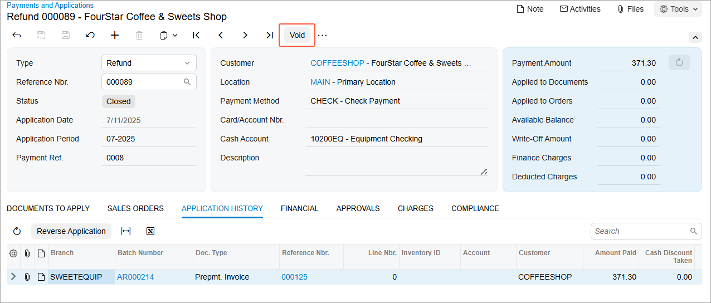
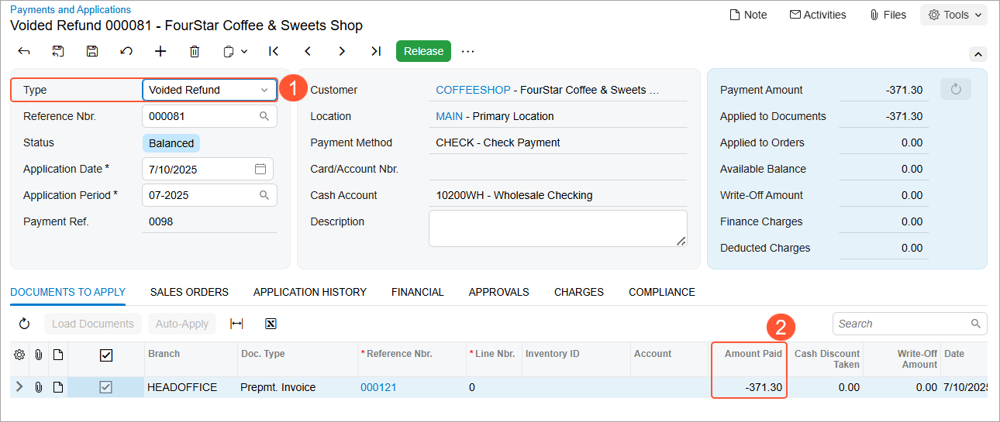
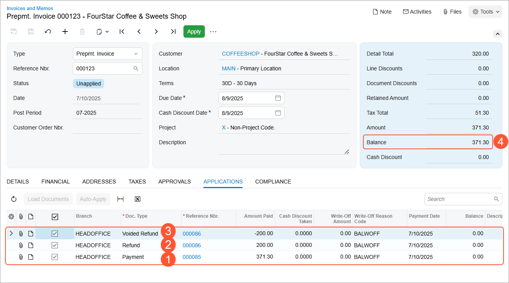

# AR Prepayment Invoices: Effortless Refunds {#_4f692633-a028-40bf-801e-fef797ba372b .concept}

In Acumatica ERP, you can quickly issue refunds for unapplied or partly applied prepayment invoices, whether you're dealing with partial or full refunds. This ensures accurate financial records, simplifies workflows, and provides greater control over accounting processes.

**Attention:** This functionality is available only if the *VAT Recognition on Prepayments* feature is enabled on the [Enable/Disable Features](CS_10_00_00.md) \(CS100000\) form.

## Key Capabilities {#section_mjr_j5t_dgc .section}

-   Issue a full refund for a prepayment invoice that hasn’t been applied to any invoice or debit memo
-   Issue a partial refund:
    -   For a portion of the unapplied balance of the prepayment invoice
    -   For the remaining unapplied balance of the prepayment invoice that was applied to an invoice or debit memo
-   Void a refund that was applied to a prepayment invoice and released

## How to Issue a Refund {#section_xw5_x4f_yfc .section}

Due to unforeseen circumstances, a customer may cancel an order before goods are shipped or services are provided, requiring a refund of the prepayment invoice they paid. Similarly, if the prepayment invoice amount exceeds the final invoice amount, the remaining unapplied balance can be refunded. In both cases, you can issue a refund for the prepayment invoice.

**Ways to initiate a refund:** You can initiate the refund in one of the following ways:

-   Open the prepayment invoice on the [Invoices and Memos](AR_30_10_00.md) \(AR301000\) form and click **Refund** on the More menu \(see below\).

    **Tip:** This command is available only if the prepayment invoice has the *Unapplied* status.

    

-   Open the prepayment invoice on the [Payments and Applications](AR_30_20_00.md) \(AR302000\) form and click **Refund** on the More menu \(see below\).

    

**Refund application workflow:**When you click **Refund**, the system opens the [Payments and Applications](AR_30_20_00.md) form with a new document of the *Refund* type \(Item 1 below\). You’ll find the prepayment invoice listed on the **Documents to Apply** tab \(Item 2\).

In the **Payment Amount** box in the Summary area of the [Payments and Applications](AR_30_20_00.md) \(AR302000\) form, the system automatically inserts the unapplied balance of the prepayment invoice. To refund the full amount, leave it unchanged and release the refund application.

**GL transactions on release of the refund application:**When you release the refund application, the system generates the GL transactions shown below on the [Journal Transactions](GL_30_10_00.md) \(GL301000\) form. You can view this batch by clicking its number on the **Financial** tab of the [Payments and Applications](AR_30_20_00.md) form.

These GL transactions are explained in the following table.

|Account|Debit|Credit|Description of the transaction|
|-------|-----|------|------------------------------|
|*Company Checking:*This account is specified in the refund document. You’ll find it in the **Cash Account** box on the [Payments and Applications](AR_30_20_00.md) form.

| |Application amount|Reflects the cash paid to the customer, reducing the company's cash balance|
|*Customer Deposit:*This account is specified in the prepayment invoice. You’ll find it in the **Prepayment Account** box of the [Invoices and Memos](AR_30_10_00.md) form \(**Financial** tab\).

|Application amount| |Reduces the amount of customer prepayment, reflecting the refunded amount|
|*Tax Payable:*This account is specified in the **Tax Payable Account** box on the [Taxes](TX_20_50_00.md) \(TX205000\) form for the tax applied in the prepayment invoice.

|Tax amount| |Reflects the reversal of VAT liability because the company no longer needs to remit the tax to the authorities|
|*Tax on AR Prepayments:*This account is specified in the **Tax on AR Prepayment Account** box of the [Taxes](TX_20_50_00.md) form for the tax applied in the prepayment invoice.

| |Tax amount|Reverses the tax portion originally posted to this account when the prepayment invoice was paid|

**After the refund is released:** When the refund is released, the status of the prepayment invoice changes to *Closed* because the available balance of the prepayment invoice has been fully refunded.

You can refund **a portion of the unapplied balance of a prepayment invoice**. To do this, in the refund application on the [Payments and Applications](AR_30_20_00.md) form, specify a refund amount less than the unapplied balance of the prepayment invoice. On release, the prepayment invoice will keep the *Unapplied* status and the *Refund* application will have the *Closed* status.

**Tip:** You can issue a refund for a prepayment invoice that either has not been applied to any invoice or has been applied to an invoice but still has an unapplied balance.

You can create multiple refund applications for the same prepayment invoice, if needed.

## Voiding a Refund {#section_lq5_2tg_yfc .section}

If a refund was mistakenly issued, you can void the refund. To do so, open the document of the *Refund* type on the [Payments and Applications](AR_30_20_00.md) \(AR302000\) form. On the form toolbar, click **Void** \(see below\).

When you click **Void**, the system opens a new document of the *Voided Refund* type \(Item 1 below\) on the current form with the prepayment invoice listed on the **Documents to Apply** tab. In the **Amount Paid** column, the refunded amount appears with the opposite sign \(Item 2\).

On release of the voided refund, the system posts GL transactions that reverse those posted when the refund was applied to the prepayment invoice and released.

Below is an example of a prepayment invoice with the list of documents applied to the prepayment invoice shown on the **Applications** tab of the [Invoices and Memos](AR_30_10_00.md) form. Notice that the payment was applied to the prepayment invoice \(Item 1 below\). Then a partial refund was applied \(Item 2\). Assume the refund was recorded mistakenly; it was voided \(Item 3\), and the balance of the prepayment invoice remained as it was initially \(Item 4\).

## Multicurrency Refunds {#section_q1h_zrf_yfc .section}

If a prepayment invoice is issued in a foreign currency and the refund is processed in the base currency, the system generates two GL batches:

-   One in the refund currency for the application amount
-   Another in the prepayment invoice currency to reverse the taxes

**Parent topic:**[Processing Prepayment Invoices in AR](../UserGuide/Finance_Prepayment_Invoices_Mapref.md)

