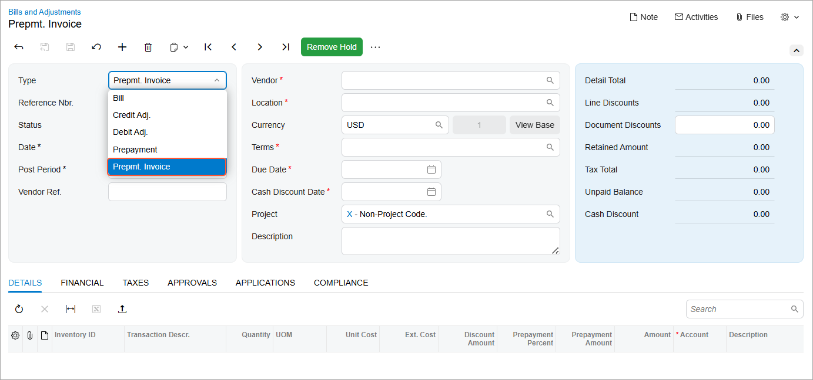
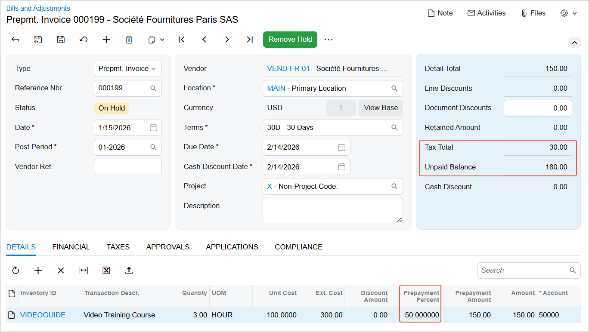

# AP Prepayment Invoices: Creation of a Prepayment Invoice {#_0cda48dc-2057-4714-8018-a851a787d3a8 .concept}

In this topic, you will learn how to create a prepayment invoice in Accounts Payable, how the system determines the prepayment percentage, and how the invoice balance and tax amounts are calculated and displayed.

## Creating a Prepayment Invoice {#section_kxv_1y1_zhc .section}

To create a prepayment invoice on the [Bills and Adjustments](AP_30_10_00.md) \(AP301000\) form, select *Prepmt. Invoice* in the **Type** box of the Summary area \(see below\).

When you add detail lines on the **Details** tab, the prepayment percent is inserted in each line \(see below\) as follows:

-   If a prepayment percent is specified in the vendor settings, the system inserts this percent.
-   If no prepayment percent is specified for the vendor, the system inserts a default prepayment percent of *0*, and you must enter the required percent.

Once you've specified all document details and saved the prepayment invoice, the system calculates the balance and the total tax amount of the prepayment invoice. These amounts are displayed in the **Unpaid Balance** and **Tax Total** boxes \(see below\).

**Parent topic:**[Processing Prepayment Invoices](../UserGuide/Finance_ProcessingPrepayment_Invocies_Mapref.md)

