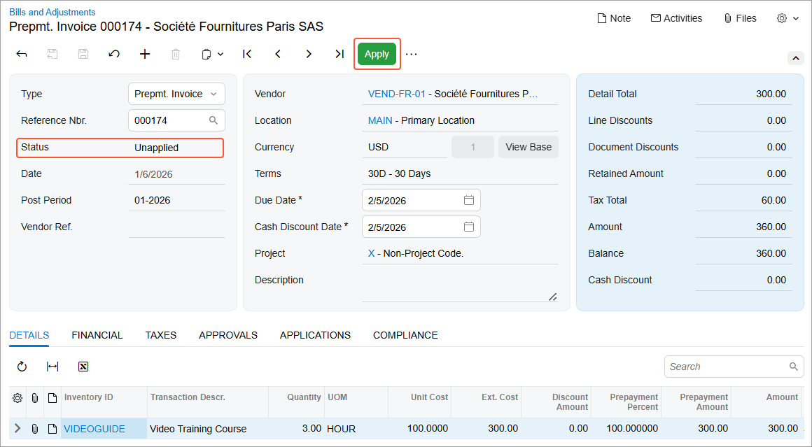
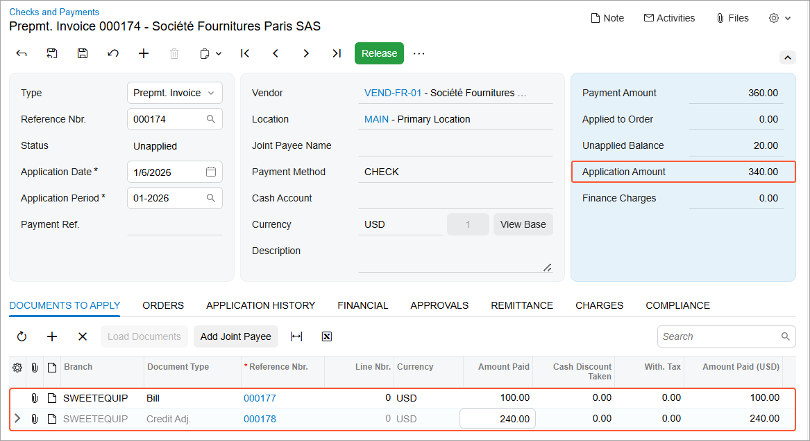
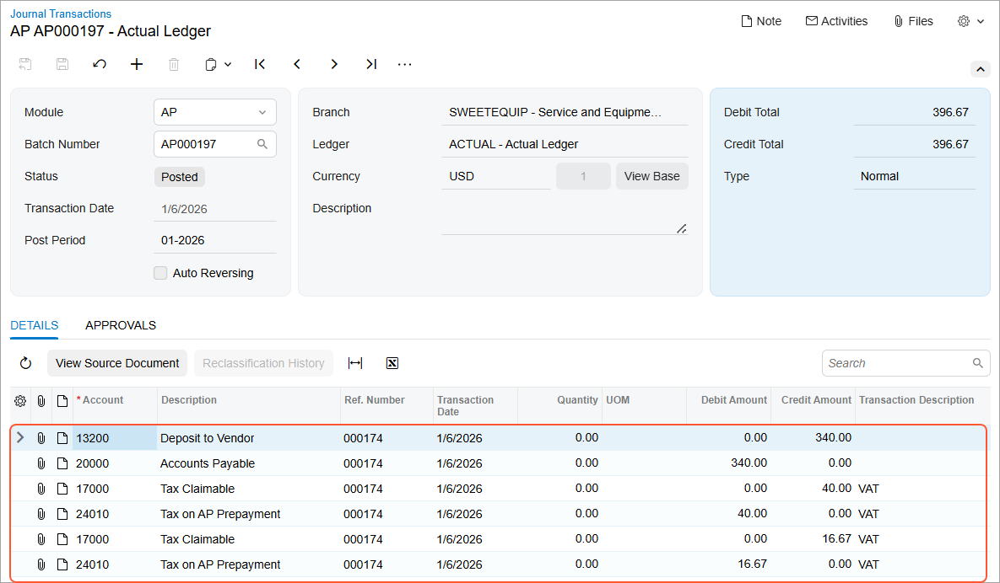
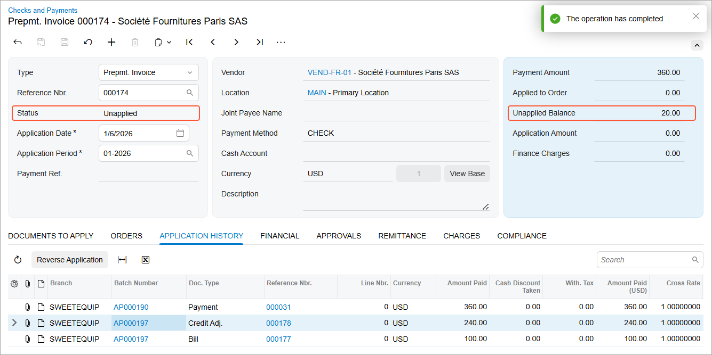

# AP Prepayment Invoices: Application of a Prepayment Invoice to AP Bills {#_abb6c17a-9be7-4e8f-9f95-3db507437b8c .concept}

In this topic, you will learn how to apply a fully paid prepayment invoice to an AP bill or a credit adjustment, how the application is performed in the system, and how this process affects document statuses, balances, and generated general ledger transactions.

## Applying the Prepayment Invoice to an AP Bill or a Credit Adjustment {#section_dh1_rym_whc .section}

When the prepayment invoice has been fully paid, it’s assigned the *Unapplied* status \(see below\) and can be applied to an AP bill or credit adjustment. You can apply a prepayment invoice to a single AP bill or credit adjustment in full or distribute its available balance across any number of the vendor’s AP documents.

On the [Bills and Adjustments](AP_30_10_00.md) \(AP301000\) form, click **Apply** on the form toolbar \(also shown below\).

The system opens the [Checks and Payments](AP_30_20_00.md) \(AP302000\) form with the prepayment invoice selected in the Summary area. On the **Documents to Apply** tab, add one or more rows and select the vendor’s AP bills or credit adjustments to which you want to apply the prepayment amount \(see below\). In the **Amount Paid** column, specify the amount to be paid for each selected AP document. Then on the form toolbar, click **Release**.

When you release the application, the system generates a GL batch that debits the Accounts Payable account and credits the prepayment \(deposit\) account. The batch also includes tax transactions debiting the Tax on AP Prepayment account and crediting the Tax Claimable account \(see below\). These entries reverse the tax entries created when the prepayment invoice was paid. The system also updates the vendor’s balance and prepayment balance on the [Vendors](AP_30_30_00.md) \(AP303000\) form.

Depending on whether an AP document \(AP bill or credit adjustment\) is fully or partially paid, you’ll see the following impact on the statuses and balances of the document and prepayment invoice:

-   If the AP document is partially paid, its status remains *Open*, and its balance is reduced.
-   If the AP document is fully paid, its status changes to *Closed*, and its balance becomes *0*.
-   If the full available balance of the prepayment invoice is applied, the prepayment invoice’s status changes to *Closed*.
-   If only part of the prepayment invoice balance is applied, the prepayment invoice’s status remains *Unapplied*, and the remaining available balance is reduced accordingly.

    

On the **Application History** tab, the system has added lines with the applied AP documents and the reference number of each document’s generated GL batch.

**Parent topic:**[Processing Prepayment Invoices](../UserGuide/Finance_ProcessingPrepayment_Invocies_Mapref.md)

