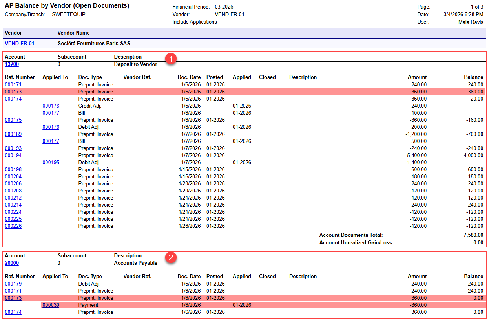

# AP Prepayment Invoices: Balance Reports {#_e3c51330-99a5-4d3a-9eab-7122e1707cb4 .concept}

In the following sections, you can find details about the AP balance reports that you may want to review to gather information about prepayment invoices.

**Important:** This functionality is available only if the *VAT Recognition on AP Prepayments* feature is enabled on the [Enable/Disable Features](CS_10_00_00.md) \(CS100000\) form.

## How Prepayment Invoices Are Reflected in Reports {#section_sv3_sgc_n3c .section}

The following reports may include prepayment invoices:

-   [AP Balance by GL Account](AP_63_20_00.md) \(AP632000\)
-   [AP Balance by Vendor](AP_63_25_00.md) \(AP632500\)
-   [AP Balance by Vendor MC](AP_63_30_00.md) \(AP633000\)

These reports reflect released prepayment invoices throughout their lifecycle until they’re closed. As a result, the vendor totals in the reports match the related GL totals.

## How Prepayment Invoices Appear in the Reports {#section_tqp_wgc_n3c .section}

In the AP balance reports, a prepayment invoice is shown twice—once under the AP account and once under the prepayment account used on this invoice. This approach ensures that the vendor balances shown in the reports match the related GL totals.

The document type \(**Doc. Type** column\) of a prepayment invoice is *Prepmt. Invoice*.

## How to Interpret Amounts and Signs {#section_axt_xgc_n3c .section}

The reports apply consistent sign logic so you can interpret balances correctly. In rows for prepayment invoices, the values in the **Amount** and **Balance** columns are shown as follows:

-   **Under the AP account**: The prepayment invoice amount posted to the AP account is shown as a positive value. When the invoice is released, the amount is posted to the AP account and appears in the **Amount** column. Therefore, even if no payments have been applied yet, the prepayment invoice still appears in the table for the AP account.

    The **Balance** for this line changes as payments or prepayments are applied to the prepayment invoice.

-   **Under the prepayment account**: The prepayment invoice amount posted to the prepayment account is shown as a negative value because it represents a vendor deposit.

    The **Balance** represents the remaining unused portion of the prepayment in that account. When the prepayment is fully applied, the balance in the table for the prepayment account becomes *0.00*.

Because the same prepayment invoice appears under both accounts, you’ll typically see a **positive** amount on the AP account line and a **negative** amount on the prepayment account line.

## Example: The Same Prepayment Invoice Under Both Accounts {#section_qgq_cmn_m3c .section}

The screenshot below shows the same prepayment invoice \(*000173*\) under two accounts in the [AP Balance by Vendor](AP_63_25_00.md) \(AP632500\) report, with opposite signs that reflect the invoice’s role in the corresponding account.

You can see the following tables in the report:

-   **Prepayment account table** \(Item 1 below\): This table shows document data for the *13200* \(*Deposit to Vendor*\) account, with negative values shown for prepayment invoices. For example, prepayment invoice *000173* is listed with a negative amount \(*–360.00*\). This amount represents the vendor deposit recorded in the prepayment account.

    Because the same value is shown in the **Amount** and **Balance** columns, the prepayment has not been used yet—that is, the prepayment invoice hasn’t been applied to any AP bill.

-   **AP account table** \(Item 2\): This table shows data for the *20000* \(*Accounts Payable*\) account, with positive values shown for the same prepayment invoices. For example, prepayment invoice *000173* appears again with a positive amount \(*360.00*\). The **Balance** for this line is *0.00*, which indicates that the prepayment invoice has been fully settled. The applied payment is shown in the line directly under the prepayment invoice line \(see below\).

## **Write-Offs of Unpaid Prepayment Invoice Balances** {#section_fnb_1hc_n3c .section}

If an unpaid prepayment invoice balance is written off with a debit adjustment, the reports display the debit adjustment row with different signs depending on the account:

-   **AP account line:** Shown as a negative value \(with a **minus** sign\)
-   **Prepayment account line:** Shown as a positive value

**Parent topic:**[Processing Prepayment Invoices](../UserGuide/Finance_ProcessingPrepayment_Invocies_Mapref.md)

