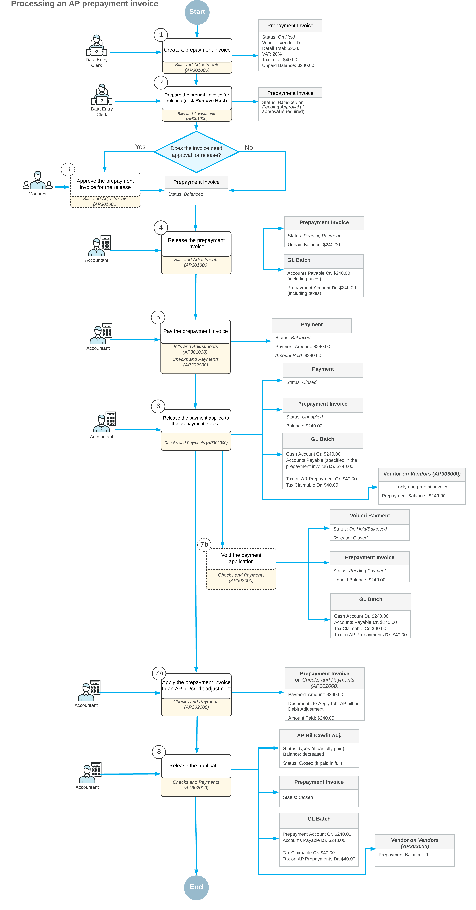

# AP Prepayment Invoices: General Information {#_2ff32ec7-08b7-4df4-b314-18596e3a74d0 .concept}

In some countries, legislation requires value-added taxes \(VATs\) to be recognized and reported in tax reports at the time a prepayment is paid. To support these requirements, Acumatica ERP allows you to create prepayment invoices in accounts payable with VAT recognition at payment time. When a prepayment invoice is paid, the system generates GL transactions for the calculated tax amounts, and these taxes are included in the corresponding tax report.

## Applicable Scenarios { .section}

A marketing agency regularly works with a freelance design studio that requires a 50% advance payment before starting any work. The exact scope and final cost of the services are agreed verbally at the beginning of the engagement, and the remaining amount is billed after the work is completed. Because the services are not tied to a formal purchase order, the agency records the advance payment directly in Accounts Payable.

Since the agency operates in a country where VAT must be recognized and reported at the time a prepayment is paid, the accountant creates a prepayment invoice in Accounts Payable. The invoice includes the applicable VAT and is paid immediately. When the payment is released, the system recognizes the VAT in the appropriate tax period and records the advance payment as a vendor prepayment.

Later, when the design studio issues the final bill for the completed services, the accountant applies the prepayment invoice to the AP bill to settle part of the liability without recognizing VAT again.

## Prepayment Invoice Processing Flow { .section}

This diagram illustrates the end-to-end lifecycle of an AP prepayment invoice based on an example in which the prepayment invoice is paid in full. It shows the key processing steps—from creation and approval through payment, tax recognition, optional voiding, and final application to an AP bill or credit adjustment—along with the resulting document statuses and general ledger transactions at each stage.

## Understanding the Prepayment Invoice Lifecycle {#section_okn_zmh_whc .section}

The following table shows the main processing steps in the lifecycle of a prepayment invoice, from creation through closure. \(Some steps apply conditionally.\) Each step is initiated by a user action on the [Bills and Adjustments](AP_30_10_00.md) \(AP301000\) form and results in a corresponding document status.

|Step|User Action|Status|Notes|
|----|-----------|------|-----|
|1|Create and save a prepayment invoice|*On Hold*|The **Remove Hold** button is shown on the form toolbar of the [Bills and Adjustments](AP_30_10_00.md) form.

 This status is assigned if the **Hold Documents on Entry** check box is selected on the [Accounts Payable Preferences](AP_10_10_00.md) \(AP101000\) form.

 **Tip:** If the approval workflow has been set up for prepayment invoices, they’re always created with the *On Hold* status.

|
|*Balanced*|The prepayment invoice can be released.

 This status is assigned instead of *On Hold* if the **Hold Documents on Entry** check box is cleared on the [Accounts Payable Preferences](AP_10_10_00.md) form.

|
|The actions of this step are performed**if the approval workflow has been set up for prepayment invoices**.|
|2|Remove the prepayment invoice from hold|*Pending Approval*|The **Approve** and **Reject** buttons become available on the form toolbar of the [Bills and Adjustments](AP_30_10_00.md) form.|
|Reject the prepayment invoice|*Rejected*|The prepayment invoice can’t be released until it’s corrected and resubmitted.|
|Approve the prepayment invoice|*Balanced*|The approved prepayment invoice can be released; the **Release** button appears on the form toolbar.|
|The following step is performed **if the approval workflow has not been set up for prepayment invoices**.|
|2|Remove the prepayment invoice from hold|*Balanced*|The prepayment invoice can be released.

 This step applies if the **Hold Documents on Entry** check box is selected on the [Accounts Payable Preferences](AP_10_10_00.md) form.

|
|3|Release the prepayment invoice|*Pending Payment*|The system creates a GL batch to credit the Accounts Payable account and debit the prepayment \(deposit\) account in the amount of the prepayment invoice.

 The prepayment invoice can now be paid; the **Pay** button appears on the form toolbar. For details, see [AP Prepayment Invoices: Paying a Prepayment Invoice](Finance_Prepayment_Invoices_in_AP_Payment.md).

|
|4 \(Optional\)|Void an unpaid prepayment invoice|*Voided*|The system creates a debit adjustment with a single line summarizing the prepayment invoice’s details. After you release the debit adjustment, the system reverses the GL entries posted when the prepayment invoice was released: Now the Accounts Payable account is debited, and the prepayment account is credited.|
|5|Pay the prepayment invoice|
|Pay the prepayment invoice **partially**|*Pending Payment*|You can do one of the following:

 -   Pay the remaining unpaid balance of the prepayment invoice
-   Write off the unpaid balance of the prepayment invoice by clicking the **Write Off Unpaid Balance** command on the More menu

 Once either of these actions has been performed, the *Unapplied* status is assigned to the prepayment invoice.

|
|Pay the prepayment invoice **in full**|*Unapplied*|The prepayment invoice is paid and its balance can be applied to AP bills or credit adjustments. The **Apply** button appears on the form toolbar of the [Bills and Adjustments](AP_30_10_00.md) form.

 For details, see [AP Prepayment Invoices: Application of a Prepayment Invoice to AP Bills](Finance_Prepayment_Invoices_in_AP_Applying_to_AP_Bill.md).

|
|6|Apply the prepayment invoice to AP bill or a credit adjustment|
|Apply **a part**of the prepayment invoice’s balance to any number of AP bills or credit adjustments of the vendor; release the application|*Unapplied*|You can apply the remaining balance to any AP document of the vendor.|
|Apply**the full balance** of the prepayment invoice to any number of the vendor’s AP bills or credit adjustments; release the application|*Closed*|The prepayment invoice’s balance is *0*, and no further processing of this document is allowed.|

**Parent topic:**[Processing Prepayment Invoices](../UserGuide/Finance_ProcessingPrepayment_Invocies_Mapref.md)

