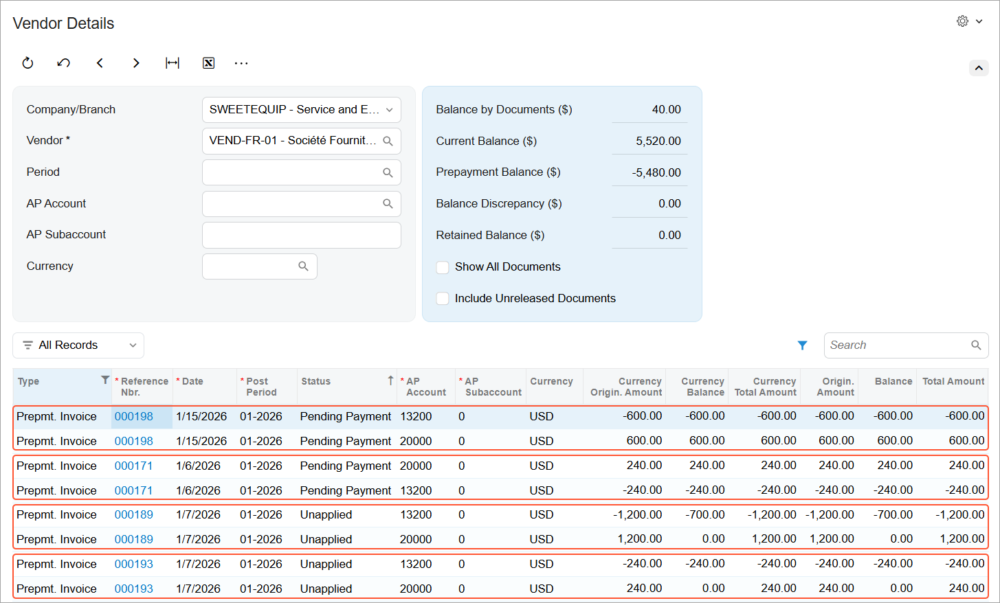

# AP Prepayment Invoices: Impact on a Vendor’s Balance {#_965f89f1-9ca3-44a0-b32c-961a3b8df6d6 .concept}

In this topic, you will learn how prepayment invoices are reflected in the vendor balance, how the system displays prepayment amounts by account, and how these amounts affect the vendor’s prepayment balance without changing the current balance.

## Viewing the Vendor’s Balance {#section_y2w_2y1_zhc .section}

On the [Vendor Details](AP_40_20_00.md) \(AP402000\) form, when the *VAT Recognition on AP Prepayments* feature is enabled, two additional columns appear in the table: **AP Account** and **AP Subaccount** \(if subaccounts are enabled in your system\). These columns show the specific accounts the system updates when a prepayment invoice is released.

A prepayment invoice appears in the table using two separate lines—one line for each AP account updated when the prepayment invoice is released. The prepayment invoice balance is shown on each line with a different sign, depending on the account to which the prepayment amount is posted \(see below\):

-   The first line shows the amount posted to the prepayment account, representing the advance payment made to the vendor. This amount is displayed with a **minus** sign.
-   The second line shows the amount posted to the Accounts Payable account, representing the VAT-related liability. This amount is displayed with a **plus** sign.

The amount shown in the **Original Amount** column follows the same sign logic.

The **Current Balance** amount in the Summary area isn’t affected by the prepayment invoice. Instead, the balances from both lines of the prepayment invoice are aggregated and reflected in the **Prepayment Balance** box. This ensures that prepayments are tracked separately while the vendor’s current liability remains unchanged.

**Parent topic:**[Processing Prepayment Invoices](../UserGuide/Finance_ProcessingPrepayment_Invocies_Mapref.md)

