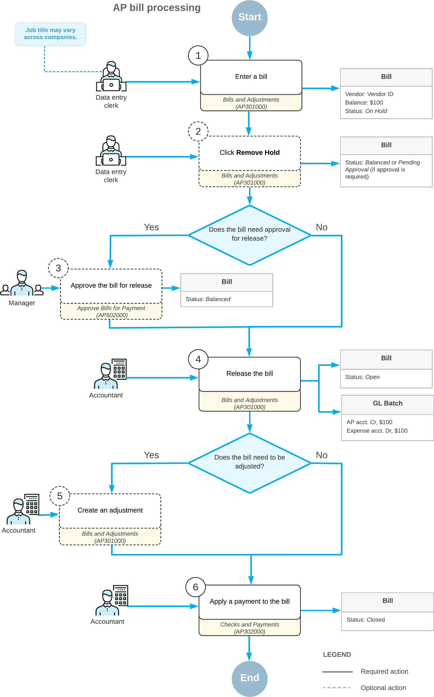

# AP Bills: General Information {#_1ea1e770-b81c-437e-831f-64f702f968f4 .concept}

In Acumatica ERP, you create an accounts payable bill for each incoming invoice from a vendor.

## Learning Objectives {#section_b4h_njv_vxb .section}

In this chapter, you will learn how to do the following:

-   Create an AP bill
-   Release the AP bill
-   Review the GL batch that the system generates as a result

## Applicable Scenarios {#section_e4h_njv_vxb .section}

You create an AP bill manually when you receive an invoice from a vendor.

## Entry of Bills {#section_g4h_njv_vxb .section}

You enter a bill by using the [Bills and Adjustments](AP_30_10_00.md) \(AP301000\) form. The summary of a bill includes information about the vendor, the vendor location, payment terms, amount, the currency used for the transaction, and other information.

A bill should contain at least one detail line. The bill can have multiple detail lines or it can have a single line that summarizes all purchases.

**Tip:** We recommend that when you enter a document, you include all the details available in the original vendor document.

If the *Inventory* feature is disabled on the [Enable/Disable Features](CS_10_00_00.md) \(CS100000\) form, you can enter a bill with only non-stock items. If the *Inventory* feature is enabled, a bill may include lines with stock items and non-stock items. Each line with a stock item must be linked to the appropriate line of a purchase order or purchase receipt. When creating a bill, you can use the **Add PO Receipt**, **Add PO Receipt Line**, and **Add PO** buttons on the table toolbar \(the **Details** tab of the [Bills and Adjustments](AP_30_10_00.md) form\) to add lines from purchase receipts and purchase orders directly to a bill. If you have added a bill line with a stock item manually, you must link it to the corresponding line of a purchase document by using the **Link Line** button on the table toolbar of the **Details** tab.

When it is first saved, a bill is automatically assigned a unique identifier that lets you track the bill through the system. The system generates this identifier based on the numbering sequence assigned to bills on the [Accounts Payable Preferences](AP_10_10_00.md) \(AP101000\) form.

Due dates and cash discount dates for each bill are calculated by the system automatically, based on the vendor credit terms specified for the vendor on the [Vendors](AP_30_30_00.md) \(AP303000\) form.

If the automatic calculation of taxes is configured in your system, the system calculates the applicable taxes for each bill and records the tax amounts to the document. If your system is integrated with the AvaTax service of Avalara or other specialized third-party software, the applicable taxes are calculated by this service or software and recorded to the document when you save it. For an overview of this integration, see [Setup of Online Integration with Avalara AvaTax](TX__con_Integrating_with_AvaTax.md) or [Online Integration with Vertex Tax Calculation](TX__con_Vertex_Integration.md).

To facilitate auditing and user reference, you can attach to each bill an electronic version or a scanned image of the original vendor document. Also, you can attach a related document to each line of the document.

If bills contain the vendor's original document numbers, users can more easily match any AP document against the vendor document and avoid document duplication. You can require this reference number by selecting the **Require Vendor Reference** check box on the [Accounts Payable Preferences](AP_10_10_00.md) form. To prevent users from entering duplicate documents \(that is, entering the same document twice\), you select the **Raise an Error On Duplicate Vendor Reference Number** check box on this form, and the system will display an error message each time a user attempts to enter a vendor reference number that is already available in the system.

## Bill Statuses {#section_q4h_njv_vxb .section}

During processing, a bill can have the following statuses:

-   *On Hold*: The bill is being edited and cannot be released. The system assigns this status to each created bill by default if the **Hold Documents on Entry** check box is selected on the [Accounts Payable Preferences](AP_10_10_00.md) \(AP101000\) form by default or if approvals have been configured for bills.
-   *Pending Approval*: The bill needs to be approved for release by the responsible person or persons. The system assigns this status when the bill for which the approval is needed is removed from hold. This status can be assigned to the bill only if the *Approval Workflow* feature is enabled on the [Enable/Disable Features](CS_10_00_00.md) \(CS100000\) form.
-   *Rejected*: The bill was rejected by the responsible person. This status can be assigned to the bill only if the *Approval Workflow* feature is enabled on the [Enable/Disable Features](CS_10_00_00.md) form.
-   *Balanced*: The bill is ready and can be released or scheduled.
-   *Open*: The bill has been released. A bill with this status has a nonzero outstanding balance to be paid. If a bill is partially paid, it retains the *Open* status until the full amount is paid.
-   *Closed*: The bill has been paid in the full amount; the document balance is zero.
-   *Scheduled*: The bill is a template for generating recurring bills according to a schedule. Based on the template, the system generates recurring bills, which can be edited and then released. \(The scheduled bill itself cannot be released and can be edited as a template.\)
-   *Pre-Released*: The bill has been released and requires expense reclassification. This status can be assigned to the bill only if the *Expense Reclassification* feature is enabled on the [Enable/Disable Features](CS_10_00_00.md) form.
-   *Voided*: The bill, which was previously scheduled, has been voided and is no longer used as a template for generating recurring bills.

## Bill Processing Workflow {#section_s4h_njv_vxb .section}

When you enter a bill on the [Bills and Adjustments](AP_30_10_00.md) \(AP301000\) form \(1 in the diagram below\), by default, the new bill has the *On Hold* status if the **Hold Documents on Entry** check box is selected on the [Accounts Payable Preferences](AP_10_10_00.md) \(AP101000\) form. If this is the case, you need to click **Remove Hold** on the form toolbar \(2\) to be able to release the bill. If the *Approval Workflow* feature is enabled on the [Enable/Disable Features](CS_10_00_00.md) \(CS100000\) form and the approval process for AP documents has been set up, the bill must be approved for release by the responsible person \(3\). After that, the bill is assigned the *Balanced* status.

When you release the bill \(4\), the system assigns the bill the *Open* status and generates the batch to credit the AP account and debit the expense accounts in the general ledger. The system also updates the vendor balance in the amount of the bill. You cannot edit the amount of the bill once it is open. If the balance of the bill needs to be corrected, you can make a debit or credit adjustment \(5\). Once it has been released, the bill needs to be paid. A payment document should be entered into the system, processed, and applied to the bill \(6\). After the bill is paid in full, it is assigned the *Closed* status.

The following diagram illustrates the bill processing workflow.

**Parent topic:**[Processing AP Bills](../UserGuide/Finance_ProcessingAPBills_Mapref.md)

