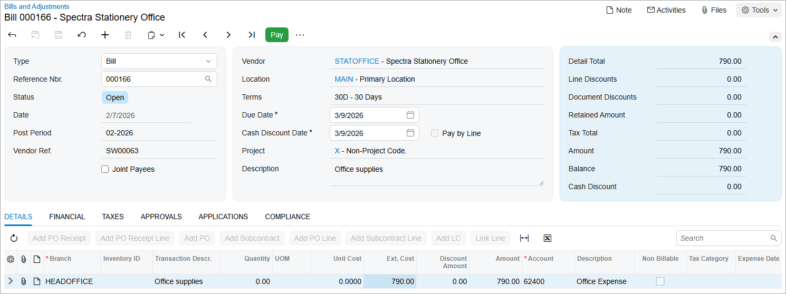

# AP Bills: Process Activity {#_bc4860af-19a6-4868-b92f-e330dce4209d .task}

The following activity will walk you through the process of creating and releasing an AP bill.

**Attention:** This activity is based on the *U100* dataset. If you are using another dataset or if any system settings have been changed in *U100*, these changes can affect the workflow of the activity and the results of the processing. To avoid issues, restore the *U100* dataset to its initial state.

## Story {#section_msh_njv_vxb .section}

Suppose that on February 2, 2026, SweetLife Fruits &amp; Jams company purchased office supplies on credit from the Spectra Stationery Office vendor for $790. The vendor sent invoice SW00063 to SweetLife.

Acting as a SweetLife accountant, you need to create an AP bill for the vendor, release it, and then review the GL batch generated by the system.

## Configuration Overview {#section_psh_njv_vxb .section}

For the purposes of this activity, the following features have been enabled on the [Enable/Disable Features](CS_10_00_00.md) \(CS100000\) form:

-   *Standard Financials*, which provides the standard financial functionality
-   *Multibranch Support*, which supports multiple branches in your instance of Acumatica ERP
-   *Multicompany Support*, which supports multiple companies within one tenant.

On the [Accounts Payable Preferences](AP_10_10_00.md) \(AP101000\) form, the **Hold Documents on Entry** check box has been selected in the **Data Entry Settings** section.

On the [Vendors](AP_30_30_00.md) \(AP303000\) form, the *STATOFFICE \(Spectra Stationery Office\)* vendor has been configured.

## Process Overview {#section_tsh_njv_vxb .section}

In this activity, you will create an AP bill on the [Bills and Adjustments](AP_30_10_00.md) \(AP301000\) form. In the bill, you will specify the vendor in the **Vendor** box of the Summary area and the document details on the **Details** tab. When the bill is ready, you will release the document by clicking **Release** on the form toolbar.

## System Preparation {#section_vsh_njv_vxb .section}

To prepare the system, do the following:

1.  Launch the Acumatica ERP website, and sign in to a company with the *U100* dataset preloaded. To sign in as an accountant, use the following credentials:
    -   Username: *johnson*
    -   Password: *123*
2.  In the info area, in the upper-right corner of the top pane of the Acumatica ERP screen, click the Business Date menu button and select *2/7/2026*. For simplicity, in this activity, you will create and process all documents in the system on this business date.
3.  On the Company and Branch Selection menu, also on the top pane of the Acumatica ERP screen, make sure that the *SweetLife Head Office and Wholesale Center* branch is selected. If it is not selected, click the Company and Branch Selection menu to view the list of branches that you have access to, and then click *SweetLife Head Office and Wholesale Center*.

## Step 1: Creating an AP Bill {#section_xsh_njv_vxb .section}

To create an AP bill, do the following:

1.  Open the [Bills and Adjustments](AP_30_10_00.md) \(AP301000\) form.

    **Tip:** To open the form for creating a new record, type the form ID in the Search box, and on the Search form, point at the form title and click **New** right of the title.

2.  Click **Add New Record** on the form toolbar, and specify the following settings in the Summary area:
    -   **Type**: *Bill*
    -   **Vendor**: *STATOFFICE*
    -   **Date**: *2/7/2026* \(the current business date, which is inserted by default\)
    -   **Post Period**: *02-2026* \(inserted by default based on the selected date\)
    -   **Vendor Ref.**: `SW00063` \(the reference number of the document sent by the vendor\)
    -   **Description**: `Office supplies`
3.  On the **Details** tab, click **Add Row** and specify the following settings for the added row:
    -   **Branch**: *HEADOFFICE* \(inserted by default\)
    -   **Transaction Descr.**: `Office supplies`
    -   **Ext. Cost**: `790`
4.  On the form toolbar, click **Save**.

## Step 2: Releasing the AP Bill {#section_ath_njv_vxb .section}

To release the AP bill, do the following:

1.  While you are still on the [Bills and Adjustments](AP_30_10_00.md) \(AP301000\) form, click **Remove Hold** on the form toolbar.

    This gives the bill the *Balanced* status. You can release a bill only if it has this status.

2.  On the form toolbar, click **Release**.

    This gives the bill the *Open* status. The released AP bill is shown in the following screenshot.

    

## Step 3: Reviewing the GL Batch Generated on Release of the Bill {#section_eth_njv_vxb .section}

To review the generated GL batch, do the following:

1.  Open the **Financial** tab, and click the number in the **Batch Nbr.** box.

    When you released the bill, the system generated and released this batch in the general ledger. The batch is assigned the first number in the sequence specified in the **GL Batch Numbering Sequence** box on the [Accounts Payable Preferences](AP_10_10_00.md) \(AP101000\) form, which determines the numbers assigned to batches generated from the accounts payable subledger.

2.  On the [Journal Transactions](GL_30_10_00.md) \(GL301000\) form, which is opened, review the transaction that has been generated on the release of the bill.

    The *20000 \(Accounts Payable\)* AP account has been credited with $790, while the *62400 \(Office Expense\)* expense account has been debited for the same amount.

**Parent topic:**[Processing AP Bills](../UserGuide/Finance_ProcessingAPBills_Mapref.md)

