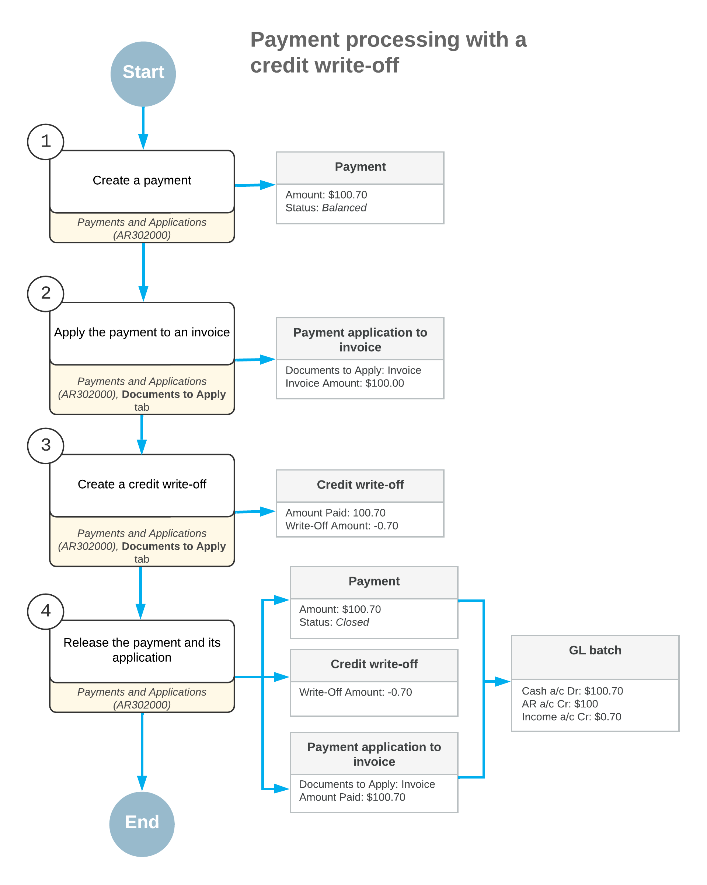
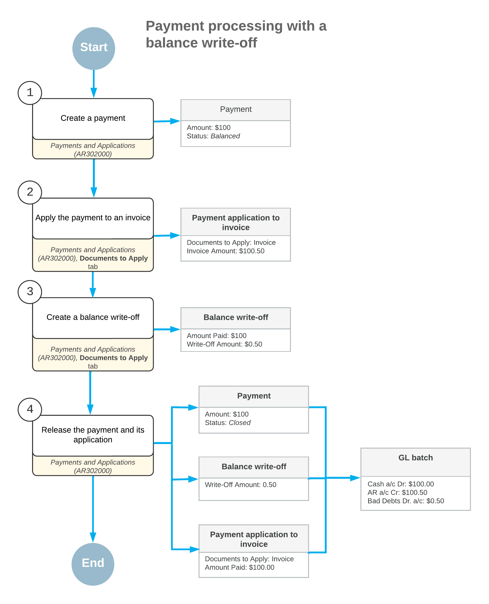

# Payments with Write-Offs: General Information {#_4efa3fc7-ff24-46df-82fc-037408a7f1d6 .concept}

In Acumatica ERP, when you receive a customer payment, you enter the payment by using the [Payments and Applications](AR_30_20_00.md) \(AR302000\) form. In the payment, you specify the customer from which you have received the payment, the cash account to which the payment amount should be recorded, the payment amount, and the payment method. The payment method denotes the actual means of payment: cash, printed check, or wire transfer. You can then apply the payment you created to an invoice \(or multiple invoices\) of the customer.

## Learning Objectives {#section_rq2_hjv_vxb .section}

From reading the topics in this chapter and completing the process activity, you will learn how to do the following:

-   Create a credit write-off as you are processing a customer payment applied to multiple documents
-   Create a balance write-off as you are processing a customer payment applied to an invoice

## Applicable Scenarios {#section_uq2_hjv_vxb .section}

You can manually create a payment in the system if you have received a payment from a customer and want to apply it to an outstanding invoice of this customer \(or multiple invoices\).

When processing a payment from a customer, you can create the following types of write-offs, if needed:

-   Credit write-off: If the payment amount slightly exceeds the amount of the invoice being paid and you need to close both documents. \(This scenario is described in [Payments with Write-Offs: To Create a Payment with a Credit Write-Off](Finance_ProcessingCustomerPayment_Process_Activity.md).\)
-   Balance write-off: To write off some amount along with the payment application. \(This scenario is described in [Payments with Write-Offs: To Create a Payment with a Balance Write-Off](Finance_ProcessingCustomerPayment_Activity_Balance_WO.md).\)

## Workflow of Creating a Payment with a Credit Write-Off {#section_xq2_hjv_vxb .section}

If the payment amount is greater than the invoice amount, you can create small credit write-offs directly on the [Payments and Applications](AR_30_20_00.md) \(AR302000\) form. To do this, when creating a payment for an invoice, on the **Documents to Apply** tab, you enter a negative amount in the **Write-Off Amount \(Payment currency\)** column and select the credit write-off reason code in the **Write-Off Reason Code** column.

You can also enter negative write-offs on the **Applications** tab of the [Invoices and Memos](AR_30_10_00.md) \(AR301000\) and [Invoices](SO_30_30_00.md) \(SO303000\) forms.

The following diagram illustrates the process of creating a payment with a credit write-off.

## Workflow of Creating a Payment with a Balance Write-Off { .section}

If the payment amount is less than the invoice amount, you can create small balance write-offs directly on the [Payments and Applications](AR_30_20_00.md) \(AR302000\) form. To do this, when creating a payment for an invoice, on the **Documents to Apply** tab, you enter a positive amount in the **Write-Off Amount \(Payment currency\)** column and select the balance write-off reason code in the **Write-Off Reason Code** column.

You can also enter positive write-offs on the **Applications** tab of the [Payments and Applications](AR_30_20_00.md) \(AR302000\) form.

The following diagram illustrates the process of creating a payment with a balance write-off.

## Voiding of Write-Offs { .section}

You can void a balance write-off that was applied to an invoice, debit memo, or overdue charge. To do this, you perform the following instructions:

1.  On the [Payments and Applications](AR_30_20_00.md) \(AR302000\) form, you open the needed *Balance WO* document.
2.  You click **Void** on the form toolbar.

    The system generates a reversed application record and displays it on the **Documents to Apply** tab.

3.  You click **Release** on the form toolbar to release the reversed application.

    After you release the reversal, the system assigns the balance write-off the *Voided* status and opens the document to which it has been applied. Also, the system generates a transaction in the general ledger, which reverses the entries posted by the balance write-off.

You can void a credit write-off that was applied to a payment, prepayment, or credit memo. To do this, you perform the following instructions:

1.  On the [Invoices and Memos](AR_30_10_00.md) \(AR301000\) form, you open the document to which the credit write-off has been applied.
2.  On the **Application History** tab, where the needed application to the *Credit WO* document is shown, you click **Reverse Application** on the table toolbar.

    The system generates a reversed application record and displays it on the **Documents to Apply** tab.

3.  On the form toolbar, you click **Release** to release the reversal.

    The system assigns the credit write-off the *Voided* status and opens the document to which it has been applied. Also, the system generates a transaction in the general ledger, which reverses the entries posted by the credit write-off.

**Parent topic:**[Processing Payments with Write-Offs](../UserGuide/Finance_ProcessingCustomerPayment_Mapref.md)

