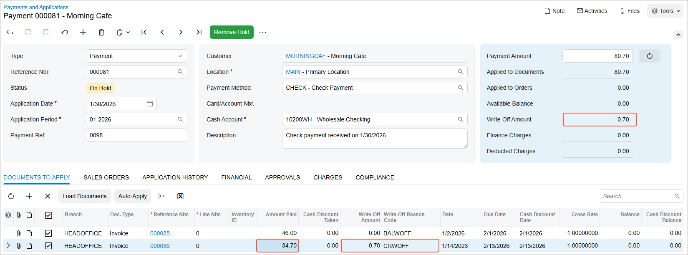

# Payments with Write-Offs: To Create a Payment with a Credit Write-Off {#_71a55d65-5fc0-4e53-8535-ca51fab789a1 .task}

In this activity, you will learn how to create a payment, apply it to multiple invoices, and create a credit write-off.

**Attention:** This activity is based on the *U100* dataset. If you are using another dataset or if any system settings have been changed in *U100*, these changes can affect the workflow of the activity and the results of the processing. To avoid issues, restore the *U100* dataset to its initial state.

## Story {#section_mv2_hjv_vxb .section}

Suppose that on January 30, 2026, the SweetLife Fruits &amp; Jams company received a check for $80.70 from one of its customers, Morning Cafe.

Acting as a SweetLife accountant, you need to create the payment in the system and apply it to two outstanding invoices of this customer, which have a total amount of $80. As you are processing the payment, you need to create a credit write-off for the remaining payment balance of $0.70 and apply it to one of the invoices.

## Configuration Overview {#section_tz4_djx_cnb .section}

In the *U100* dataset, the following tasks have been performed to support this activity:

-   On the [Reason Codes](CS_21_10_00.md) \(CS211000\) form, a reason code for credit write-offs has been created.
-   On the [Customers](AR_30_30_00.md) \(AR303000\) form, the *MORNINGCAF* customer has been created. For the customer, the **Enable Write-Offs** check box has been selected on the **Financial** tab of the [Customers](AR_30_30_00.md) form.
-   On the [Invoices and Memos](AR_30_10_00.md) \(AR301000\) form, the $46 and $34 invoices that will be paid in the activity have been created for the customer.

## Process Overview {#section_pv2_hjv_vxb .section}

To process the customer payment, you create a payment document on the [Payments and Applications](AR_30_20_00.md) \(AR302000\) form, and then apply the payment to two of the customer's invoices. While applying one of the invoices to the payment, you enter a credit write-off in the row for this invoice on the **Documents to Apply** tab. You then release the payment and its applications and review the GL transaction generated by the system on the [Journal Transactions](GL_30_10_00.md) \(GL301000\) form.

## System Preparation {#section_rv2_hjv_vxb .section}

To prepare the system for the processing of the customer payment, do the following:

1.  Launch the Acumatica ERP website, and sign in to a company with the *U100* dataset preloaded. To sign in as an accountant, use the following credentials:
    -   Username: *johnson*
    -   Password: *123*
2.  In the info area, in the upper-right corner of the top pane of the Acumatica ERP screen, make sure that the business date in your system is set to *1/30/2026*. If a different date is displayed, click the Business Date menu button and select *1/30/2026*. For simplicity, in this exercise, you will create and process all documents in the system on this business date.
3.  On the Company and Branch Selection menu, also on the top pane of the Acumatica ERP screen, make sure that the *SweetLife Head Office and Wholesale Center* branch is selected. If it is not selected, click the Company and Branch Selection menu to view the list of branches that you have access to, and then click *SweetLife Head Office and Wholesale Center*.

## Step 1: Entering a Payment {#section_tv2_hjv_vxb .section}

To enter a payment, do the following:

1.  On the [Payments and Applications](AR_30_20_00.md) \(AR302000\) form, add a new record.
2.  In the Summary area, specify the following settings:
    -   **Type**: *Payment*
    -   **Customer**: *MORNINGCAF*
    -   **Application Date**: *1/30/2026* \(inserted by default\)
    -   **Application Period**: *01-2026* \(inserted by default\)
    -   **Payment Amount**: `80.70`
    -   **Description**: `Check payment received on 1/30/2026`

## Step 2: Applying the Payment to Multiple Invoices and Creating a Credit Write-Off {#section_vv2_hjv_vxb .section}

To apply the payment to two of the customer's invoices and create a credit write-off, do the following:

1.  While you are still on the [Payments and Applications](AR_30_20_00.md) \(AR302000\) form viewing the payment you have created, in the table on the **Documents to Apply** tab, review the customer's invoices, which the system has loaded automatically.
2.  Click the Included check box for the two rows in the table, which correspond to a $46 invoice and a $34 invoice. Notice that the **Applied to Documents** box in the Summary area now displays *80.00* and the **Available Balance** box displays *0.70*.
3.  On the **Documents to Apply** tab, in the row of the $34 invoice, specify the following settings \(also shown in the screenshot below\):
    -   **Write-Off Amount \(USD\)**: `-0.70`
    -   **Write-Off Reason Code**: *CRWOFF*
    -   **Amount Paid \(USD\)**: `34.70`
4.  On the form toolbar, click **Save** to save your changes. The saved payment is illustrated in the following screenshot.

    

5.  Review the Summary area of the form. The **Applied to Documents** box now displays *80.70*, the **Write-Off Amount** box displays *-0.70*, and the **Available Balance** box displays *0.00*.

## Step 3: Releasing the Payment and Its Applications {#section_xv2_hjv_vxb .section}

To release the payment and its applications to the invoices, do the following:

1.  While you are still on the [Payments and Applications](AR_30_20_00.md) \(AR302000\) form viewing the payment you have created, click **Remove Hold** on the form toolbar to give the payment the *Balanced* status.
2.  On the form toolbar, click **Release** to release the payment and its applications.

    Notice that the payment now has the *Closed* status.

3.  On the **Application History** tab, review the rows that the system has added, and click the link in the **Batch Number** column in any row.

    The system opens the [Journal Transactions](GL_30_10_00.md) \(GL301000\) form with the GL transaction generated after the release of the payment and its applications.

**Parent topic:**[Processing Payments with Write-Offs](../UserGuide/Finance_ProcessingCustomerPayment_Mapref.md)

