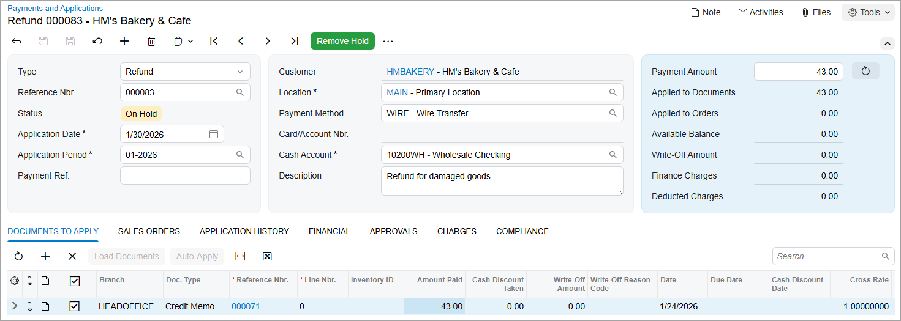

# Refunds: To Create a Refund and Apply a Credit Memo to It {#_90d571d6-946c-4a2e-9927-2438b8f65a38 .task}

In this activity, you will learn how to create a refund and apply a credit memo in full to it.

**Attention:** This activity is based on the *U100* dataset. If you are using another dataset or if any system settings have been changed in *U100*, these changes can affect the workflow of the activity and the results of the processing. To avoid issues, restore the *U100* dataset to its initial state.

## Story {#section_prp_4jv_vxb .section}

Suppose that in January, HM’s Bakery &amp; Cafe \(*HMBAKERY*\) bought twelve jars of apple jam from the SweetLife Fruits &amp; Jams company for a total amount of $258 and returned two damaged jars. One of the SweetLife accountants has already created a credit memo in the system for the amount of the damaged goods \($43\).

Acting as the chief accountant of SweetLife, you need to create a refund for this credit memo.

## Configuration Overview {#section_srp_4jv_vxb .section}

For the purposes of this activity, the following features have been enabled on the [Enable/Disable Features](CS_10_00_00.md) \(CS100000\) form:

-   *Standard Financials*, which provides the standard financial functionality
-   *Multibranch Support*, which supports multiple branches in your instance of Acumatica ERP
-   *Multicompany Support*, which supports multiple companies within one tenant.

On the [Accounts Receivable Preferences](AR_10_10_00.md) \(AR101000\) form, the **Hold Documents on Entry** check box has been selected in the **Data Entry Settings** section.

On the [Customers](AR_30_30_00.md) \(AR303000\) form, the *HMBAKERY \(HM’s Bakery &amp; Cafe\)* customer has been defined.

## Process Overview {#section_wrp_4jv_vxb .section}

In this process activity, on the [Payments and Applications](AR_30_20_00.md) \(AR302000\) form, you will create a refund for which a credit memo has already been created. On the **Documents to Apply** tab of the form, you will select the credit memo for which the refund is being issued and apply it in full to the refund. Finally, you will release the refund and the application.

## System Preparation {#section_yrp_4jv_vxb .section}

Before you perform the steps of this lesson, do the following:

1.  Launch the Acumatica ERP website, and sign in as an accountant by using the following credentials:
    -   Username: *johnson*
    -   Password: *123*
2.  In the info area, in the upper-right corner of the top pane of the Acumatica ERP screen, make sure that the business date in your system is set to *1/30/2026*. If a different date is displayed, click the Business Date menu button and select *1/30/2026*. For simplicity, in this activity, you will create and process all documents in the system on this business date.
3.  On the Company and Branch Selection menu, also on the top pane of the Acumatica ERP screen, make sure that the *SweetLife Head Office and Wholesale Center* branch is selected. If it is not selected, click the Company and Branch Selection menu button to view the list of branches that you have access to, and then click *SweetLife Head Office and Wholesale Center*.

## Step 1: Creating the Refund {#section_asp_4jv_vxb .section}

To create the refund, do the following:

1.  Open the [Payments and Applications](AR_30_20_00.md) \(AR302000\) form.

    **Tip:** To open the form for creating a new record, type the form ID in the Search box, and on the Search form, point at the form title and click **New** right of the title.

2.  On the form toolbar, click **Add New Record**, and specify the following settings in the Summary area:
    -   **Type**: *Refund*
    -   **Customer**: *HMBAKERY*
    -   **Payment Method**: *WIRE*
    -   **Cash Account**: *10200WH \(Wholesale Checking\)*
    -   **Application Date**: *1/30/2026* \(inserted by default\)
    -   **Description**: `Refund for damaged goods`
3.  On the form toolbar, click **Save**.

## Step 2: Applying a Credit Memo to the Refund in Full {#section_dsp_4jv_vxb .section}

To apply a credit memo to the refund in full, do the following:

1.  While you are still on the [Payments and Applications](AR_30_20_00.md) \(AR302000\) form with the refund opened, on the **Documents to Apply** tab, click **Add Row**, and specify the following settings in the added row:
    -   **Doc. Type**: *Credit Memo*
    -   **Reference Nbr.**: The number corresponding to the existing credit memo in the amount of $43
    -   **Amount Paid \(USD\)**: *43* \(filled in automatically\)
2.  In the Summary area, click the Refresh button right of the **Payment Amount** box.

    Notice that the **Amount Paid \(USD\)** amount from the credit memo has been inserted as the payment amount for the refund.

3.  On the form toolbar, click **Save** to save the refund, which is shown in the following screenshot.

    

## Step 3: Releasing the Refund and its Application {#section_gsp_4jv_vxb .section}

To release the refund and its application, do the following:

1.  While you are still viewing the refund on the [Payments and Applications](AR_30_20_00.md) \(AR302000\) form, on the form toolbar, click **Remove Hold** and then click **Release**.
2.  On the **Application History** tab, click the link in the **Batch Number** column to review the created batch on the [Journal Transactions](GL_30_10_00.md) \(GL301000\) form.

**Parent topic:**[Processing Refunds](../UserGuide/Finance_ProcessingCustomerRefunds_Mapref.md)

