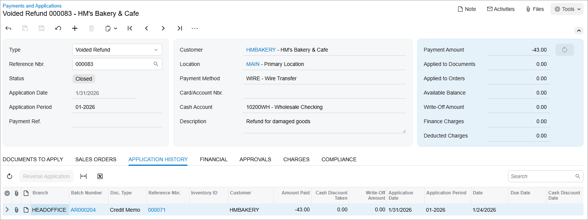

# Refunds: To Void a Refund {#_fcb72320-53ec-43be-a0ba-7c7e7054aef4 .task}

In this activity, you will learn how to void a refund.

## Story {#section_vsp_4jv_vxb .section}

Suppose that a refund for HM’s Bakery &amp; Cafe \(*HMBAKERY*\) that you created in the previous activity has to be voided \(because the date is incorrect\) so that a new refund can be created.

Acting as the chief accountant of SweetLife, you need to void the refund.

## Configuration Overview {#section_ysp_4jv_vxb .section}

For the purposes of this activity, the following features have been enabled on the [Enable/Disable Features](CS_10_00_00.md) \(CS100000\) form:

-   *Standard Financials*, which provides the standard financial functionality
-   *Multibranch Support*, which supports multiple branches in your instance of Acumatica ERP
-   *Multicompany Support*, which supports multiple companies within one tenant.

On the [Accounts Receivable Preferences](AR_10_10_00.md) \(AR101000\) form, the **Hold Documents on Entry** check box has been selected in the **Data Entry Settings** section.

On the [Customers](AR_30_30_00.md) \(AR303000\) form, the *HMBAKERY \(HM’s Bakery &amp; Cafe\)* customer has been defined.

## Process Overview {#section_ctp_4jv_vxb .section}

In this activity, you will void a refund on the [Payments and Applications](AR_30_20_00.md) \(AR302000\) form, and review the document that the system creates.

**Tip:** In a production environment, you would first make sure that the needed refund has been created in the system, as described in [Refunds: To Create a Refund and Apply a Credit Memo to It](Finance_ProcessingCustomerRefunds_Activity1.md).

## System Preparation {#section_ftp_4jv_vxb .section}

Before you perform the steps of this lesson, do the following:

1.  Launch the Acumatica ERP website, and sign in as an accountant by using the following credentials:
    -   Username: *johnson*
    -   Password: *123*
2.  In the info area, in the upper-right corner of the top pane of the Acumatica ERP screen, make sure that the business date in your system is set to *1/30/2026*. If a different date is displayed, click the Business Date menu button and select *1/30/2026*. For simplicity, in this activity, you will create and process all documents in the system on this business date.
3.  On the Company and Branch Selection menu, also on the top pane of the Acumatica ERP screen, make sure that the *SweetLife Head Office and Wholesale Center* branch is selected. If it is not selected, click the Company and Branch Selection menu button to view the list of branches that you have access to, and then click *SweetLife Head Office and Wholesale Center*.
4.  Make sure that you have created a refund as described in [Refunds: To Create a Refund and Apply a Credit Memo to It](Finance_ProcessingCustomerRefunds_Activity1.md).

## Step 1: Voiding the Refund {#section_htp_4jv_vxb .section}

To void the refund with the incorrect date, do the following:

1.  Open the [Payments and Applications](AR_30_20_00.md) \(AR302000\) form.
2.  In the **Type** box of the Summary area, select *Refund*.
3.  In the **Reference Nbr.** box, select the reference number of the refund that you need to void \(the refund you created in the [Refunds: To Create a Refund and Apply a Credit Memo to It](Finance_ProcessingCustomerRefunds_Activity1.md) activity\).
4.  On the form toolbar, click **Void**.

    The system does the following:

    -   Reverses the refund in full.
    -   Changes the status of the refund to *Voided*. \(The original refund is not shown on the form.\)
    -   Creates a document with the *Voided Refund* type that has the same reference number as the refund has. \(You will use this document in the remaining instructions of this activity.\)
5.  In the **Application Date** box of the Summary area, change the date of the voided refund to *1/31/2026*.

    The date specified in this box should be the date when the voided refund is released \(**Payment Date**\) and when the related batch was created \(**Transaction Date**\).

## Step 2: Releasing the Voided Refund {#section_ltp_4jv_vxb .section}

To release the voided refund, do the following:

1.  On the form toolbar, click **Remove Hold**.
2.  On the form toolbar, click **Release**. The following screenshot shows the released voided refund.

    

**Parent topic:**[Processing Refunds](../UserGuide/Finance_ProcessingCustomerRefunds_Mapref.md)

