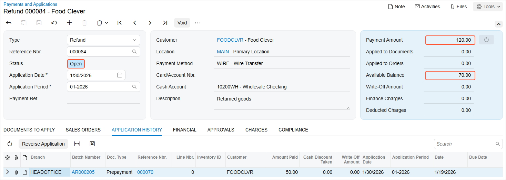

# Refunds: To Create and Partially Apply a Refund {#_ebc17e9f-20bc-4791-b2b6-8993d5b70e1c .task}

The following activity will walk you through the process of creating a refund and partially applying it to a prepayment.

**Attention:** This activity is based on the *U100* dataset. If you are using another dataset or if any system settings have been changed in *U100*, these changes can affect the workflow of the activity and the results of the processing. To avoid issues, restore the *U100* dataset to its initial state.

## Story {#section_ytp_4jv_vxb .section}

Suppose that in January 2026, one of the customers of SweetLife Fruits &amp; Jams, Food Clever, returned goods for the amount of $70. A credit memo has not been processed in the system yet, but SweetLife needs to refund the money. \(Later, when a credit memo for this amount is created, this refund can be applied to this credit memo.\) Also, the company had made a prepayment of $400 for services, but the overpaid amount of $50 needs to be refunded as well.

Acting as a SweetLife accountant, you need to create and release a refund for $120, and apply $50 of this refund to the $400 prepayment.

## Configuration Overview {#section_tz4_djx_cnb .section}

In the *U100* dataset, the following configuration tasks have been performed to prepare the system for this activity to be performed:

-   On the [Accounts Receivable Preferences](AR_10_10_00.md) \(AR101000\) form, the **Hold Documents on Entry** check box has been selected in the **Data Entry Settings** section.
-   On the [Customers](AR_30_30_00.md) \(AR303000\) form, the *FOODCLVR \(Food Clever\)* customer has been defined.
-   On the [Payments and Applications](AR_30_20_00.md) \(AR302000\) form, a $400 prepayment for the Food Clever customer has been created.

## Process Overview {#section_c5p_4jv_vxb .section}

In this activity, on the [Payments and Applications](AR_30_20_00.md) \(AR302000\) form, you will create and release a refund. On the **Documents to Apply** tab, you will apply a part of this refund to the customer's prepayment and will release the application.

Finally, on the [Journal Transactions](GL_30_10_00.md) \(GL301000\) form, you will review the GL transactions generated by the system on release of the refund and its application.

## System Preparation {#section_f5p_4jv_vxb .section}

To prepare the system, do the following:

1.  Launch the Acumatica ERP website, and sign in to a company with the *U100* dataset preloaded. You should sign in as an accountant by using the *johnson* username and the *123* password.
2.  In the info area at the upper-right corner of the top pane of the Acumatica ERP screen, make sure that the business date is set to *1/30/2026*. If a different date is displayed, click the Business Date menu button and select *1/30/2026* from the calendar. For simplicity, you'll create and process all documents in this activity using this business date.
3.  On the Company and Branch Selection menu, on the top pane of the Acumatica ERP screen, select the *SweetLife Head Office and Wholesale Center* branch.

## Step 1: Creating and Releasing a Refund {#section_h5p_4jv_vxb .section}

To create and release a refund, do the following:

1.  Open the [Payments and Applications](AR_30_20_00.md) \(AR302000\) form.

    **Tip:** To open the form for creating a new record, type the form ID in the Search box, and on the Search form, point at the form title and click **New** right of the title.

2.  On the form toolbar, click **Add New Record**, and specify the following settings in the Summary area:
    -   **Type**: *Refund*
    -   **Customer**: *FOODCLVR*
    -   **Payment Method**: *WIRE*
    -   **Cash Account**: *10200WH \(Wholesale Checking\)*
    -   **Application Date**: *1/30/2026* \(inserted by default\)
    -   **Description**: `Returned goods`
    -   **Payment Amount**: `120`
3.  On the form toolbar, click **Save**.
4.  On the form toolbar, click **Remove Hold** to give the refund the *Balanced* status.
5.  On the form toolbar, click **Release** to release the refund.

    In the Summary area, notice that the status of the refund is *Open* and the available balance is *120*, which means that the refund can be applied to documents.

## Step 2: Applying the Refund to a Prepayment and Releasing the Application {#section_l5p_4jv_vxb .section}

To apply the open refund to a prepayment and release the application, do the following:

1.  While you are still on the [Payments and Applications](AR_30_20_00.md) \(AR302000\) form with the refund opened, on the **Documents to Apply** tab, click **Add Row**.
2.  In the added row, specify the following settings:
    -   **Doc. Type**: *Prepayment*
    -   **Reference Nbr.**: The number of the prepayment with the amount of $400 for the *FOODCLVR* customer.
    -   **Amount Paid \(USD\)**: *50* \(inserted automatically\)
3.  On the form toolbar, click **Save**.
4.  On the form toolbar, click **Release** to release the application.

    In the Summary area, notice that the refund retains the *Open* status and the available balance of the refund is *70*, as shown in the following screenshot.

    

## Step 3: Reviewing the GL Transactions Generated by the System {#section_s5p_4jv_vxb .section}

To review the GL transactions generated by the system on release of the refund and its application to the prepayment, do the following:

1.  While you are still on the [Payments and Applications](AR_30_20_00.md) \(AR302000\) form with the refund opened, open the **Financial** tab.
2.  Click the link in the **Batch Nbr.** box to open the GL transaction generated on release of the refund.
3.  On the [Journal Transactions](GL_30_10_00.md) \(GL301000\) form, review the GL transaction.

    The *10200 \(Company Checking\)* account has been credited in the amount of the refund \($120\), meaning that the balance of the company's checking account has been decreased. The *11000 \(Accounts Receivable\)* account has been debited in the amount of the refund, meaning that the balance of the company's AR account has been decreased.

4.  On the [Payments and Applications](AR_30_20_00.md) form, open the **Application History** tab.
5.  Click the link in the **Batch Number** column to open the GL transaction generated on release of the refund's application to the prepayment.
6.  On the [Journal Transactions](GL_30_10_00.md) form, review the GL transaction.

    The *11000 \(Accounts Receivable\)* account has been credited in the amount of the unused part of the prepayment \($50\). The *22100 \(Customer Deposit\)* account has been debited in the same amount.

**Parent topic:**[Processing Refunds](../UserGuide/Finance_ProcessingCustomerRefunds_Mapref.md)

