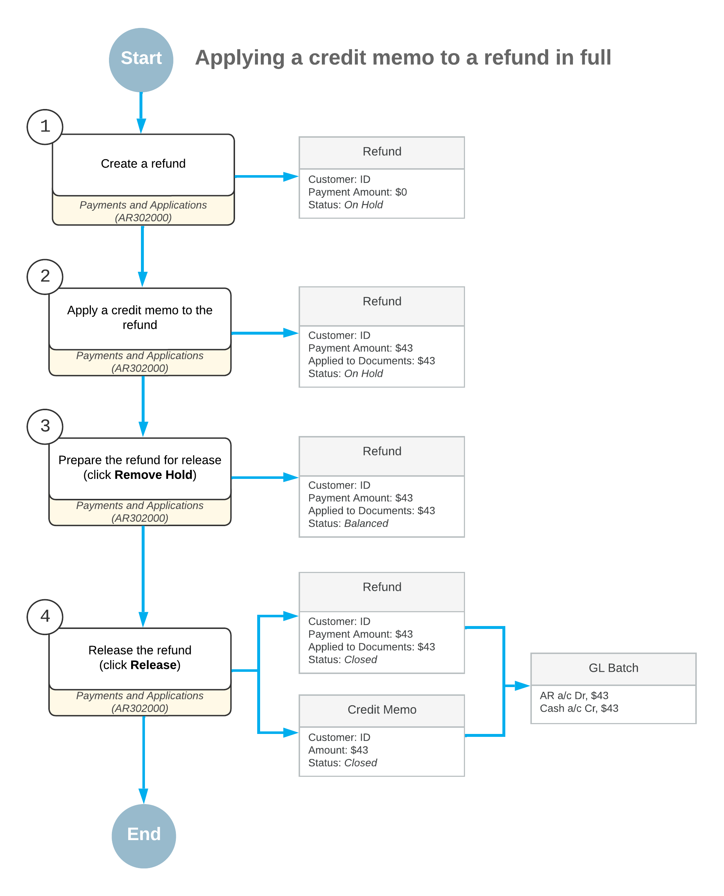
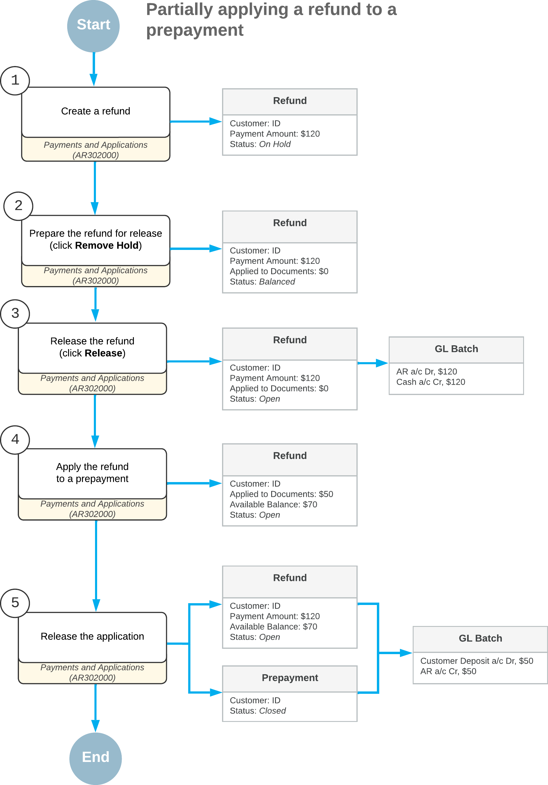

# Refunds: General Information {#_787e1440-10f0-448b-8cff-8f92c07141d1 .concept}

In this topic, you will learn how to process AR documents with the *Refund* type.

## Learning Objectives {#section_bnp_4jv_vxb .section}

In this chapter, you will learn how to do the following:

-   Create a refund and fully apply a credit memo to it
-   Void a refund
-   Create a refund and partially apply a prepayment to the refund

## Applicable Scenarios {#section_fnp_4jv_vxb .section}

Refunds can be created in the following cases:

-   To record a refund to the customer for returned goods \(this scenario is described in [Refunds: To Create a Refund and Apply a Credit Memo to It](Finance_ProcessingCustomerRefunds_Activity1.md)\)
-   To record an overpaid amount
-   To record an unused amount of a prepayment \(this scenario is described in [Refunds: To Create and Partially Apply a Refund](Finance_ProcessingCustomerRefunds_Activity3.md)\)

Refunds can be voided if errors have been made or if the refunds are otherwise invalid. Voiding a refund reverses the original refund transactions. You can use the [Payments and Applications](AR_30_20_00.md) \(AR302000\) form to void a refund that has been applied to customer payments, prepayments, credit memos, invoices, debit memos, and overdue charges.

## Creation of a Refund {#section_inp_4jv_vxb .section}

To create and process a refund, you use the [Payments and Applications](AR_30_20_00.md) \(AR302000\) form. Alternatively, you can use the [Invoices and Memos](AR_30_10_00.md) \(AR301000\) form, where you can select a credit memo and then click **Refund** \(under **Processing**\) on the More menu.

When you are recording a refund, you can apply its available balance fully or partially to an open payment, prepayment, credit memo, or sales order—or to multiple documents of these types—before or after you release the refund. For step-by-step instructions, see [Refunds: To Create a Refund and Apply a Credit Memo to It](Finance_ProcessingCustomerRefunds_Activity1.md). To perform a refund for a closed payment document, first reverse the applications of the payment document, and then create a refund for the payment document.

## Release of a Refund {#section_lnp_4jv_vxb .section}

On the [Payments and Applications](AR_30_20_00.md) \(AR302000\) form, you can create and release a document with the *Refund* type without applying it to another document. When the refund is released, its status is changed to *Open*, the refund has an open balance \(that is, the **Available Balance** box shows a nonzero amount\), and the refund can be applied to a payment, prepayment, or credit memo on the **Documents to Apply** tab.

If you release a refund that is fully applied to a document, the status of the refund is changed to *Closed* because its amount was fully applied. The balances of refunds with the *Refund* and *Voided Refund* types affect the customer’s balance as a payment with a reverse sign.

When you release a refund to which documents have been applied, the system does the following:

-   Releases the application records.
-   Decreases the balances of the paid documents. If the balance of a paid document becomes zero, the system changes its status to *Closed*.
-   Increases the customer's balance by the refund amount if the refund is applied to a document of the *Payment* or *Credit Memo* type.
-   Decreases the customer's prepayment balance by the refund amount if the refund is applied to a payment document of the *Prepayment* type.
-   Generates a GL batch to update the involved asset accounts.

## Application of a Refund {#section_pnp_4jv_vxb .section}

Customer refunds often involve a combination of invoices and credits, especially when customers have been over-credited. On the **Documents to Apply** tab of the [Payments and Applications](AR_30_20_00.md) \(AR302000\) form, you can apply customer refunds to documents of the following types: *Invoice*, *Debit Memo*, *Overdue Charge*, *Credit Memo*, *Payment*, and *Prepayment*.

The system calculates the application amount as follows.

``` {#codeblock_ebx_5g2_13c}
Applied to Documents = Amount Paid (Credit Memo) + Amount Paid (Prepayment) + Amount Paid (Payment) - Amount Paid (Invoice) - Amount Paid (Debit Memo) - Amount Paid (Overdue Charge)
```

This calculation allows you to fully settle a customer’s open documents—even when credit memos exceed invoice totals—without breaking the process into multiple transactions.

When you’re working with parent and child customer accounts, you can apply refunds created at the parent level to documents from associated child accounts. This capability simplifies centralized settlement for organizations with complex customer structures.

On the [Invoices and Memos](AR_30_10_00.md) \(AR301000\) form, a refund with the *Open* status can be applied to a credit memo if the credit memo has not been released. Regardless of the status of the credit memo and the refunds applied to it, all applications of documents to this credit memo are displayed on the **Applications** tab. For details, see [AR Invoice Correction: To Create a Credit Memo and Apply a Refund to It](Finance_CorrectingARInvoices_Process_Activity3.md).

## Correction of a Refund {#section_snp_4jv_vxb .section}

You can correct a released refund by voiding it and recording the correct refund. For step-by-step instructions, see [Refunds: To Void a Refund](Finance_ProcessingCustomerRefunds_Activity2.md).

You void the refund on the [Payments and Applications](AR_30_20_00.md) \(AR302000\) form by selecting the needed document of the *Refund* type and then clicking **Void** on the form toolbar. The system creates a document of the *Voided Refund* type with the same reference number as the refund has, and reverses the original refund.

Before you release the voided refund, you can change the date of the voided refund in the **Application Date** box in the Summary area of the form. The date you specify in this box should be the date when the voided refund is released and when the related batch was created. You can also enter a description of the voided refund in the **Description** box of the Summary area of the [Payments and Applications](AR_30_20_00.md) form.

On release of the voided refund, the system changes the status of the refund to *Voided* and the status of the voided refund to *Closed*. On the **Application History** tab, you can see the original document to which the refund has been applied with a negative amount in the **Amount Paid \(Payment currency\)** column.

If the original document for which the refund has been applied has the *Closed* status, when the refund is voided, the system changes the document’s status to *Open*. You can again apply documents to the original document.

## Workflow of Processing Refunds {#section_ynp_4jv_vxb .section}

The following diagram illustrates the workflow of creating a refund and fully applying a credit memo to it. \(This process is described in [Refunds: To Create a Refund and Apply a Credit Memo to It](Finance_ProcessingCustomerRefunds_Activity1.md).\)



The following diagram illustrates the workflow of creating a refund and partially applying it to a prepayment. \(This process is described in [Refunds: To Create and Partially Apply a Refund](Finance_ProcessingCustomerRefunds_Activity3.md).\)



**Parent topic:**[Processing Refunds](../UserGuide/Finance_ProcessingCustomerRefunds_Mapref.md)

