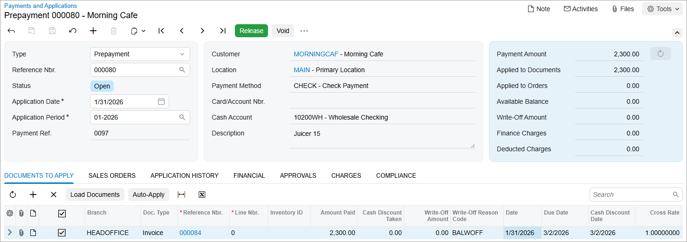

# Invoice Prepayments: To Process a Prepayment {#_d169f522-d6eb-48d0-a2d5-2a789d1e0054 .task}

In this activity, you will learn how to create a prepayment and apply it to an invoice.

**Attention:** This activity is based on the *U100* dataset. If you are using another dataset or if any system settings have been changed in *U100*, these changes can affect the workflow of the activity and the results of the processing. To avoid issues, restore the *U100* dataset to its initial state.

## Story {#section_uhp_4jv_vxb .section}

Suppose that the SweetLife Fruits &amp; Jams company received a prepayment of $2,300 from one of its customers, Morning Cafe \(*MORNINGCAF*\) on January 12, 2026. On January 31, SweetLife sold a juicer to Morning Cafe and an invoice for $2,300 was entered in the system.

Acting as a SweetLife accountant, you need to create and release a prepayment, and later, apply this prepayment to the customer's invoice, and then release the prepayment application.

## Configuration Overview {#section_xhp_4jv_vxb .section}

For the purposes of this activity, the following features have been enabled on the [Enable/Disable Features](CS_10_00_00.md) \(CS100000\) form:

-   *Standard Financials*, which provides the standard financial functionality
-   *Multibranch Support*, which supports multiple branches in your instance of Acumatica ERP
-   *Multicompany Support*, which supports multiple companies within one tenant.

On the [Accounts Receivable Preferences](AR_10_10_00.md) \(AR101000\) form, the **Hold Documents on Entry** check box has been selected in the **Data Entry Settings** section.

On the [Customers](AR_30_30_00.md) \(AR303000\) form, the *MORNINGCAF \(Morning Cafe\)* customer has been defined.

## Process Overview {#section_b3p_4jv_vxb .section}

On the [Payments and Applications](AR_30_20_00.md) \(AR302000\) form, you will create and release a prepayment for the needed customer. You will review the generated GL transaction on the [Journal Transactions](GL_30_10_00.md) \(GL301000\) form. You will then apply the prepayment manually to the customer's invoice and release the prepayment application. Finally, on the [Journal Transactions](GL_30_10_00.md) form, you will review the transaction generated on release of the prepayment application.

## System Preparation {#section_d3p_4jv_vxb .section}

To prepare the system, do the following:

1.  Launch the Acumatica ERP website, and sign in to a company with the *U100* dataset preloaded. To sign in as an accountant, use the following credentials:
    -   Username: *johnson*
    -   Password: *123*
2.  In the info area, in the upper-right corner of the top pane of the Acumatica ERP screen, make sure that the business date in your system is set to *1/12/2026*. If a different date is displayed, click the Business Date menu button and select *1/12/2026*.
3.  On the Company and Branch Selection menu, also on the top pane of the Acumatica ERP screen, make sure that the *SweetLife Head Office and Wholesale Center* branch is selected. If it is not selected, click the Company and Branch Selection menu to view the list of branches that you have access to, and then click *SweetLife Head Office and Wholesale Center*.

## Step 1: Creating and Releasing a Prepayment {#section_f3p_4jv_vxb .section}

To create and release a prepayment, do the following:

1.  Open the [Payments and Applications](AR_30_20_00.md) \(AR302000\) form.

    **Tip:** To open the form for creating a new record, type the form ID in the Search box, and on the Search form, point at the form title and click **New** right of the title.

2.  On the form toolbar, click **Add New Record**, and specify the following settings in the Summary area:

    -   **Type**: *Prepayment*
    -   **Customer**: *MORNINGCAF*
    -   **Application Date**: *1/12/2026* \(inserted by default\)
    -   **Payment Amount**: `2300`
    -   **Description**: `Juicer 15`
    When you create a new prepayment on the current form, as soon as you select the customer in the Summary area, the system forms the list of the customer's outstanding documents on the **Documents to Apply** tab. The system loads only open documents of the *Invoice*, *Debit Memo*, *Credit Memo*, and *Overdue Charge* type that do not have unreleased applications.

3.  On the form toolbar, click **Remove Hold** and then click **Release** to release the prepayment.
4.  On the **Financial** tab, click the link in the **Batch Nbr.** box.
5.  On the [Journal Transactions](GL_30_10_00.md) \(GL301000\) form, which is opened, review the transaction that has been generated on the release of the prepayment.

    The *10200* cash account specified for the prepayment has been debited with $2,300, while the *22100 \(Customer Deposit\)* account specified for the customer as the prepayment account has been credited in the same amount.

## Step 2: Applying the Prepayment to an Invoice {#section_k3p_4jv_vxb .section}

To apply the prepayment to an invoice, do the following:

1.  In the info area, click the Business Date menu button and select *1/31/2026*.
2.  While you are still on the [Payments and Applications](AR_30_20_00.md) \(AR302000\) form with the prepayment opened, on the **Documents to Apply** tab, click **Add Row** on the table toolbar.
3.  Specify the following settings in the added row:

    -   **Doc. Type**: *Invoice*
    -   **Reference Nbr.**: The invoice dated *1/31/2026* for the amount of $2,300
    -   **Amount Paid \(USD\)**: *2300* \(inserted automatically by the system\)
    Notice that the system has automatically selected the unlabeled check box for the added row.

    **Tip:** Alternatively, you can click **Load Documents** on the table toolbar; in the **Load Options** dialog box, which opens, you select the needed settings to load multiple documents and click **Load**.

4.  On the form toolbar, click **Save** to save the changes.

    The released prepayment applied to the invoice is shown in the following screenshot.

    

## Step 3: Releasing the Prepayment Application {#section_p3p_4jv_vxb .section}

To release the prepayment application to the invoice, do the following:

1.  While you are still on the [Payments and Applications](AR_30_20_00.md) \(AR302000\) form, click **Release** on the form toolbar.
2.  On the **Application History** tab, click the link in the **Batch Number** column.
3.  On the [Journal Transactions](GL_30_10_00.md) \(GL301000\) form, which is opened, review the transaction that has been generated on the release of the prepayment application.

    The *22100 \(Customer Deposit\)* account specified for the customer as the prepayment account has been debited with $2,300, while the *11000 \(Accounts Receivable\)* account specified for the customer has been credited in the same amount.

**Parent topic:**[Processing Prepayments](../UserGuide/Finance_ARProcessing_Prepayments_Mapref.md)

