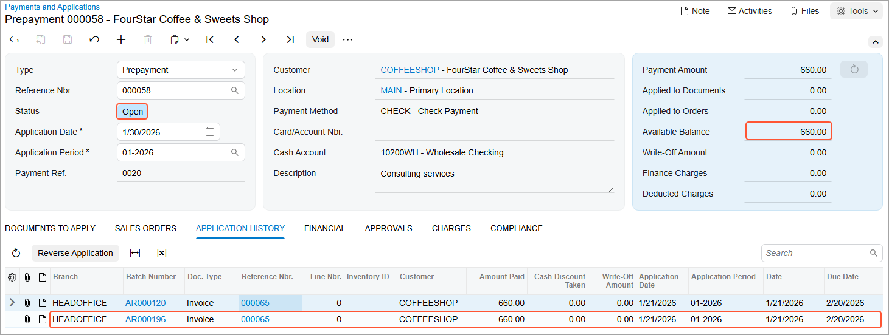

# Invoice Prepayments: To Reverse an Application {#_c267674e-3136-4bb6-a9e4-736a1fe8cf75 .task}

The following activity will walk you through the process of reversing a prepayment application to the wrong invoice.

**Attention:** This activity is based on the *U100* dataset. If you are using another dataset or if any system settings have been changed in *U100*, these changes can affect the workflow of the activity and the results of the processing. To avoid issues, restore the *U100* dataset to its initial state.

## Story {#section_v3p_4jv_vxb .section}

Suppose that the SweetLife Fruits &amp; Jams company received a prepayment from its customer \(FourStar Coffee &amp; Sweets Shop\) in the amount of $660 for consulting services and an AR clerk applied the prepayment to the wrong invoice on January 21, 2026.

Acting as a SweetLife accountant, you have to find this mistakenly applied application of $660 in the system and reverse it.

## Configuration Overview {#section_y3p_4jv_vxb .section}

For the purposes of this activity, the following features have been enabled on the [Enable/Disable Features](CS_10_00_00.md) \(CS100000\) form:

-   *Standard Financials*, which provides the standard financial functionality
-   *Multibranch Support*, which supports multiple branches in your instance of Acumatica ERP
-   *Multicompany Support*, which supports multiple companies within one tenant.

On the [Customers](AR_30_30_00.md) \(AR303000\) form, the *COFFEESHOP \(FourStar Coffee &amp; Sweets Shop\)* customer has been configured.

## Process Overview {#section_bjp_4jv_vxb .section}

In this activity, you will open a prepayment on the [Payments and Applications](AR_30_20_00.md) \(AR302000\) form, select the application to the wrong invoice, and reverse it. You will then release the reversing entry created by the system and review the generated GL transaction on the [Journal Transactions](GL_30_10_00.md) \(GL301000\) form.

## System Preparation {#section_djp_4jv_vxb .section}

To prepare the system, do the following:

1.  Launch the Acumatica ERP website, and sign in to a company with the *U100* dataset preloaded. To sign in as an accountant, use the following credentials:
    -   Username: *johnson*
    -   Password: *123*
2.  In the info area, in the upper-right corner of the top pane of the Acumatica ERP screen, make sure that the business date in your system is set to *1/30/2026*. If a different date is displayed, click the Business Date menu button and select *1/30/2026*. For simplicity, in this activity, you will create and process all documents in the system on this business date.
3.  On the Company and Branch Selection menu, also on the top pane of the Acumatica ERP screen, make sure that the *SweetLife Head Office and Wholesale Center* branch is selected. If it is not selected, click the Company and Branch Selection menu to view the list of branches that you have access to, and then click *SweetLife Head Office and Wholesale Center*.

## Step 1: Reviewing an Incorrect Application and the Application Batch {#section_fjp_4jv_vxb .section}

To review the application batch, do the following:

1.  Open the Payments and Applications \(AR3020PL\) list of records.
2.  If you applied any filters before on this form, remove them by clearing the quick filters.
3.  Find a prepayment in the amount of $660 for the *COFFEESHOP* customer as follows:
    1.  In the table, click the **Customer** column header, and in the dialog box that opens, specify the following settings:

        -   **Equals**: Selected
        -   Filter Value \(the unlabeled box at the bottom of the dialog box\): *COFFEESHOP*
        Click **Apply** to close the dialog box.

    2.  Click the **Payment Amount** column header, and in the dialog box that opens, specify the following settings:

        -   **Equals**: Selected
        -   **Value**: `660`
        Click **Apply** to close the dialog box.

4.  Click the link in the **Reference Nbr.** column to open the prepayment on the [Payments and Applications](AR_30_20_00.md) \(AR302000\) form.
5.  On the **Application History** tab, click the link in the **Reference Nbr.** column, and on the [Invoices and Memos](AR_30_10_00.md) \(AR301000\) form that opens, review the invoice to which the prepayment has been applied mistakenly. Close the [Invoices and Memos](AR_30_10_00.md) form.
6.  On the [Payments and Applications](AR_30_20_00.md) form, click the link in the **Batch Number** column to open and review the application batch on the [Journal Transactions](GL_30_10_00.md) \(GL301000\) form.

## Step 2: Reversing the Application {#section_jjp_4jv_vxb .section}

To reverse the incorrect application, do the following:

1.  On the [Payments and Applications](AR_30_20_00.md) \(AR302000\) form, make sure that you are still viewing the prepayment that you reviewed in Step 1.
2.  On the **Application History** tab, click **Reverse Application** on the table toolbar.

    The system reverses the application of the $660 prepayment to the invoice.

3.  Save the prepayment. Notice that in the Summary area, the **Applied to Documents** box shows *-660.00*, and the **Available Balance** box shows *660.00*.
4.  On the form toolbar, click **Release**.

    The system creates a reversing batch that you can see on the **Application History** tab. The system also sets the statuses of the invoice and the prepayment to *Open* and increases their balances by $660, as shown in the following screenshot.

    

5.  Click the link in the **Batch Number** column for the second row, and review the application batch on the [Journal Transactions](GL_30_10_00.md) \(GL301000\) form, which opens.

**Parent topic:**[Processing Prepayments](../UserGuide/Finance_ARProcessing_Prepayments_Mapref.md)

