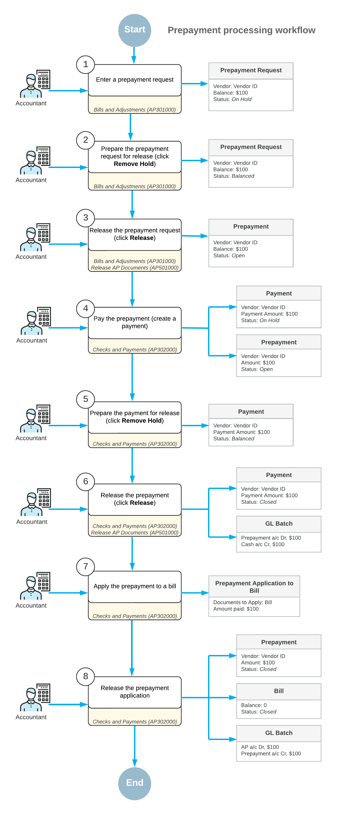

# Bill Prepayments: General Information {#_4a4d967f-52ec-40c1-ac86-ecd522dd2b7a .concept}

A prepayment is a type of accounts payable document that you create to record advance payments or down payments to vendors. You can create a prepayment in one of the following ways:

-   *Standard way*: First, you enter the vendor’s prepayment request on the [Bills and Adjustments](AP_30_10_00.md) \(AP301000\) form as an internal accounts payable document of the *Prepayment* type. Then you create a payment to pay for this prepayment request on the [Checks and Payments](AP_30_20_00.md) \(AP302000\) form. After you release the payment, you can apply the prepayment against bills.
-   *Simplified way*: You create and release a prepayment directly by using the [Checks and Payments](AP_30_20_00.md) \(AP302000\) form. This method has some restrictions.

To process a prepayment in the system, you have to first create and release the prepayment request, which denotes the vendor's request for prepayment in the system. A prepayment request is not a financial document; it is an internal document that can be approved \(if required in your system\) before the prepayment is actually paid to the vendor. The prepayment created through the request can then be applied to outstanding bills and credit adjustments.

## Learning Objectives {#section_zmn_njv_vxb .section}

In this chapter, you will learn how to do the following:

-   Process a prepayment in the standard way
-   Apply the prepayment to a bill
-   Enter a refund for a prepayment

## Applicable Scenarios {#section_cnn_njv_vxb .section}

You create a prepayment in the system when you need to pay a vendor for goods and services before they are provided. You apply a prepayment to a bill or multiple bills of this vendor and if the amount of the prepayment was not used by the vendor, you create a refund for the prepayment.

## Creation of Prepayments in the Standard Way {#section_enn_njv_vxb .section}

The standard way of creating prepayments involves the following stages:

1.  On the [Bills and Adjustments](AP_30_10_00.md) \(AP301000\) form, you enter a vendor prepayment request as a document of the *Prepayment* type. You can specify line details \(non-stock items or services\). If the prepayment is intended for stock items, specify this in the description. When you save the prepayment, the system assigns it a reference number based on the numbering sequence assigned to bills on the [Accounts Payable Preferences](AP_10_10_00.md) \(AP101000\) form.

    A prepayment may have one summary line or any number of detail lines. You cannot apply or withhold taxes on prepayments, but you can add tax amounts to the prepayment amount for easier calculations.

    **Tip:** To facilitate auditing and user reference, you can attach an electronic version or a scanned image of the original vendor document to each prepayment. Also, you can attach a related document to each line of the document.

2.  You can release the prepayment requests one by one by using the [Bills and Adjustments](AP_30_10_00.md) form, or along with other accounts payable documents by using the [Release AP Documents](AP_50_10_00.md) \(AP501000\) form.

    A prepayment request, when released, does not change the vendor balance and tax obligations because it generates no transactions.

3.  If approval is required in your system, the prepayment request must be approved on the [Approve Bills for Payment](AP_50_20_00.md) \(AP502000\) form before it can be paid.
4.  You pay the prepayment by creating an AP payment, as you would to pay any other bill, by using the [Checks and Payments](AP_30_20_00.md) \(AP302000\) form. The payment should be in the same currency and amount as the prepayment request.

    **Attention:** Cash discounts do not apply to prepayments.

5.  You release the AP payment. When you do, the system changes the status of this payment to *Closed* and changes the status of the original prepayment to *Open*, so that you can apply this prepayment to bills and credit adjustments. For details, see [Bill Prepayments: To Process a Prepayment](Finance_ProcessingPrepayments_Process_Activity.md).

Prepayments created in this way can be paid by any payment method allowed for the particular vendor.

## Creation of Prepayments in the Simplified Way {#section_lnn_njv_vxb .section}

Alternatively, you can create a prepayment more simply by using the [Checks and Payments](AP_30_20_00.md) \(AP302000\) form. This prepayment also may have line details or just one summary line, and you can attach all the related files.

**Important:** Even if the approval of documents is required in your system, prepayments created in this way are not subject to approval.

Also, prepayments created in this way cannot be paid by a payment method that requires the printing of checks, so when you are deciding how to create a prepayment, make sure at least one payment method can be used for this prepayment.

For details, see [To Enter a Prepayment in the Simplified Way](AP__how_Entering_a_Prepayment.md).

## Application of the Prepayments {#section_rnn_njv_vxb .section}

You can apply the *Open* prepayment to bills and adjustments. A prepayment may have a balance after it is applied to bills and credit adjustments, and it can be released with a balance. When the prepayment application is released, appropriate journal entries to the general ledger are made automatically, and the links to appropriate batches are displayed on the **Application History** tab of the [Checks and Payments](AP_30_20_00.md) \(AP302000\) form.

If a prepayment was incorrectly applied to bills and adjustments and released, you can reverse the application if needed. To do this, you click the **Reverse Application** button on the **Application History** tab of the [Checks and Payments](AP_30_20_00.md) form. You can then apply the prepayment to other bills and adjustments.

## Correction of Errors {#section_unn_njv_vxb .section}

The way you can correct errors in a prepayment depends on the way you entered it.

If you need to correct errors in a prepayment that you created in the standard way, you have the following options:

-   If the prepayment has not been paid, you can void it at any time by clicking **Void** on the form toolbar of the [Bills and Adjustments](AP_30_10_00.md) \(AP301000\) form for the selected prepayment.
-   If there were errors detected for a paid prepayment, you should create an adjustment instead of voiding the prepayment.
-   If the prepayment has been paid, you void the associated AP payment.

If you need to void a prepayment that you created in the simplified way, you select the prepayment on the [Checks and Payments](AP_30_20_00.md) \(AP302000\) form and click **Void** on the form toolbar.

**Tip:** If the prepayment to be voided has been applied, first unapply the prepayment, and then void it.

If a vendor did not use the prepayment or used it only partially, you can enter a refund and apply it against the prepayment. For details, see [Bill Prepayments: To Refund a Prepayment](Finance_ProcessingPrepayments_Process_Activity2.md).

## Process Diagram {#section_a4n_njv_vxb .section}

The following diagram illustrates the workflow of prepayment processing.

**Parent topic:**[Processing Prepayments for a Bill](../UserGuide/Finance_ProcessingPrepayments_Mapref.md)

