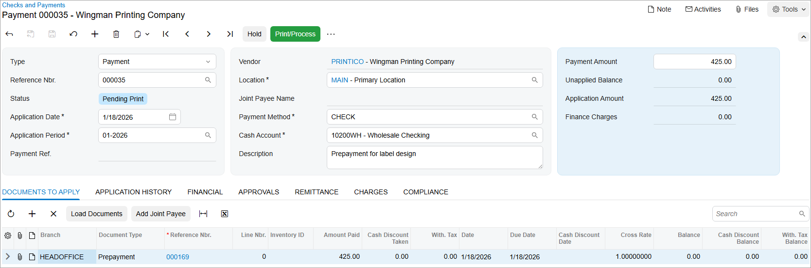
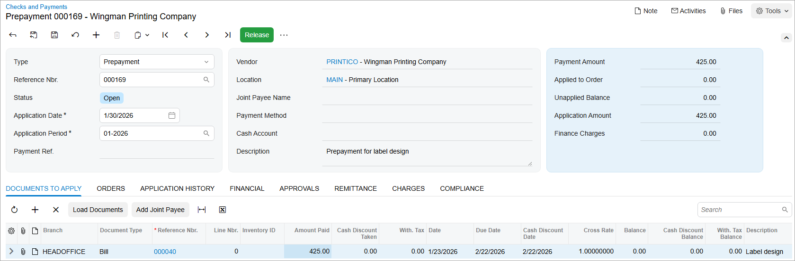

# Bill Prepayments: To Process a Prepayment {#_603e0aa1-81fc-48a0-ab9f-2803999068c8 .task}

The following activity will walk you through the process of creating a prepayment request, making a payment based on the prepayment request, and applying the prepayment to a bill.

**Attention:** This activity is based on the *U100* dataset. If you are using another dataset or if any system settings have been changed in *U100*, these changes can affect the workflow of the activity and the results of the processing. To avoid issues, restore the *U100* dataset to its initial state.

## Story {#section_wtn_njv_vxb .section}

Suppose that the SweetLife Fruits &amp; Jams company has ordered a new design for the company's printed labels and paper bags from Wingman Printing Company. They requested an advance payment of $425 for these services. Further suppose that the prepayment that SweetLife made on January 18, 2026 has to be applied to an AP bill from Wingman Printing Company.

Acting as a SweetLife accountant, you have to record a request for an advance payment of $425 to the *PRINTICO* vendor. You then need to make a payment for the request, and then apply this prepayment to the bill.

## Configuration Overview {#section_ztn_njv_vxb .section}

For the purposes of this activity, the following features have been enabled on the [Enable/Disable Features](CS_10_00_00.md) \(CS100000\) form:

-   *Standard Financials*, which provides the standard financial functionality
-   *Multibranch Support*, which supports multiple branches in your instance of Acumatica ERP
-   *Multicompany Support*, which supports multiple companies within one tenant.

On the [Accounts Payable Preferences](AP_10_10_00.md) \(AP101000\) form, the **Hold Documents on Entry** check box has been selected in the **Data Entry Settings** section.

On the [Vendors](AP_30_30_00.md) \(AP303000\) form, the *PRINTICO \(Wingman Printing Company\)* vendor has been defined. This vendor has the *CHECK* payment method specified as the default one.

## Process Overview {#section_d5n_njv_vxb .section}

To create a prepayment request and a payment, you will enter the vendor's prepayment request on the [Bills and Adjustments](AP_30_10_00.md) \(AP301000\) form. Then you will create a payment for this prepayment request on the [Checks and Payments](AP_30_20_00.md) \(AP302000\) form, and release the payment on the [Release Payments](AP_50_52_00.md) \(AP505200\) form. You will apply the prepayment to an AP bill on the [Checks and Payments](AP_30_20_00.md) form and release the application.

## System Preparation {#section_f5n_njv_vxb .section}

To prepare the system, do the following:

1.  Launch the Acumatica ERP website, and sign in to a company with the *U100* dataset preloaded. To sign in as an accountant, use the following credentials:
    -   Username: *johnson*
    -   Password: *123*
2.  In the info area, in the upper-right corner of the top pane of the Acumatica ERP screen, click the Business Date menu button and select *1/18/2026*. For simplicity, in Step 1 and Step 2 of this process activity, you will create and process all documents in the system on this business date.
3.  On the Company and Branch Selection menu, also on the top pane of the Acumatica ERP screen, make sure that the *SweetLife Head Office and Wholesale Center* branch is selected. If it is not selected, click the Company and Branch Selection menu to view the list of branches that you have access to, and then click *SweetLife Head Office and Wholesale Center*.

## Step 1: Creating and Releasing a Prepayment Request {#section_h5n_njv_vxb .section}

To create and release a prepayment request, do the following:

1.  Open the [Bills and Adjustments](AP_30_10_00.md) \(AP301000\) form.

    **Tip:** To open the form for creating a new record, type the form ID in the Search box, and on the Search form, point at the form title and click **New** right of the title.

2.  On the form toolbar, click **Add New Record**, and specify the following settings in the Summary area:
    -   **Type**: *Prepayment*
    -   **Vendor**: *PRINTICO*
    -   **Due Date**: *1/18/2026* \(the current business date, which is inserted by default\)
    -   **Post Period**: *01-2026* \(inserted by default based on the selected date\)
    -   **Description**: `Prepayment for label design`
3.  On the **Details** tab, click **Add Row** on the table toolbar, and specify the following settings for the added row:
    -   **Branch**: *HEADOFFICE* \(inserted by default based on the selected branch\)
    -   **Transaction Descr.**: `Label design`
    -   **Ext. Cost**: `425`
    -   **Account**: *61000 - Advertising Expense*
4.  On the form toolbar, click **Remove Hold**.
5.  On the form toolbar, click **Release** to release the prepayment request.

## Step 2: Creating a Payment to Pay for the Prepayment Request {#section_k5n_njv_vxb .section}

To create a payment to pay for the prepayment request, do the following:

1.  While you are still viewing the prepayment request on the [Bills and Adjustments](AP_30_10_00.md) \(AP301000\) form, on the form toolbar, click **Pay/Apply**.
2.  On the [Checks and Payments](AP_30_20_00.md) \(AP302000\) form, which is opened, review the payment, and verify that it has the following settings in the Summary area:
    -   **Type**: *Payment*
    -   **Vendor**: *PRINTICO*
    -   **Payment Method**: *CHECK*
    -   **Payment Amount**: `425`
    -   **Application Date**: *1/18/2026*
    -   **Description**: `Prepayment for label design`
3.  On the **Documents to Apply** tab, verify that there is only one row with the following settings:
    -   **Document Type**: *Prepayment*
    -   **Reference Nbr.**: The reference number of the document you created in Step 1
    -   **Amount Paid**: `425`
4.  On the form toolbar, click **Remove Hold**, then click **Save** to save the payment. The following screenshot illustrates the payment prepared to pay the prepayment request.

    

5.  On the form toolbar, click **Print/Process**.
6.  On the [Process Payments / Print Checks](AP_50_50_00.md) \(AP505000\) form, which is opened, notice that the system has added a row with the payment and selected the unlabeled check box for it. On the form toolbar, click **Process**.

    A separate browser tab has opened showing a printable version of the selected payment.

7.  Review the printable version of the printed payment.

    **Tip:** In a production setting, you would click **Print** on the form toolbar to print the check.

8.  Close the browser tab.
9.  On the [Release Payments](AP_50_52_00.md) \(AP505200\) form, which is opened, click **Process**. In the **Processing** pop-up window, which is opened, click **Close**.

## Step 3: Applying the Prepayment to a Bill {#section_o5n_njv_vxb .section}

To apply the prepayment to a bill, do the following:

1.  In the info area, in the upper-right corner of the top pane of the Acumatica ERP screen, click the Business Date menu button and change the business date in your system to *1/30/2026*.
2.  Open the Checks and Payments \(AP3020PL\) list of records.
3.  Select the prepayment with an amount of $425 and a date of 1/18/2026 as follows:
    1.  Click the **Filter Settings** button in the filtering area.
    2.  Click **Type** in the filtering area and select *Prepayment*.
    3.  Click **Apply**.
4.  Click the link in the **Reference Nbr.** column for the $425 prepayment to open it on the [Checks and Payments](AP_30_20_00.md) \(AP302000\) form.
5.  On the **Documents to Apply** tab, click **Add Row**, and specify the following settings in the table:

    -   **Document Type**: *Bill*
    -   **Reference Nbr.**: The bill with an amount of $425 and dated 1/23/2026
    -   **Amount Paid**: 425 \(filled in automatically\)
    The following screenshot shows the prepayment that has been applied to a bill, but not yet released.

    

6.  On the form toolbar, click **Release** to release the prepayment application to the bill.

**Parent topic:**[Processing Prepayments for a Bill](../UserGuide/Finance_ProcessingPrepayments_Mapref.md)

