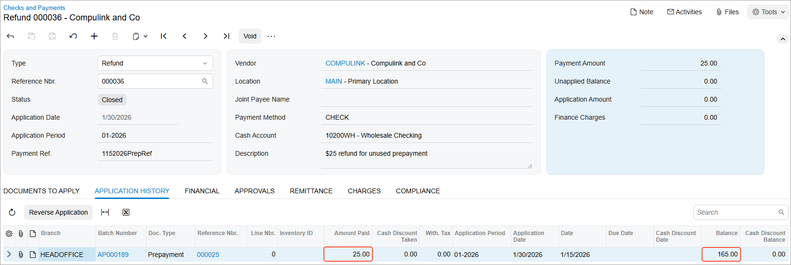

# Bill Prepayments: To Refund a Prepayment {#_a50b04f1-f769-4502-8f48-668f05096a2f .task}

The following activity will walk you through the process of creating a refund for a prepayment.

**Attention:** This activity is based on the *U100* dataset. If you are using another dataset or if any system settings have been changed in *U100*, these changes can affect the workflow of the activity and the results of the processing. To avoid issues, restore the *U100* dataset to its initial state.

## Story {#section_rvn_njv_vxb .section}

Suppose that on January 30, 2026, the SweetLife Fruits &amp; Jams company received a refund of $25 from Compulink and Co. for the unused amount of the $190 prepayment. Acting as a SweetLife accountant, you need to process this refund in the system.

## Configuration Overview {#section_tvn_njv_vxb .section}

For the purposes of this activity, the following features have been enabled on the [Enable/Disable Features](CS_10_00_00.md) \(CS100000\) form:

-   *Standard Financials*, which provides the standard financial functionality
-   *Multibranch Support*, which supports multiple branches in your instance of Acumatica ERP
-   *Multicompany Support*, which supports multiple companies within one tenant.

On the [Accounts Payable Preferences](AP_10_10_00.md) \(AP101000\) form, the **Hold Documents on Entry** check box has been selected in the **Data Entry Settings** section.

On the [Vendors](AP_30_30_00.md) \(AP303000\) form, the *COMPULINK \(Compulink and Co.\)* vendor has been configured. This vendor has the *CHECK* payment method specified as the default one.

## Process Overview {#section_xvn_njv_vxb .section}

In this activity, you will create and release a refund on the [Checks and Payments](AP_30_20_00.md) \(AP302000\) form.

## System Preparation {#section_zvn_njv_vxb .section}

To prepare the system, do the following:

1.  Launch the Acumatica ERP website, and sign in to a company with the *U100* dataset preloaded. To sign in as an accountant, use the following credentials:
    -   Username: *johnson*
    -   Password: *123*
2.  In the info area, in the upper-right corner of the top pane of the Acumatica ERP screen, make sure that the business date in your system is set to *1/30/2026*. If a different date is displayed, click the Business Date menu button and select *1/30/2026*. For simplicity, in this process activity, you will create and process the document in the system on this business date.
3.  On the Company and Branch Selection menu, also on the top pane of the Acumatica ERP screen, make sure that the *SweetLife Head Office and Wholesale Center* branch is selected. If it is not selected, click the Company and Branch Selection menu to view the list of branches that you have access to, and then click *SweetLife Head Office and Wholesale Center*.

## Step 1: Creating the Refund for the Prepayment {#section_bwn_njv_vxb .section}

To create the refund for the prepayment, do the following:

1.  Open the [Checks and Payments](AP_30_20_00.md) \(AP302000\) form.

    **Tip:** To open the form for creating a new record, type the form ID in the Search box, and on the Search form, point at the form title and click **New** right of the title.

2.  On the form toolbar, click **Add New Record**, and specify the following settings in the Summary area:
    -   **Type**: *Refund*
    -   **Vendor**: *COMPULINK*
    -   **Application Date**: *1/30/2026* \(the current business date, which is inserted by default\)
    -   **Payment Ref.**: `1152026PrepRef`
    -   **Description**: `$25 refund for unused prepayment`
    -   **Payment Amount**: `25`
3.  On the **Documents to Apply** tab, click **Add Row** on the table toolbar, and specify the following settings in the added row:
    -   **Document Type**: *Prepayment*
    -   **Reference Nbr.**: The number of a prepayment with an amount of $190 and dated 1/15/2026
    -   **Amount Paid \(USD\)**: 25.00 \(filled in automatically\)
4.  On the form toolbar, click **Save**.

## Step 2: Releasing the Refund {#section_ewn_njv_vxb .section}

To release the refund, do the following:

1.  While you are still on the [Checks and Payments](AP_30_20_00.md) \(AP302000\) form, click **Remove Hold** on the form toolbar to give the refund the *Balanced* status.
2.  On the form toolbar, click **Release** to release the refund.

    On the **Application History** tab, the released refund applied to the prepayment has appeared \(see the following screenshot\). The amount of the refund is shown in the **Amount Paid \(USD\)** column whereas the **Balance** column shows the balance of the prepayment.

    

**Parent topic:**[Processing Prepayments for a Bill](../UserGuide/Finance_ProcessingPrepayments_Mapref.md)

