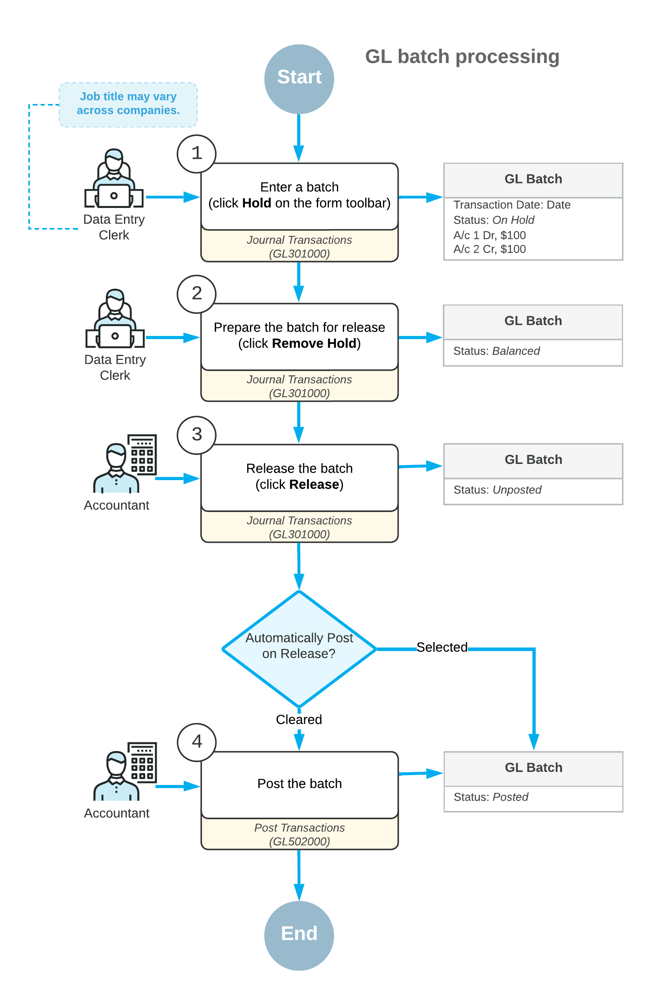

# GL Transactions: General Information {#_35393020-6269-466d-8a08-df558cd43367 .concept}

In Acumatica ERP, all financial information is collected for analyzing, summarizing, and reporting. Transactions, which can be viewed on the [Journal Transactions](GL_30_10_00.md) \(GL301000\) form, are generated on the release of various types of documents that affect the general ledger.

Transactions are organized into batches, which are posted to general ledger accounts. A batch is a group of journal entries that together represent one transaction or multiple transactions that can be posted to the general ledger. The batch must include at least two journal entries. For each journal entry, the account and the debit or credit amount must be specified.

## Learning Objectives {#section_yqg_mjv_vxb .section}

You will learn how to create a GL batch, release and post the batch, and review the statuses of the batch.

## Applicable Scenarios {#section_arg_mjv_vxb .section}

Batches are very rarely entered manually. Usually, you work with documents \(such as invoices\), and Acumatica ERP automatically generates the appropriate GL batches. However, you can enter transactions manually in the general ledger.

## Batch Processing Overview {#section_crg_mjv_vxb .section}

The following diagram illustrates the process of creating, releasing, and posting batches in Acumatica ERP.

## GL Batch Statuses {#section_erg_mjv_vxb .section}

The status of a batch reflects the current processing state of the transactions in the system. A batch can have one of the following statuses.

|Status|Description|
|------|-----------|
|*On Hold*|The batch is being edited and can be saved without being balanced. A batch with the *On Hold* status cannot be released or posted. You can give a batch this status by clicking **Hold** on the form toolbar of the [Journal Transactions](GL_30_10_00.md) \(GL301000\) form.

 If a batch that is on hold has total debits equal to total credits, you can change its status to *Balanced* by clicking **Remove Hold** on the form toolbar.

|
|*Balanced*|The batch is being edited and can be saved only if it is balanced \(that is, its debit total equals its credit total\). The batch can be released or posted. You can modify or delete a balanced batch, but you can save your changes only if the batch's credit and debit totals remain equal.|
|*Unposted*|The batch has been released but has not yet been posted. The unposted batch is read-only.

 You cannot edit or delete the batch with the *Unposted* status; you can reverse it, reclassify it, or split it. For details, see [Reversing Transactions: General Information](Finance_Reversing_Transactions_GeneralInfo.md), [Reclassifying Transactions: General Information](Finance_Reclassifying_Transactions_GeneralInfo.md), and [Splitting Transactions: General Information](Finance_Splitting_a_Transaction_GeneralInfo.md).

 If the batch is correct, you can post it to update GL account balances on the [Post Transactions](GL_50_20_00.md) \(GL502000\) form.

|
|*Posted*|The batch has been posted, and the account balances have been updated with transaction amounts. The posted batch is read-only.

 You cannot edit or delete the posted batch; you can reverse it, reclassify it, or split it. For details, see [Reversing Transactions: General Information](Finance_Reversing_Transactions_GeneralInfo.md), [Reclassifying Transactions: General Information](Finance_Reclassifying_Transactions_GeneralInfo.md), and [Splitting Transactions: General Information](Finance_Splitting_a_Transaction_GeneralInfo.md).

|
|*Scheduled*|The batch is a template for generating recurring batches according to the defined schedule. Based on the template, the system generates new batches, which can be edited, released, and then posted. The scheduled batch itself isn't released and posted and can be edited. For details, see [Recurring Transactions: General Information](Finance_Recurring_Transactions_GeneralInfo.md).

 The status of a scheduled batch changes to *Voided* if the batch is deleted from the schedule. A scheduled batch can be fully deleted only if the schedule was never executed and no ordinary GL batches were generated in accordance with it.

|
|*Voided*|The scheduled batch has been canceled \(that is, removed from the schedule\). The voided batch is read-only.|

**Parent topic:**[Processing Transactions](../UserGuide/Finance_Processing_Batch_Mapref.md)

