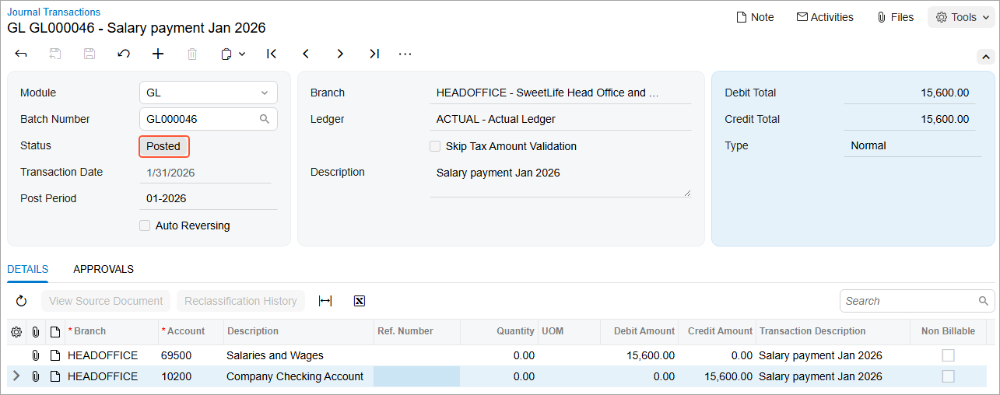

# GL Transactions: Process Activity {#_3ffba67b-2346-4f70-b511-3a32a8b82d63 .task}

In this activity, you will learn how to create a GL batch, release and post the batch, and review the statuses of the batch.

**Attention:** This activity is based on the *U100* dataset. If you are using another dataset or if any system settings have been changed in *U100*, these changes can affect the workflow of the activity and the results of the processing. To avoid issues, restore the *U100* dataset to its initial state.

## Story {#section_lvg_mjv_vxb .section}

Suppose that in January 2026, the SweetLife Fruits &amp; Jams company paid its employees $15,600.

Acting as a SweetLife accountant, you need to enter a batch for a payment in the amount of $15,600 for the *01-2026* financial period for the salaries and wages of the employees of the SweetLife Head Office and Wholesale Center \(*HEADOFFICE*\) branch.

## Process Overview {#section_ovg_mjv_vxb .section}

In this activity, you will enter a batch directly on the [Journal Transactions](GL_30_10_00.md) \(GL301000\) form, release and post the batch, and note the status of the batch at each step. Then you will review the batch details in the [GL Register Detailed](GL_62_10_00.md) \(GL621000\) report.

## System Preparation {#section_qvg_mjv_vxb .section}

To prepare the system, do the following:

1.  Launch the Acumatica ERP website with the *U100* dataset. Sign in as an accountant by using the following credentials:
    -   Username: *johnson*
    -   Password: *123*
2.  In the info area, in the upper-right corner of the top pane of the Acumatica ERP screen, make sure that the business date in your system is set to *1/31/2026*. If a different date is displayed, click the Business Date menu button and select *1/31/2026*. For simplicity, in this activity, you will create and process all documents in the system on this business date.
3.  On the Company and Branch Selection menu, also on the top pane of the Acumatica ERP screen, make sure that the *SweetLife Head Office and Wholesale Center* branch is selected. If it is not selected, click the Company and Branch Selection menu to view the list of branches that you have access to, and then click *SweetLife Head Office and Wholesale Center*.

## Step 1: Creating a Batch of Transactions {#section_svg_mjv_vxb .section}

To create a batch of GL transactions, do the following:

1.  Open the [Journal Transactions](GL_30_10_00.md) \(GL301000\) form, and on the form toolbar, click **Add New Record** to create a document.

    **Tip:** To open the form for creating a new record, type the form ID in the Search box, and on the Search form, point at the form title and click **New** right of the title.

2.  In the Summary area, specify the following settings:
    -   **Transaction Date**: *1/31/2026* \(inserted by default\)
    -   **Post Period**: *01-2026* \(inserted by default\)
    -   **Description**: `Salary payment Jan 2026`
3.  On the table toolbar of the **Details** tab, click **Add Row** and specify the following settings in the row that appears:
    -   **Branch**: *HEADOFFICE* \(inserted by default based on the selected branch\)
    -   **Account**: *69500 - Salaries and Wages*
    -   **Debit Amount**: `15600`
4.  Click **Add Row** again, and specify the following settings in the second row:
    -   **Branch**: *HEADOFFICE* \(inserted by default based on the selected branch\)
    -   **Account**: *10200 - Company Checking Account*
    -   **Credit Amount**: `15600`
5.  Click **Save** on the form toolbar, and note that the status of the batch is *On Hold*.
6.  Click **Remove Hold** on the form toolbar and save the batch. The batch's status has changed to *Balanced*.

## Step 2: Releasing and Posting the Batch {#section_vvg_mjv_vxb .section}

To release and post the GL batch, do the following:

1.  On the form toolbar, click **Release**.
2.  Note that the batch's status has changed to *Posted* as shown in the following screenshot.

## Step 3: Reviewing the Batch Details {#section_xvg_mjv_vxb .section}

To review the batch details, do the following:

-   On the More menu \(under **Reports**\), click **Batch Register Details**.
-   On the [GL Register Detailed](GL_62_10_00.md) \(GL621000\) report, which is opened, review the details of the posted batch.

**Parent topic:**[Processing Transactions](../UserGuide/Finance_Processing_Batch_Mapref.md)

