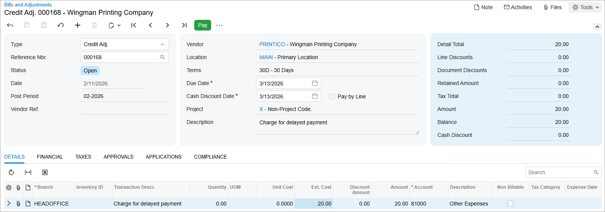

# Debit and Credit Adjustments: To Process a Credit Adjustment {#_f98beff3-a8e4-4939-be54-2f4783629a78 .task}

The following activity will walk you through the process of creating and releasing a credit adjustment.

**Attention:** This activity is based on the *U100* dataset. If you are using another dataset or if any system settings have been changed in *U100*, these changes can affect the workflow of the activity and the results of the processing. To avoid issues, restore the *U100* dataset to its initial state.

## Story {#section_xn3_njv_vxb .section}

Suppose that on February 11, 2026, SweetLife Fruits &amp; Jams received a debit memo from Wingman Printing Company. The document charges SweetLife an additional $20 for the delayed payment of a bill.

Acting as a SweetLife accountant, you need to process the vendor's debit memo by creating a credit adjustment in the system.

## Process Overview {#section_a43_njv_vxb .section}

In this activity, you will create and release a credit adjustment on the [Bills and Adjustments](AP_30_10_00.md) \(AP301000\) form.

## System Preparation {#section_c43_njv_vxb .section}

To prepare the system, do the following:

1.  Launch the Acumatica ERP website, and sign in to a company with the *U100* dataset preloaded. To sign in as an accountant, use the following credentials:
    -   Username: *johnson*
    -   Password: *123*
2.  In the info area, in the upper-right corner of the top pane of the Acumatica ERP screen, make sure that the business date in your system is set to *2/11/2026*. If a different date is displayed, click the Business Date menu button and select *2/11/2026*. For simplicity, in this exercise, you will create and process all documents in the system on this business date.
3.  On the Company and Branch Selection menu, also on the top pane of the Acumatica ERP screen, make sure that the *SweetLife Head Office and Wholesale Center* branch is selected. If it is not selected, click the Company and Branch Selection menu to view the list of branches that you have access to, and then click *SweetLife Head Office and Wholesale Center*.

## Step 1: Creating a Credit Adjustment {#section_e43_njv_vxb .section}

To create a credit adjustment, do the following:

1.  Open the [Bills and Adjustments](AP_30_10_00.md) \(AP301000\) form.
2.  Click **Add New Record** on the form toolbar, and specify the following settings in the Summary area:
    -   **Type**: *Credit Adj.*
    -   **Vendor**: *PRINTICO*
    -   **Date**: *2/11/2026* \(the current business date, which is inserted by default\)
    -   **Description**: `Charge for delayed payment`
3.  On the **Details** tab, click **Add Row** and specify the following settings for the added row:
    -   **Branch**: *HEADOFFICE* \(inserted by default\)
    -   **Transaction Descr.**: `Charge for delayed payment`
    -   **Ext. Cost**: `20.00`
4.  On the form toolbar, click **Save**.

## Step 2: Releasing the Credit Adjustment {#section_g43_njv_vxb .section}

To release the credit adjustment, do the following:

1.  While you are still on the [Bills and Adjustments](AP_30_10_00.md) \(AP301000\) form, click **Remove Hold** on the form toolbar.

    This gives the credit adjustment the *Balanced* status. You can release only documents that have this status.

2.  On the form toolbar, click **Release**.

    This gives the credit adjustment the *Open* status. The released credit adjustment is shown in the following screenshot.

    

3.  On the **Financial** tab, click the number of the batch that was generated on release of the credit adjustment and review the batch on the [Journal Transactions](GL_30_10_00.md) \(GL301000\) form, which is opened.

**Parent topic:**[Processing Debit and Credit Adjustments](../UserGuide/Finance_Processing_Debit_and_Credit_Mapref.md)

