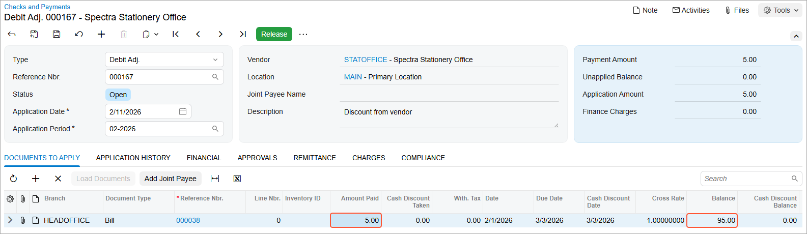

# Debit and Credit Adjustments: To Process a Debit Adjustment {#_2913bba9-197a-4eeb-a884-0920a39f6d60 .task}

The following activity will walk you through the process of creating and releasing a debit adjustment and applying it to a bill.

**Attention:** This activity is based on the *U100* dataset. If you are using another dataset or if any system settings have been changed in *U100*, these changes can affect the workflow of the activity and the results of the processing. To avoid issues, restore the *U100* dataset to its initial state.

## Story {#section_xm3_njv_vxb .section}

Suppose that on February 11, 2026, SweetLife Fruits &amp; Jams received a credit memo from Spectra Stationery Office, which gave them a $5 discount for the bill of $100.

Acting as a SweetLife accountant, you will need to process the vendor's credit memo as a debit adjustment that reduces the outstanding balance of the bill.

## Process Overview {#section_an3_njv_vxb .section}

In this activity, you will create a debit adjustment on the [Bills and Adjustments](AP_30_10_00.md) \(AP301000\) form. You will then release the debit adjustment and apply it to the needed bill on the [Checks and Payments](AP_30_20_00.md) \(AP302000\) form.

## System Preparation {#section_cn3_njv_vxb .section}

To prepare the system, do the following:

1.  Launch the Acumatica ERP website, and sign in to a company with the *U100* dataset preloaded. To sign in as an accountant, use the following credentials:
    -   Username: *johnson*
    -   Password: *123*
2.  In the info area, in the upper-right corner of the top pane of the Acumatica ERP screen, click the Business Date menu button and select *2/11/2026*. For simplicity, in this activity, you will create and process all documents in the system on this business date.
3.  On the Company and Branch Selection menu, also on the top pane of the Acumatica ERP screen, make sure that the *SweetLife Head Office and Wholesale Center* branch is selected. If it is not selected, click the Company and Branch Selection menu to view the list of branches that you have access to, and then click *SweetLife Head Office and Wholesale Center*.

## Step 1: Creating a Debit Adjustment {#section_en3_njv_vxb .section}

To create a debit adjustment, do the following:

1.  Open the [Bills and Adjustments](AP_30_10_00.md) \(AP301000\) form.
2.  Click **Add New Record** on the form toolbar, and specify the following settings in the Summary area:
    -   **Type**: *Debit Adj.*
    -   **Vendor**: *STATOFFICE*
    -   **Date**: *2/11/2026* \(inserted by default\)
    -   **Description**: `Discount from vendor`
3.  On the **Details** tab, click **Add Row** and specify the following settings for the added row:
    -   **Branch**: *HEADOFFICE* \(inserted by default\)
    -   **Transaction Descr.**: `Discount from vendor`
    -   **Ext. Cost**: `5`
4.  On the form toolbar, click **Save**.

## Step 2: Releasing the Debit Adjustment {#section_gn3_njv_vxb .section}

To release the debit adjustment, do the following:

1.  While you are still on the [Bills and Adjustments](AP_30_10_00.md) \(AP301000\) form, click **Remove Hold** on the form toolbar.

    This gives the debit adjustment the *Balanced* status. You can release only documents that have this status.

2.  On the form toolbar, click **Release**.

    This gives the debit adjustment the *Open* status.

3.  On the **Financial** tab, click the batch number to review the batch that the system has generated. Notice that the debit journal entry reduces the balance of the *20000 \(Accounts Payable\)* account by $5.

## Step 3: Applying the Debit Adjustment to the Bill {#section_kn3_njv_vxb .section}

To apply the debit adjustment to the bill, do the following:

1.  While you are still on the [Bills and Adjustments](AP_30_10_00.md) \(AP301000\) form, on the form toolbar, click **Apply**.

    The system opens the [Checks and Payments](AP_30_20_00.md) \(AP302000\) form.

2.  On the [Checks and Payments](AP_30_20_00.md) form, in the **Application Date** box, make sure *2/11/2026* is selected.
3.  On the table toolbar of the **Documents to Apply** tab, click **Add Row** and in the **Reference Nbr.** column, select the $100 bill.

    By default, the system applies the full amount of the debit adjustment \($5\) to the bill. After you apply the debit adjustment, $95 \($100 – $5\) remains on the balance of the bill, which is displayed in the **Balance** column. The debit adjustment applied to the bill is shown in the following screenshot.

    

4.  On the form toolbar, click **Release** to release the application.

    The debit adjustment gets the *Closed* status because the full balance of the debit adjustment has been applied.

**Parent topic:**[Processing Debit and Credit Adjustments](../UserGuide/Finance_Processing_Debit_and_Credit_Mapref.md)

