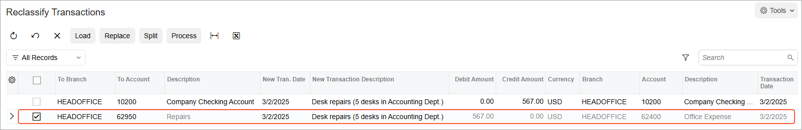

# Reclassifying Transactions: Process Activity {#_486a8d2f-bdd2-49dc-a10f-cd56ea3b3ba9 .task}

In this activity, you will learn how to reclassify GL transactions.

**Attention:** This activity is based on the *U100* dataset. If you are using another dataset or if any system settings have been changed in *U100*, these changes can affect the workflow of the activity and the results of the processing. To avoid issues, restore the *U100* dataset to its initial state.

## Story {#section_qd3_mjv_vxb .section}

Suppose that while reviewing the [Transactions for Account](GL_63_35_00.md) \(GL633500\) report, CFO of the SweetLife Fruits &amp; Jams company found out that an office desk repair transaction was mistakenly posted to the *62400 - Office Expense* account.

Acting as a SweetLife accountant, you have to find this transaction, which was posted in *03-2025*, and reclassify it to the *62950 - Repairs* account.

## Process Overview {#section_td3_mjv_vxb .section}

In this activity, to reclassify a GL transaction, you will run the [Transactions for Account](GL_63_35_00.md) \(GL633500\) report, load a list of transactions, reclassify the needed transaction on the [Reclassify Transactions](GL_50_60_00.md) \(GL506000\) form, and release the batch. Then you will run the [Account Details](GL_40_40_00.md) \(GL404000\) inquiry and review the transactions after the reclassification.

## System Preparation {#section_vd3_mjv_vxb .section}

To prepare the system, do the following:

1.  Launch the Acumatica ERP website with the *U100* dataset. Sign in as an accountant by using the following credentials:
    -   Username: *johnson*
    -   Password: *123*
2.  In the info area, in the upper-right corner of the top pane of the Acumatica ERP screen, make sure that the business date in your system is set to *1/30/2026*. If a different date is displayed, click the Business Date menu button and select *1/30/2026*. For simplicity, in this activity, you will create and process all documents in the system on this business date.
3.  On the Company and Branch Selection menu, also on the top pane of the Acumatica ERP screen, make sure that the *SweetLife Head Office and Wholesale Center* branch is selected. If it is not selected, click the Company and Branch Selection menu to view the list of branches that you have access to, and then click *SweetLife Head Office and Wholesale Center*.

## Step 1: Finding the Transaction to be Reclassified {#section_xd3_mjv_vxb .section}

To find the transaction to be reclassified, do the following:

1.  Open the [Transactions for Account](GL_63_35_00.md) \(GL633500\) form.
2.  On the **Report Parameters** tab, specify the following parameters:
    -   **Company/Branch**: *HEADOFFICE \(SweetLife Head Office and Wholesale Center\)* \(inserted by default based on the selected branch\)
    -   **Ledger**: *ACTUAL*
    -   **From Period**: *03-2025*
    -   **To Period**: *03-2025*
    -   **Account**: *62400 - Office Expense*
3.  Click **Run Report**.

    The report displays the transaction that falls within the specified criteria.

## Step 2: Reclassifying the Transaction {#section_a23_mjv_vxb .section}

To reclassify the transaction, do the following:

1.  On the [Transactions for Account](GL_63_35_00.md) \(GL633500\) report, which you generated in Step 1, click the link in the **Batch Number** column.

    The batch is opened on the [Journal Transactions](GL_30_10_00.md) \(GL301000\) form.

2.  On the More menu \(under **Corrections**\), click **Reclassify**.

    The batch is opened on the [Reclassify Transactions](GL_50_60_00.md) \(GL506000\) form.

3.  In the **To Account** column for the row with the *62400* account, change the value to *62950 \(Repairs\)*. Press Ctrl + Enter to submit your changes.

    Notice that the unlabeled check box for this row is selected automatically. This is because you have changed the value in the **To Account** box, as shown in the following screenshot.

    

4.  On the form toolbar, click **Process**.

## Step 3: Releasing the Batch {#section_f23_mjv_vxb .section}

To release the reclassification batch, do the following:

1.  While you are still on the [Reclassify Transactions](GL_50_60_00.md) \(GL506000\) form, in the **Processing** dialog box, which is displayed, click the **Processed** tab.

    Notice the batch number in the **Reclass. Batch Number** column \(which the system inserted when processing completed successfully\).

2.  Click the link in the **Reclass. Batch Number** column and review the reclassification batch on the [Journal Transactions](GL_30_10_00.md) \(GL301000\) form, which opens. Notice that the reclassification batch has not yet been released.
3.  On the form toolbar, click **Remove Hold**.
4.  On the form toolbar, click **Release** to release the batch.

## Step 4: Reviewing the Account Details {#section_i23_mjv_vxb .section}

To review the details of the *62400* account, do the following:

1.  Open the [Account Details](GL_40_40_00.md) \(GL404000\) form.
2.  In the Summary area, specify the following settings:

    -   **Period Range**: *03-2025* to *03-2025*
    -   **Account**: *62400*
    -   **Include Reclassified**: Cleared
    The table displays no transactions.

3.  Select the **Include Reclassified** check box in the Summary area, and review the two batches listed in the table. Note that a message is displayed next to the original batch, stating that the transaction has been reclassified. In the **Reclass. Batch Number** column, you can view the number of the reclassification batch.

**Parent topic:**[Reclassifying Transactions](../UserGuide/Finance_Reclassifying_Transactions_Mapref.md)

