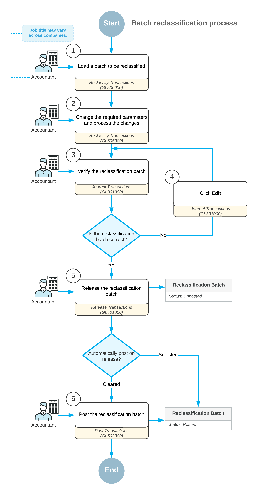

# Reclassifying Transactions: General Information {#_7ceb94a4-5a8f-4930-a1d9-31920750580d .concept}

You use the [Reclassify Transactions](GL_50_60_00.md) \(GL506000\) form to reclassify a batch was posted to the wrong GL account, subaccount, or branch. For details on reclassifying GL transactions related to a project, see [Transaction Reclassification: General Information](Projects_Reclassifying_GLTran_GeneralInfo.md).

## Learning Objectives {#section_vwh_mjv_vxb .section}

You will learn how to perform the reclassification process.

## Applicable Scenarios {#section_xwh_mjv_vxb .section}

You reclassify a batch in the following cases:

-   A batch has been posted to the wrong account.
-   A batch has been posted to the wrong subaccount.
-   A batch has been posted to the wrong branch.

## Workflow of Batch Reclassification {#section_zwh_mjv_vxb .section}

On the [Reclassify Transactions](GL_50_60_00.md) \(GL506000\) form, before you perform the reclassification process, you need to specify new details for each journal entry that you need to reclassify. You can change an account, subaccount, and branch.

**Tip:** While reclassifying a transaction, you can also edit the transaction date and the description of the reclassification transaction. If you edit the date, the new date has to be in the range of the financial period of the original transaction.

You can change required settings in each needed row manually, or perform mass changing of settings in multiple rows.

The following diagram shows the general process of reclassifying transactions.

## Modification of Selected Transactions Manually {#section_exh_mjv_vxb .section}

To change the required settings manually, in each needed row, you modify any of the following boxes:

-   **To Account**: The transaction amount will be moved from the originally specified GL account \(**Account**\) to the account specified in this box.
-   **To Subaccount**: The transaction amount will be moved from the originally specified subaccount \(**Subaccount**\) to the subaccount specified in this box.

    **Attention:** This box is available only if the *Subaccounts* feature is enabled on the [Enable/Disable Features](CS_10_00_00.md) \(CS100000\) form.

-   **To Branch**: The transaction will be moved to the GL account or subaccount of the branch specified in this box.

    **Attention:** This box is available only if the *Multibranch Support* feature is enabled on the [Enable/Disable Features](CS_10_00_00.md) form.

By default, these boxes contain the values of the original journal entry. Once you have changed any of the default values, the entry becomes available for reclassification.

To edit the date and description of a transaction, you need to enter new values in the **New Tran. Date** and **New Transaction Description** boxes, respectively.

## Modification of a Group of Transactions {#section_kxh_mjv_vxb .section}

To perform mass-changing of settings in multiple rows, on the form toolbar of the [Reclassify Transactions](GL_50_60_00.md) \(GL506000\) form, you click **Replace**. In the **Find and Replace** dialog box that opens, you specify the original and replacement transaction settings. Then you click **Replace** to close the dialog box and replace the settings in the needed rows.

To run the reclassification process, you click **Process** on the form toolbar.

## Transactions that Cannot be Reclassified {#section_nxh_mjv_vxb .section}

The following general ledger transactions cannot be reclassified:

-   Project-related transactions that have been billed.
-   Project-related transactions that have been allocated.
-   Project-related transactions linked to project commitments.
-   Project-related transactions that are related to a project that is not active.
-   Journal entries of transactions in which a control account is specified, such as entries posted on release of accounts receivable and accounts payable documents to AR and AP accounts, respectively, and to Tax Payable and Tax Claimable accounts. \(A control account is a general ledger account that accumulates the summary information of a subledger, such as AR or AP. The details of the control account balance are contained in the subledger, so the balance of the control account should match the total of the related subledger.\)

    **Tip:** You can reclassify GL entries posted on release of AR and AP documents to income and expense accounts.

-   Transactions generated in the general ledger when consolidation data has been imported on the [Import Consolidation Data](../Shared/../UserGuide/GL_50_90_00.md) \(GL509000\) form. For details, see [GL Consolidation: General Information](../Shared/../UserGuide/Finance_GL_Consolidation_GeneralInfo.md).
-   Transactions generated by a user invoking the run allocation process on the [Run Allocations](../Shared/../UserGuide/GL_50_45_00.md) \(GL504500\) form. For details, see [Allocation Rules](../Shared/../ImplementationGuide/config_Allocation_Rules_Mapref.md) and [Running Allocations](../Shared/../UserGuide/Finance_Running_Allocations_Mapref.md).
-   All currency-related GL transactions, such as transactions generated based on the currency translation and revaluation processes.
-   Transactions that have already been reclassified.

**Parent topic:**[Reclassifying Transactions](../UserGuide/Finance_Reclassifying_Transactions_Mapref.md)

