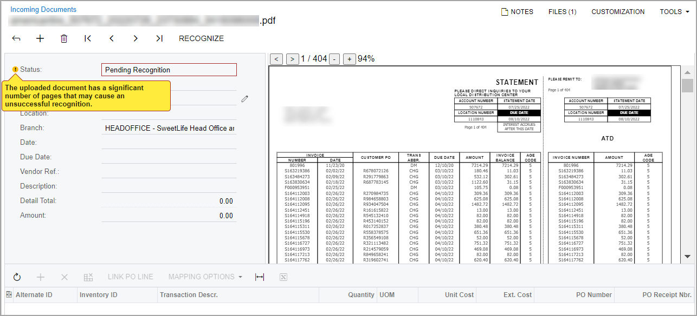
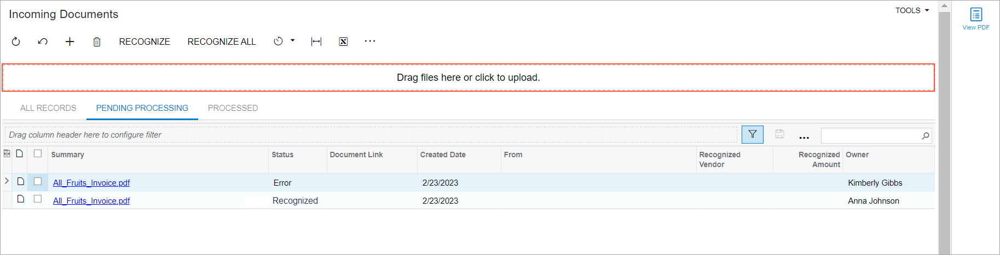
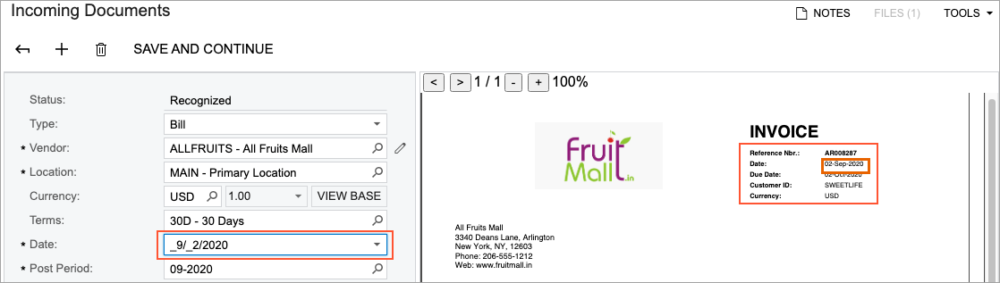
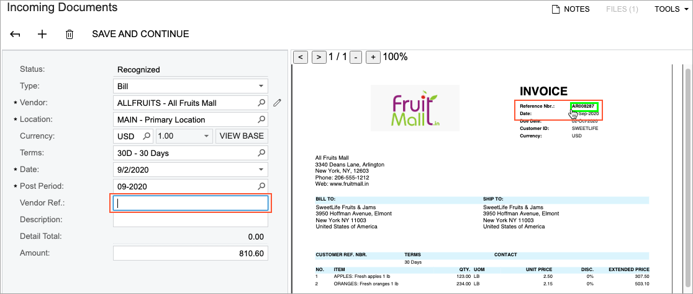
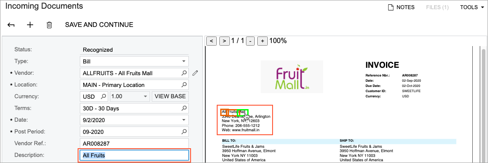

# AP Documents from PDFs: General Information {#_e2aea8fd-a773-4ead-94e0-78d7d7548a26 .concept}

You can configure the system to automatically recognize invoices attached to incoming emails and to give users the ability to manually submit PDF files for recognition. With these capabilities, users can create AP documents from these recognized documents with a single click.

Acumatica ERP uses an external recognition service for this functionality and the number of recognized documents is limited by the applied license.

**Tip:**

Recognition accuracy depends on the quality, language, size, and complexity of the submitted file. Because recognition is performed by the model and tools provided by a third party, complete accuracy cannot be guaranteed.

-   For best results, use files with the `en-us` locale. For example, invoice dates are more likely to be recognized in the *MM/DD/YYYY* format. Files in other locales may also be recognized successfully, but this behavior is not guaranteed.
-   To improve recognition results, avoid large PDF files of more than 10 MB, because recognition quality may decrease as document size and complexity increase.

## Learning Objectives {#section_qt4_njv_vxb .section}

In this chapter, you will learn how to do the following:

-   Configure the system to automatically recognize invoices attached to incoming emails
-   Submit an AP document in PDF format for recognition
-   Validate a recognized document
-   Create an AP document from a recognized PDF file

## Applicable Scenarios {#section_tt4_njv_vxb .section}

You create AP documents from recognized PDF files in the following cases:

-   When you receive invoices from vendors attached to emails as PDF files
-   When you have a number of AP documents in PDF format that you need to enter into the system

## Manual PDF Submission for Recognition in Acumatica ERP {#section_vt4_njv_vxb .section}

You use the [Incoming Documents](AP_30_11_00.md) \(AP301100\) form to manually submit a PDF file for recognition. You drag the downloaded PDF file into the Preview area \(right pane\) of the form, and then you click **Recognize** on the form toolbar.

Initially, the uploaded document has the *Pending Recognition* status displayed in the Summary area \(left pane\) of the form. If an uploaded document exceeds 50 pages, a warning message indicating the potential failure of document recognition will appear next to the **Status** box, as shown in the following screenshot.

If the document is successfully recognized, the system fills in the settings in the Summary area and the Details area \(bottom\) of the form with the recognized values, and changes the status of the document to *Recognized*.

If the recognition process failed or was interrupted \(for example, due to an unstable internet connection\), the system assigns the uploaded document the *Error* status. You click the **Recognize** button again and the system restarts the recognition process. Additionally, for a document with the *Error* status, you can view the history of the failed recognition attempts in the **History** dialog box and get the information a support engineer may need to investigate the failure. To view this dialog box, you click **View History** on the form toolbar.

## Automatic PDF Submission for Recognition in Acumatica ERP {#section_b54_njv_vxb .section}

You create a system email account on the [Email Accounts](SM_20_40_02.md) \(SM204002\) form for the mailbox that receives emails with invoices. On the **Incoming Mail Processing** tab, you activate incoming mail processing by selecting the **Incoming Mail Processing** check box and select the **Submit Incoming Documents** check box on the tab.

In this case, all incoming emails in the mailbox are processed and any PDF attachment that is found is automatically submitted for recognition. You can view the recognized documents on the [Incoming Documents](AP_30_11_00.md) \(AP301100\) form.

**Tip:** We recommend that a dedicated mailbox \(or a dedicated root folder in a mailbox\) be used for storing emails with invoices that need to be automatically processed and recognized.

## Manual PDF Submission for Recognition with Acumatica Add-In for Outlook {#section_f54_njv_vxb .section}

You open the Acumatica add-in for Outlook for an email that contains a PDF attachment and click **Create AP Document** in the add-in. After the document has been recognized, the **View Document** button appears in the add-in for the processed email. By clicking this button, the user can open the recognized document on the [Incoming Documents](AP_30_11_00.md) \(AP301100\) form. For details on using the Acumatica add-in for Outlook, see [Using the Acumatica Add-In for Outlook](OU_00_00_00.md).

## Submission for Recognition of Multiple PDF Files at Once {#section_u3k_55j_lrb .section}

By using the [Incoming Documents](AP_30_11_10.md) \(AP301110\) mass-processing form, you can submit for recognition one document or multiple documents at once by dragging the files into the file upload area \(shown below\). Also, you can click the area and upload the files by following the standard uploading steps \(which depend on your browser\). You can preview the uploaded document by clicking the **View PDF** icon on the side panel. The system will open the PDF file on the right pane.

Alternatively, you can submit for recognition multiple documents with the *Pending Recognition* status at once by selecting the unlabeled check boxes for these documents and clicking **Recognize** on the form toolbar, or submit all the documents that are pending processing by clicking **Recognize All** on the form toolbar.

## Validation of a Recognized Document {#section_m54_njv_vxb .section}

If any setting in the Summary area or any document line in the Details area has not been properly recognized by the document recognition service, you can map the recognized values with the settings in the Summary area, add document lines manually, and map values to the cells in the Details area. If you move focus to a box that is filled in with a recognized value, the system displays a red frame around the mapped value in the Preview area, as shown in the following screenshot.

If you set the focus to the box that needs to be updated and then click the value in the Preview area, the system maps the value to this box, as shown in the following screenshot.

If you need to add multiple recognized values to one box, you hold the Ctrl key \(the Command key for Mac\) and click the needed values one by one, as the following screenshot demonstrates.

Also you can manually edit the values of the boxes in the Summary and Details areas. For more information on detail mapping, see [AP Documents from PDFs: Detail Mapping](Finance_Recognizing_AP_Documents_from_PDF_Table_Mapping_Mode.md).

## Creation of the Corresponding AP Document {#section_s54_njv_vxb .section}

When all necessary settings have been specified on the [Incoming Documents](AP_30_11_00.md) \(AP301100\) form, you click **Save and Continue** on the form toolbar to convert the recognized document into an AP document. As a result, the [Bills and Adjustments](AP_30_10_00.md) \(AP301000\) form opens with the newly created AP document, which has the *On Hold* status and the rest of the settings filled with the values from the recognized document. The original PDF file is added to the record as a file attachment.

**Tip:** The system always creates an AP document from a recognized document with the *On Hold* status, regardless the state of the **Hold Documents on Entry** check box on the [Accounts Payable Preferences](AP_10_10_00.md) \(AP101000\) form.

For an incoming document of the *Bill* type, the system also copies the project-related data, purchase order links, and subcontract links, if they were recognized automatically or specified manually in the bill lines. For more information about the recognition of purchase order links, see [AP Documents from PDFs: Recognition of Purchase Orders in Bill Lines](Finance_Recognizing_AP_Documents_from_PDF_POLinks.md). For more information about the recognition of subcontracts and project-related data. see [AP Documents from PDFs: Recognition of Project-Related Data](Finance_Recognizing_AP_Documents_From_PDF_ProjectDocs.md).

If the vendor bills are based on receipts, the system will not copy the purchase order number if the receipt number is not specified. In this case, you need to link such lines manually on the [Bills and Adjustments](AP_30_10_00.md) form.

**Attention:** If billing is based on receipts for a vendor, currently, it is possible to link only stock items and non-stock items that require a purchase receipt. That is, items can be linked only if the **Require Receipt** check box is selected for them on the [Non-Stock Items](IN_20_20_00.md) \(IN202000\) or [Stock Items](IN_20_25_00.md) \(IN202500\) form.

If you delete the AP document on the [Bills and Adjustments](AP_30_10_00.md) form, the system deletes the attachment \(the PDF file\) and the recognition result of the file. To recreate the AP document, you need to submit the PDF file for recognition once again.

## Cleanup of Recognition Results {#section_lsg_z1g_j2c .section}

You and your colleagues can use the recognition functionality to speed up the adding of expense receipts, contacts, and AP documents. When you work with receipts and contacts, you submit for recognition images you take with your phone. For AP documents, you submit PDF files for recognition \(manually or automatically\).

The results of the recognition are saved to the database in a record. This record includes the user who initiated the recognition \(and the date and time when this occurred\), the recognition status, and the image or file that was submitted as an attachment. When the corresponding entity created based on the recognition result is saved, the system moves the attachment to the entity, but keeps the recognition record. We recommend the regular deletion of outdated recognition results from the system database, to free space.

You use the [Delete Outdated Recognition Results](AP_50_11_00.md) \(AP501100\) mass processing form to view and remove the recognition results of any type of recognized documents \(expense receipts, business cards, and AP documents\). On this form, you can process all of the listed records or only those you select for processing in the table.

By default, the system displays on this form only records with the *Processed* status—that is, records for which the corresponding entity \(the AP document, expense receipt, or contact\) was created in the system—that have been processed before the **Created Before** date specified in the Selection area. For the listed records that you process, the system will delete only the recognition results; a PDF document or an image used for recognition will remain attached to the corresponding linked entity.

To view all the recognition records, including those for which no corresponding entity was created in the system, you can select the **Show Unprocessed Records** check box in the Selection area of the form. With the check box selected, the system will also display records with statuses other than *Processed*. For the listed records that you process, the system will delete both the recognition results and the corresponding PDF documents or images.

**Parent topic:**[Recognizing AP Documents from PDFs](../UserGuide/Finance_Recognizing_AP_Documents_From_PDF_Mapref.md)

