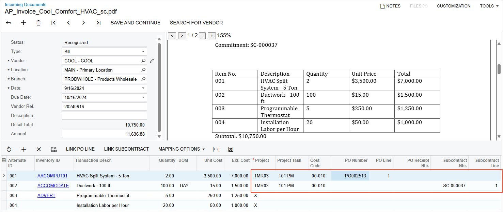

# AP Documents from PDFs: Recognition of Project-Related Data {#_34a5a91e-e4f3-45aa-bf01-7ba1ff95ea9d .concept}

For project-related expenses, your company may receive PDF invoices attached to email. Manually entering the related AP bills may be time-consuming, especially if your company is managing numerous projects at a time.

In Acumatica ERP, you can simplify and automate the management of AP bills for any projects, including construction ones, to increase efficiency and accuracy in tracking project-related expenses. This functionality is available if the *Projects*, *Construction*, and *Recognition of Project-Related Documents* features are included in your license and enabled on the [Enable/Disable Features](CS_10_00_00.md) \(CS100000\) form.

## Recognition of Direct Bills Related to Projects {#section_y5z_3qh_12c .section}

On the [Incoming Documents](AP_30_11_00.md) \(AP301100\) form, you can upload a PDF to recognize a direct bill that is related to a project. After the document is recognized, you can manually enter the project budget key in the lines of the recognized AP document, and continue processing the created document. For more information about the recognition process, see [AP Documents from PDFs: General Information](Finance_Recognizing_AP_Documents_From_PDF_GeneralInfo.md).

## Recognition of Bills Linked to Project Commitments {#section_gdv_ghb_j2c .section}

If an AP document that is being recognized relates to a project commitment, the system recognizes the following information in the bill line:

-   If a purchase order line with matching information is found, the system specifies the found purchase order number in the recognized line and automatically inserts the project budget key \(project, project task, and cost code\) based on the corresponding purchase order line. You can also link AP document lines to purchase order lines manually if no exact matching document was found by clicking **Link PO Line** on the table toolbar and selecting the needed purchase order line.
-   If a subcontract line with matching information is found, the system specifies the found subcontract number in the recognized line and automatically inserts the project budget key \(project, project task, and cost code\) based on the corresponding subcontract line. You can also link AP document lines to subcontract lines manually if no exact matching document was found by clicking **Link Subcontract** on the table toolbar and selecting the needed subcontract line.

**Tip:** The recognized lines that are not linked to any project \(that is, that have the non-project code specified in the **Project** column\) can also be linked to purchase order lines and subcontract lines.

The following screenshot shows a recognized AP bill that has a line related to a purchase order for a project, a line related to a subcontract for a project, and two lines that are not related to any project.

When the user clicks **Save and Continue** for the recognized bill, the system creates an AP bill and opens the [Bills and Adjustments](AP_30_10_00.md) \(AP301000\) form with the AP bill. The bill lines are added to the **Details** tab and include the following information:

-   For the direct AP bills, the system copies the project budget key, along with other line information.
-   For the project-related lines linked to purchase order lines, the system also copies the purchase order and receipt numbers to the **PO Number** and **PO Receipt Nbr.** columns, respectively.
-   For the project-related lines linked to subcontract lines, the system copies the subcontract number to the **Subcontract Nbr.** box.

The document is created with the *On Hold* status, so you can make any needed corrections before processing it further.

**Parent topic:**[Recognizing AP Documents from PDFs](../UserGuide/Finance_Recognizing_AP_Documents_From_PDF_Mapref.md)

