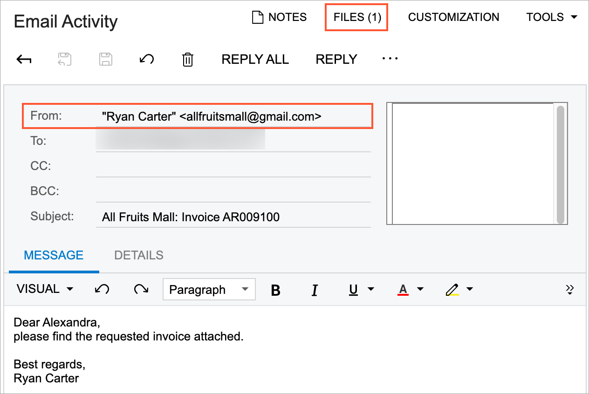
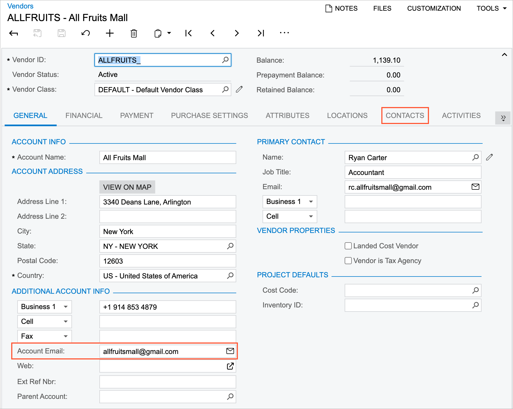
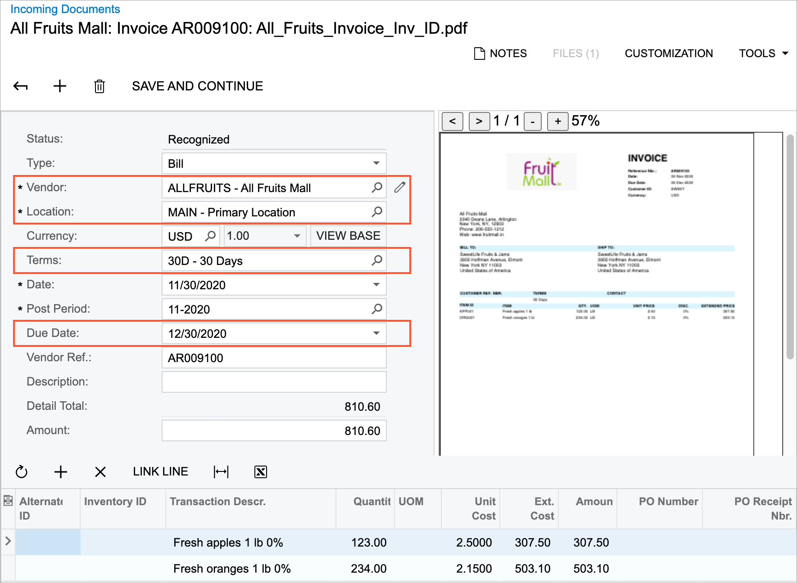
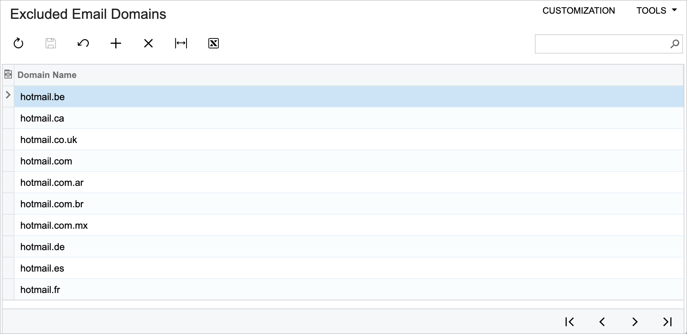

# AP Documents from PDFs: Search for a Vendor by Email Address {#_93d12195-469f-4218-88c7-df209246fbbf .concept}

If automatic PDF submission for recognition is configured in your system for a system email account on the [Email Accounts](SM_20_40_02.md) \(SM204002\) form, the system processes all incoming emails and submits any PDF attachment for recognition. The recognition results can be then reviewed on the [Incoming Documents](AP_30_11_00.md) \(AP301100\) form.

Also, your company may use the Acumatica add-in for Outlook for processing incoming email, which gives employees the ability to submit PDF attachments for recognition by using the **Create AP Document** button on the add-in form.

In some cases, the vendor may not be properly recognized by the recognition service. In this case, the system performs a search for the vendor by using the email address of the sender.

You can manually initiate the search for a vendor for a recognized document by clicking **Search for Vendor** on the toolbar of the [Incoming Documents](AP_30_11_00.md) \(AP301100\) form or for a selected recognized document on the [Incoming Documents](AP_30_11_10.md) \(AP301110\) mass-processing form.

## Search for a Vendor by Email Address {#section_kdq_lbw_rqb .section}

If the vendor was not recognized by the recognition service, the system uses the email address of the sender of the email with the PDF attachment submitted for the recognition, as shown in the following screenshot.

The system compares the sender's email address with the email addresses specified for vendors on the [Vendors](AP_30_30_00.md) \(AP303000\) form until it finds a matching email address. The vendor email addresses the system uses for comparison are specified in the **Account Email** box on the **General** tab \(as shown in the following screenshot\). Also, the system compares the sender's email address with the email addresses of all contacts listed for the vendor on the **Contacts** tab of the form. \(See the following screenshot.\)

If no matches have been found, the system compares the domain part of the sender's email address with the domain part of the email address specified for each vendor account \(in the **Account Email** box of the **General** tab\) and the email address specified for each vendor's primary contact \(that is, the contact for which the **Primary** check box is selected on the **Contacts** tab\).

If a match has been found, the system inserts the value in the **Vendor** box of the [Incoming Documents](AP_30_11_00.md) \(AP301100\) form for the recognized document, along with the applicable vendor-related settings, as the following screenshot shows.

If multiple matches were found, the system will display a warning message with the list of possible matches next to the **Vendor** box. If multiple matches were found or no match was found, you need to manually select a vendor account in the **Vendor** box of the form.

## The List of Excluded Domains {#section_ldq_lbw_rqb .section}

To optimize the search for a vendor account by the domain part of a sender's email address, you use the [Excluded Email Domains](SM_20_96_00.md)\(SM209600\) form; see the following screenshot. By default, the form lists the most popular domains used for registering an email account. You can modify the list if needed.

While searching for a vendor account by the domain part of a sender's email address, the system verifies that the domain is not listed on this form and then proceeds with the search. If the domain is listed, the system stops searching for possible matches.

The ability to exclude email domains can be useful in the following circumstances:

-   Your company works with multiple small vendors with email addresses registered by using the Gmail or Yahoo providers.
-   The email was sent by an employee who forgot to switch from a personal email account to the corporate one.

**Parent topic:**[Recognizing AP Documents from PDFs](../UserGuide/Finance_Recognizing_AP_Documents_From_PDF_Mapref.md)

