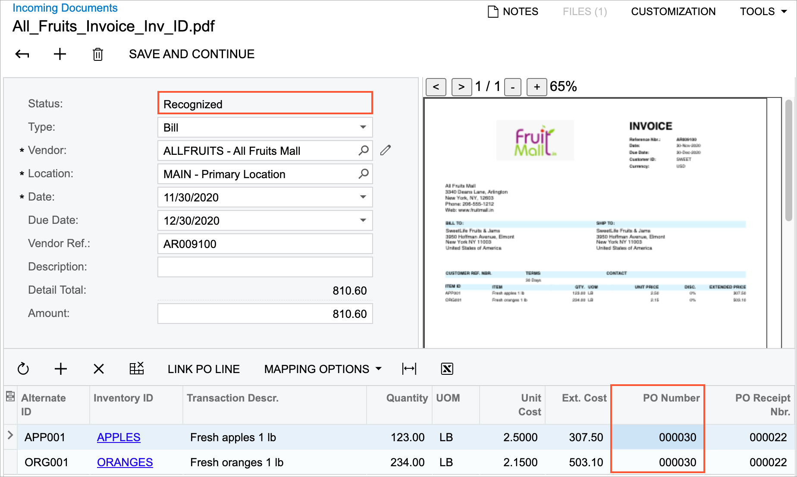
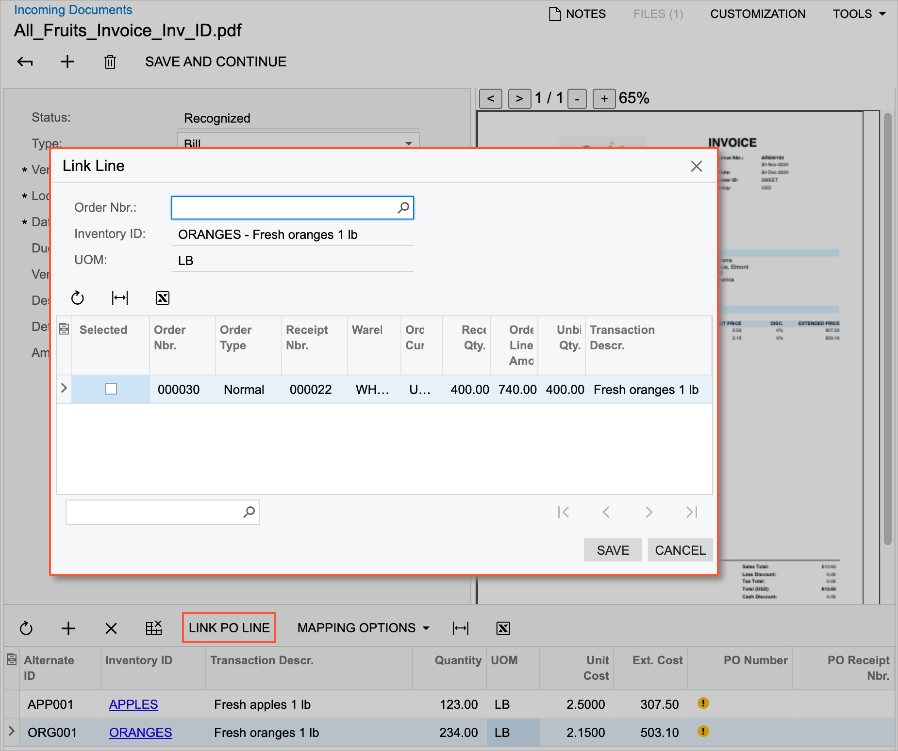

# AP Documents from PDFs: Recognition of Purchase Orders in Bill Lines {#_60cc8708-d072-4f93-9dab-b18267ba6f03 .concept}

If your organization uses the purchase order functionality in business processes, you may need to establish a link between the lines of the recognized bill and the lines of the respective purchase order in the system.

After the successful recognition of the document, the lines of a recognized AP bill can be linked to a corresponding purchase order or purchase order and receipt in dependence on billing configuration of a vendor that is controlled with the **Allow AP Bill Before Receipt** check box on the [Vendors](AP_30_30_00.md) \(AP303000\) form.

The system will automatically link the recognized bill line to a related purchase order line and purchase receipt line \(if applicable\) in the following cases:

-   If the purchase order number has been recognized in the document, the corresponding order exists in the system, and a single corresponding receipt exists in the system if the billing is based on receipts.
-   If the purchase order number has not been recognized but only one order or purchase order and receipt pair corresponds to the bill line.

If the system linked the line automatically, it adds the purchase order and receipt number \(if applicable\) to the **PO Number** and **PO Receipt Nbr.** columns of the table \(as shown on the following screenshot\).

If the system did not link the line automatically to a purchase order line \(for example, multiple options for linking are available\), you can link the line by clicking the **Link PO Line** button on the table toolbar. When the you click this button, the **Link PO Line** dialog box opens with a list of purchase orders \(for vendors that bill based on orders\) or a list of orders and corresponding receipts \(for vendors that bill based on receipts\), as the following screenshot demonstrates.

For information about how the system recognizes project-related data in document lines, see [AP Documents from PDFs: Recognition of Project-Related Data](Finance_Recognizing_AP_Documents_From_PDF_ProjectDocs.md).

**Parent topic:**[Recognizing AP Documents from PDFs](../UserGuide/Finance_Recognizing_AP_Documents_From_PDF_Mapref.md)

