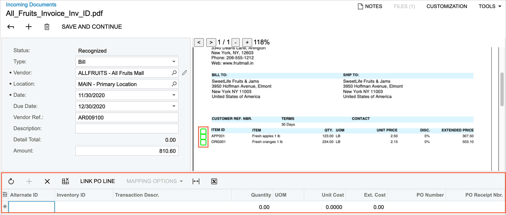
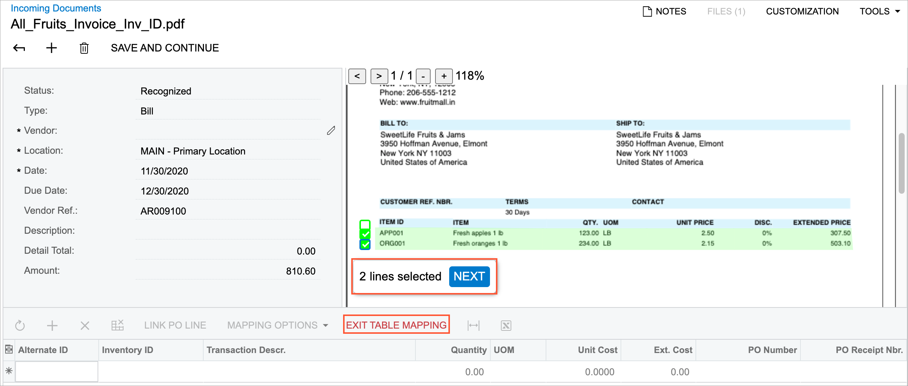
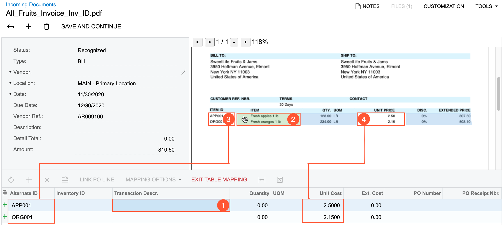
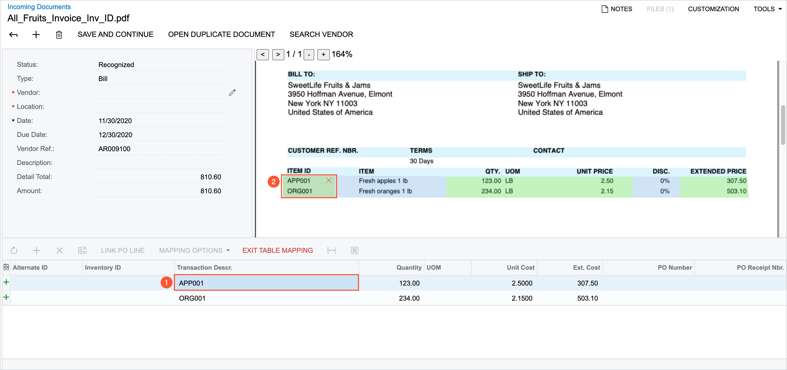
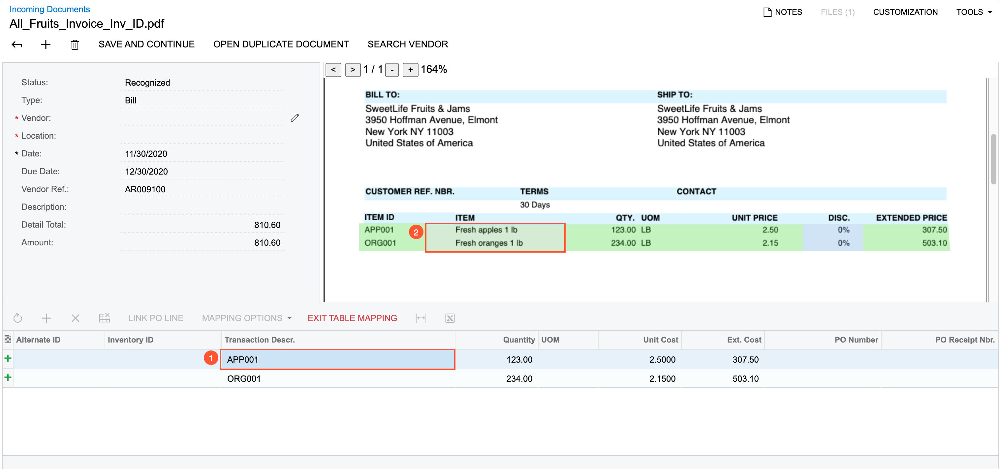
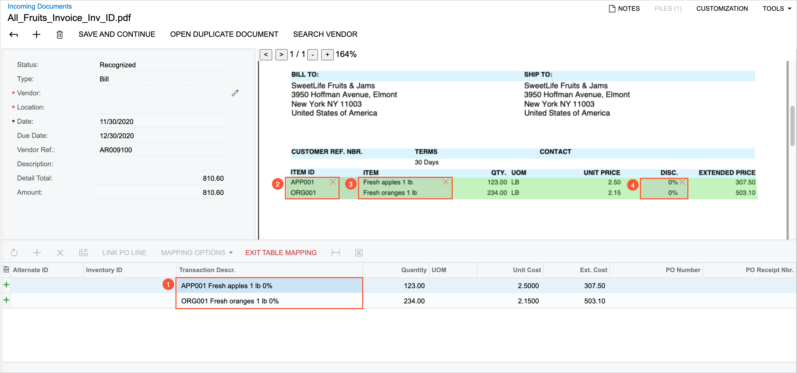
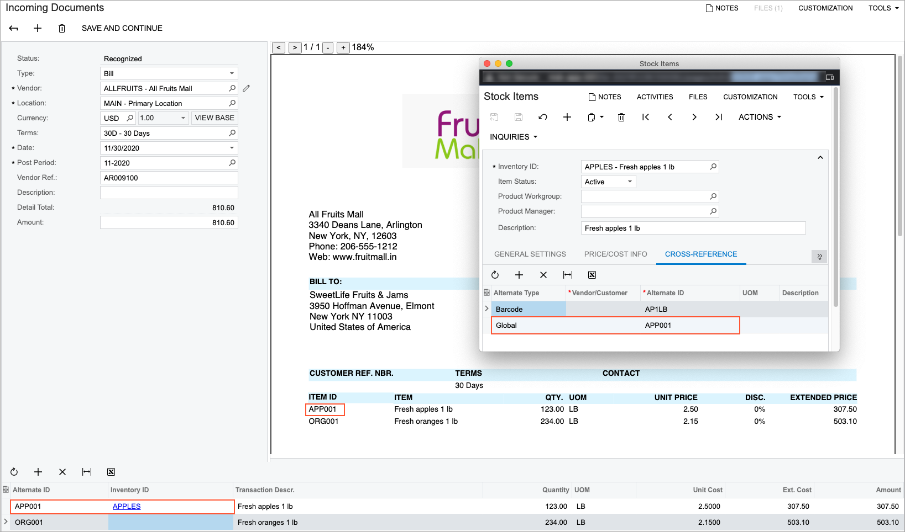
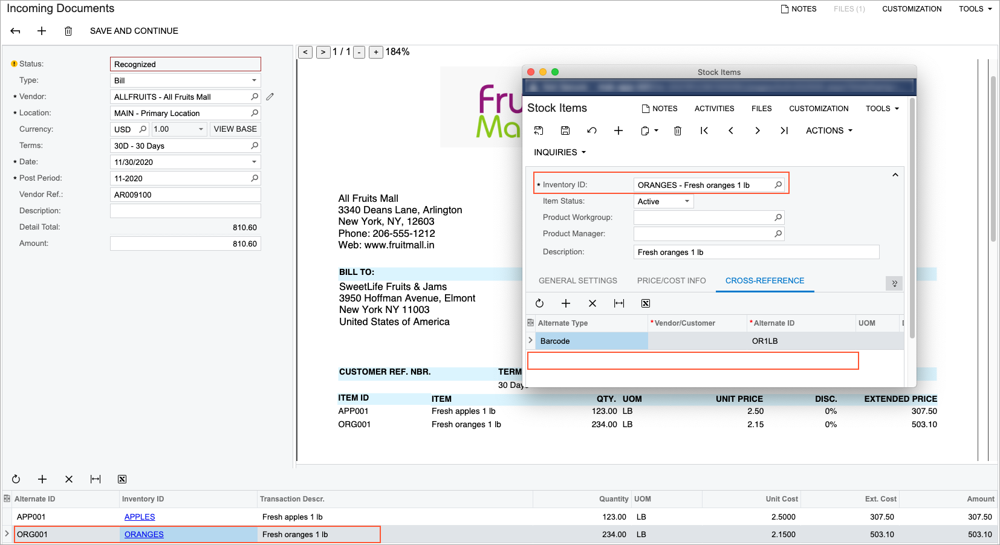
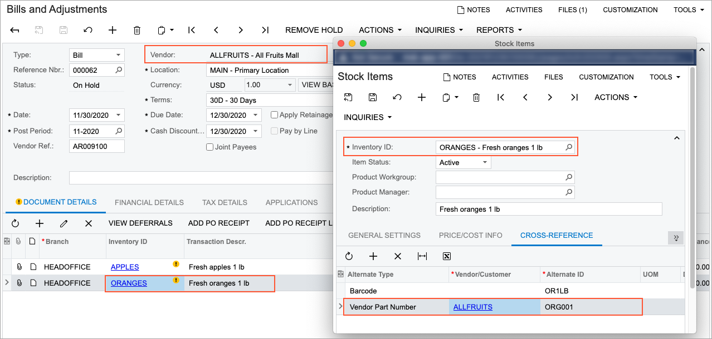

# AP Documents from PDFs: Detail Mapping {#_818e9080-dabf-440c-aa6f-5d2f9812ac8b .concept}

In most cases, an invoice from a vendor has details—a list of items to be purchased, which is usually printed as a table.

The recognition service may not recognize invoice details at all, or it may recognize them partially or incorrectly. For example, some columns or rows remained empty, and some values were mapped incorrectly or merged into one cell. Also, invoice details may be printed on multiple pages—that is, broken into multiple tables vertically \(by columns\) or horizontally \(by rows\).

You can manually enter data in the Details area of the [Incoming Documents](AP_30_11_00.md) \(AP301100\) form or map the values cell by cell. Alternatively, you can use built-in table mapping mechanism to ease document entry.

## Mapping All Details {#section_gv4_njv_vxb .section}

Suppose that the recognition service did not recognize the details of an invoice at all. That is, no columns in the Preview area were mapped to the columns in the Details area of the [Incoming Documents](AP_30_11_00.md) \(AP301100\) form—the table is empty.

To start mapping the details, you add a new empty row to the table by clicking the standard **Add Row** button on the table toolbar. In the Preview area of the form, the system adds a column with light green cleared check boxes to the left of the list with invoice details, as the following screenshot shows.

In the Preview area, you specify the rows that you need to add to the table in the Details area of the form by selecting the corresponding check boxes. \(When you have selected at least one check box, the system switches to table mapping mode and displays the **Exit Table Mapping** button on the table toolbar.\) The system highlights the selected rows in light green. Then in the tooltip that appears, you click **Next** \(see the following screenshot\) to proceed to column mapping.

**Tip:** To select multiple sequential check boxes at once, you select the check box for the first row, hold the Shift key, and select the check box for the last needed row.

After you have clicked **Next**, in the Preview area, the system hides the check boxes and changes the highlighting of the selected details to blue.

In the Details area, you set focus to the cell in the column that you would like to map \(see Item 1 in the following screenshot\) and click the corresponding column in the Preview area \(Item 2\). The system adds values to the column cells in the Details area and clears the highlighting for the mapped columns in the Preview area \(Items 3 and 4\).

When you have completed the mapping of the columns, you click **Exit Table Mapping** on the table toolbar to save your changes and exit mapping mode.

If the system has mapped some values incorrectly, you can perform manual adjustments.

If the list of details in an invoice is quite long and spans more than a page, the service may recognize the list as multiple tables. In this case, after you have mapped the first table, you click **Add Row** on the table toolbar, scroll down the document in the Preview area, and select the rows to map in the next table. You repeat this operation for every table that you need to map.

## Updating Column Mapping {#section_pv4_njv_vxb .section}

Suppose that the service has partially recognized the invoice details. That is, the number of rows added to the Details area is correct, but some columns in the Preview area were not mapped to the columns in the Details area or were mapped incorrectly.

**Tip:** If you are not satisfied with the recognition results at all and it is easier to map all the details from scratch, you can click the **Clear Table** button on the table toolbar to delete all the rows that were added by the recognition process.

To start mapping process, on the table toolbar \(in the Details area\), you click **Mapping Options** &gt; **Update Column Mapping**. The **Mapping Options** menu is available if the table has at least one row with some values filled in.

The system switches to mapping mode, highlights the mapped area in the Preview area in blue, and displays the **Exit Table Mapping** button on the table toolbar.

In the Details area, you set focus to a cell in the column for which you want to update or add mapping and click the corresponding column in the Preview area. \(This process is the same as the process for adding mapping for the whole table, which was described earlier in the topic.\)

## Adding Column Mapping from Another Table {#section_qsn_nhd_sqb .section}

Suppose, that the table with invoice details is wider than a page and some columns were printed on the next page. The service has partially recognized the invoice details. That is, the number of rows added to the Details area is correct, but some columns in the Preview area were not mapped to the columns in the Details area.

To start the mapping process, on the table toolbar \(in the Details area\), you click **Mapping Options** &gt; **Add Columns**. The menu is available if the table has at least one row with some values filled in.

In the Preview area of the form, the system adds a column with the light green cleared check boxes to the left of the list with invoice details. You may need to scroll down to the next page to find the table with the next columns. In this table, you select the same number of rows that has already been added to the table in the Details area and click **Next** \(in the tooltip that appears\) to proceed to column mapping.

In the Details area, you set focus to the cell in the column for which you want to update or add mapping and click the corresponding column in the Preview area. This process is the same as the process for adding mapping for the whole table, which was described earlier in the topic.

## Correcting Mapped Document Details {#section_ayj_sdm_vsb .section}

During the process of mapping document details, you could mistakenly map data to the wrong column. To easily correct such mistakes on the [Incoming Documents](AP_30_11_00.md) \(AP301100\) form, you can remove or override incorrect mapping for a column.

If data has been mapped to a column incorrectly, you switch to editing mode by clicking **Mapping Options** &gt; **Update Column Mapping** on the toolbar of the table of the form. In this table, you click a cell in the column with the incorrect data \(see Item 1 in the following screenshot\). Then in the Preview area, you hover over the column with data that needs to be removed. The system displays a red *X* in the upper right corner of the mapped column \(Item 2\). When you click the *X*, the system removes data from the column.

Alternatively, you can override the incorrect mapping with the correct data if the data in the correct column has not been mapped yet. While keeping focus on the cell with the incorrect mapping in the table \(see Item 1 in the following screenshot\), in the Preview area, you click the unmapped column \(Item 2\), and the system overrides the mapping.

Also, you can map data from multiple unmapped columns in the Preview area into one column in the table with the details. You set focus on the cell in the table column to which data from multiple columns should be mapped \(see Item 1 in the following screenshot\). In the Preview area, you click the first column to be mapped to the column selected in the table \(Item 2\). Then you hold CTRL and click another column \(Item 3\) and another one \(Item 4\). For each row, the system merges data from the mapped columns into one cell \(Item 1\).

The **Mapping Options** &gt; **Update Column Mapping** command is not available if the system or you mapped to the table cells one of the following values:

-   A value outside the table with the document details in the Preview area.
-   Values from multiple tables with the document details in the Preview area.
-   Values from different rows of the table with the document details in the Preview area were mapped into one row.

## Ability to Search for an Inventory ID by Its Alternate ID {#section_a1v_rgl_vsb .section}

When you map the vendor’s identifier of an inventory item to the **Alternate ID** column, in the Details area, for the corresponding record, the system searches for the inventory item by the alternate ID and adds the item’s identifier to the **Inventory ID** column if the item is found. In the following screenshot, the system has added the *APPLES* inventory ID to the **Inventory ID** column for the record with the *APP01* alternate ID maintained by the vendor, because the corresponding cross-reference has been added for the inventory item.

If the system cannot find an inventory ID associated with the specified alternate ID, you can manually select the correct inventory ID for the record. The following screenshot shows an example in which a user has selected the inventory ID that corresponds to the alternate ID, because a cross-reference between these identifiers had not been defined for the item.

In this case, when you save the AP document based on the recognized document on the [Bills and Adjustments](AP_30_10_00.md) \(AP301000\) form, the system adds a record for the inventory item about the alternate ID on the **Cross-Reference** tab of the [Stock Items](IN_20_25_00.md) \(IN202500\) or [Non-Stock Items](IN_20_20_00.md) \(IN202000\) form. The cross-reference is added with the *Vendor Part Number* type and the corresponding vendor identifier \(also shown in the following screenshot\).

**Parent topic:**[Recognizing AP Documents from PDFs](../UserGuide/Finance_Recognizing_AP_Documents_From_PDF_Mapref.md)

