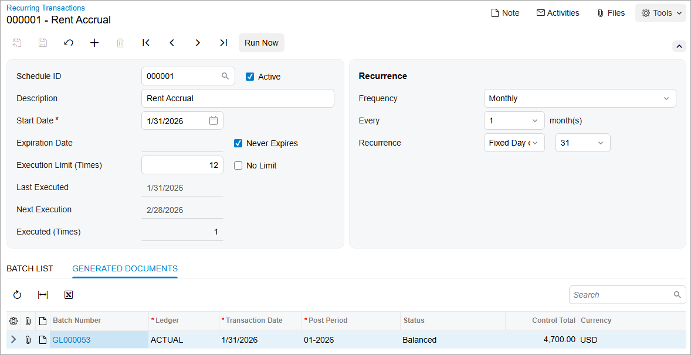

# Recurring Transactions: Process Activity {#_50f4af65-6da7-4d06-a8d5-672efdbb069e .task}

In this activity, you will create a recurring batch to be used as a template, create a schedule for the batch, and run the schedule to generate the batch.

**Attention:** This activity is based on the *U100* dataset. If you are using another dataset or if any system settings have been changed in *U100*, these changes can affect the workflow of the activity and the results of the processing. To avoid issues, restore the *U100* dataset to its initial state.

## Story {#section_fth_mjv_vxb .section}

Suppose that the SweetLife Fruits &amp; Jams company pays rent every month and receives the rent bill for each month at the beginning of the next month. The company records the accrual of rent expenses every month.

Acting as a SweetLife accountant, you have to create a recurring batch to schedule the accrual of rent expenses for every month of 2026. You also need to generate the batch for the *01-2026* financial period.

## Process Overview {#section_ith_mjv_vxb .section}

To use a recurring batch, you will create a recurring batch to be used as a template on the [Journal Transactions](GL_30_10_00.md) \(GL301000\) form. You will then create a schedule for the batch based on this template on the [Recurring Transactions](GL_20_35_00.md) \(GL203500\) form. To generate a batch, you will run the schedule on the [Generate Recurring Transactions](GL_50_40_00.md) \(GL504000\) form; you will then release the batch on the [Release Transactions](GL_50_10_00.md) \(GL501000\) form.

## System Preparation {#section_kth_mjv_vxb .section}

To prepare the system, do the following:

1.  Launch the Acumatica ERP website with the *U100* dataset. Sign in as an accountant by using the following credentials:
    -   Username: *johnson*
    -   Password: *123*
2.  In the info area, in the upper-right corner of the top pane of the Acumatica ERP screen, make sure that the business date in your system is set to *1/31/2026*. If a different date is displayed, click the Business Date menu button and select *1/31/2026*. For simplicity, in this activity, you will create and process all documents in the system on this business date.
3.  On the Company and Branch Selection menu, also on the top pane of the Acumatica ERP screen, make sure that the *SweetLife Head Office and Wholesale Center* branch is selected. If it is not selected, click the Company and Branch Selection menu to view the list of branches that you have access to, and then click *SweetLife Head Office and Wholesale Center*.

## Step 1: Creating a Batch to Be Used as a Template {#section_mth_mjv_vxb .section}

To create a recurring batch with the *Balanced* status to be used as a template, do the following:

1.  Open the [Journal Transactions](GL_30_10_00.md) \(GL301000\) form.

    **Tip:** To open the form for creating a new record, type the form ID in the Search box, and on the Search form, point at the form title and click **New** right of the title.

2.  On the form toolbar, click **Add New Record** and specify the following settings in the Summary area:
    -   **Transaction Date**: *1/31/2026* \(inserted by default\)
    -   **Description**: `Rent Accrual`
3.  On the form toolbar, click **Remove Hold** to give the batch the *Balanced* status.
4.  Click **Add Row** on the table toolbar of the **Details** tab, and add a row with the following settings:
    -   **Branch**: *HEADOFFICE* \(inserted automatically based on the selected branch\)
    -   **Account**: *62900 \(Rent or Lease Expense\)*
    -   **Debit Amount**: `4700`
5.  Click **Add Row** again and add another row with the following settings:
    -   **Branch**: *HEADOFFICE* \(inserted automatically based on the selected branch\)
    -   **Account**: *23015 \(Accrued Expenses\)*
    -   **Credit Amount**: `4700`
6.  On the form toolbar, click **Save** to save the batch you have created.

## Step 2: Creating a Schedule for the Batch {#section_pth_mjv_vxb .section}

To create a schedule for the batch, do the following:

1.  While you are viewing the batch you have just created and saved on the [Journal Transactions](GL_30_10_00.md) \(GL301000\) form, on the More menu \(under **Other**\), click **Add to Schedule**.

    The [Recurring Transactions](GL_20_35_00.md) \(GL203500\) form is opened.

2.  Configure a schedule to repeat the batch 12 times, on the last day of each month, by specifying the following settings:
    -   **Description**: `Rent Accrual`
    -   **Start Date**: *1/31/2026* \(or any date that is not after the first date when you need to execute the schedule\)
    -   **Execution Limit \(Times\)**: `12`
    -   **Frequency**: *Monthly*
    -   **Every**: *1* month\(s\)
    -   **Recurrence**: *Fixed Day of Month* *31*
3.  On the form toolbar, click **Save** to save the schedule.

## Step 3: Running the Schedule and Generating a Batch {#section_sth_mjv_vxb .section}

To run the schedule and generate a batch, do the following:

1.  Open the [Generate Recurring Transactions](GL_50_40_00.md) \(GL504000\) form, and in the Summary area, specify the following settings:
    -   **Execution Date**: *1/31/2026*
    -   **Stop After Number of Executions**: Selected, `1`
2.  In the table that displays recurring transaction schedules, select the unlabeled check box in the row of the only schedule, and click **Run** on the table toolbar to generate the batch according to the schedule.
3.  In the **Processing** pop-up window, which opens, click the **Processed** tab and click the link in the **Schedule ID** column to open the schedule on the [Recurring Transactions](GL_20_35_00.md) \(GL203500\) form.
4.  On the **Generated Documents** tab of this form, verify that a batch has been generated by the template, as shown in the following screenshot.

    

## Step 4: Releasing the Generated Batch {#section_uth_mjv_vxb .section}

To release the generated batch, do the following:

1.  Open the [Release Transactions](GL_50_10_00.md) \(GL501000\) form.
2.  Select the unlabeled check box for the only transaction in the table, and click **Release** on the form toolbar. In the **Processing** pop-up window, which opens, wait for the processing to complete and click **Close**.

**Parent topic:**[Processing Recurring Transactions](../UserGuide/Finance_Recurring_Transactions_Mapref.md)

