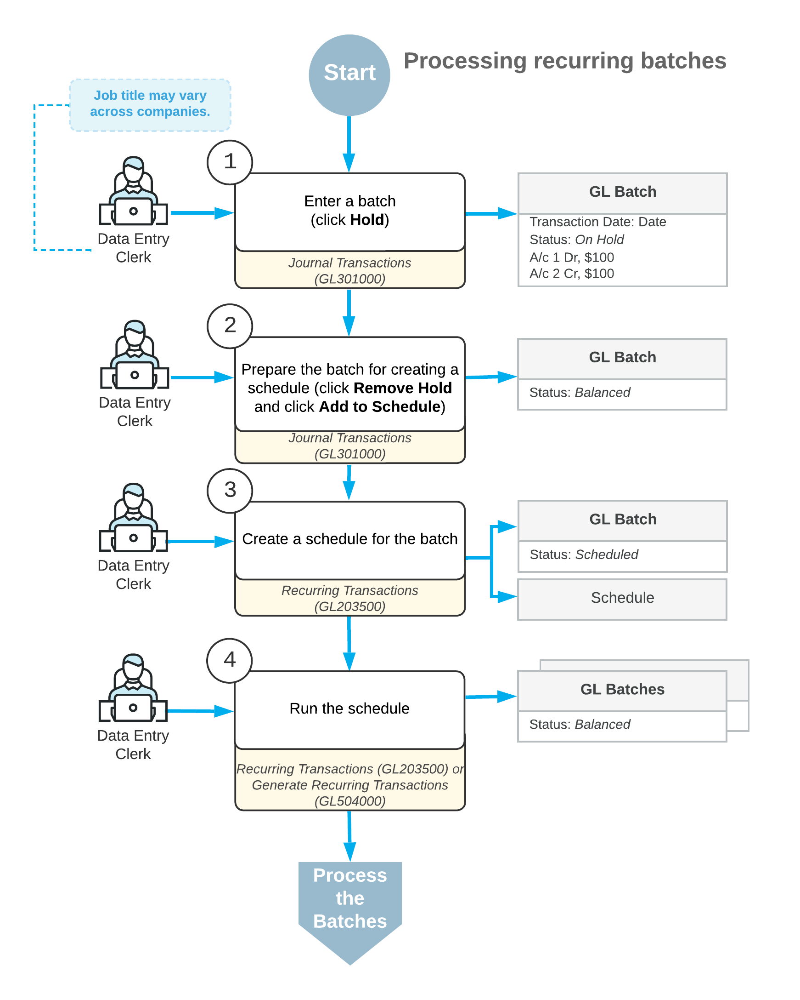

# Recurring Transactions: General Information {#_af017adb-eecc-40e8-9a0f-0c6504cd462e .concept}

To automate the entry of recurring transactions, you create schedules for these transactions in the system.

## Learning Objectives {#section_dqh_mjv_vxb .section}

You will learn how to do the following:

-   Create schedules for recurring transactions
-   Generate the recurring transactions

## Applicable Scenarios {#section_fqh_mjv_vxb .section}

You need to create schedules for transactions that repeat regularly, such as loan payments and depreciation-related transactions.

## Entry of Recurring Transactions {#section_hqh_mjv_vxb .section}

Generally, the process of entering of recurring transactions to the system consists of the following steps:

1.  Creating a recurring batch on the [Journal Transactions](GL_30_10_00.md) \(GL301000\) form.
2.  Preparing the batch to be scheduled—that is, saving the batch in the *Balanced* status on the [Journal Transactions](GL_30_10_00.md) form.
3.  Creating a schedule on the [Recurring Transactions](GL_20_35_00.md) \(GL203500\) form for the batch.
4.  Running the schedule to generate recurring batches.
5.  Processing the generated batches.

The typical processing workflow of processing recurring batches is shown in the following diagram.

## Schedule Creation {#section_kqh_mjv_vxb .section}

You create a schedule on the [Recurring Transactions](GL_20_35_00.md) \(GL203500\) form. For the schedule, you specify the date when it starts, and you can either specify a maximum number of times the schedule should be repeated or set up unlimited schedule executions by selecting the **No Limit** check box.

You then select the appropriate option in the **Frequency** box to indicate how frequently the schedule applies:

-   *Daily*: The batches should be generated daily or every *x* days.
-   *Weekly*: The batches should be generated on specific days of the week each week or every *x* weeks.
-   *Monthly*: The batches should be generated once per month or every *x* months on a specific day of the month.
-   *By Financial Period*: The batches should be generated only once per financial period or every *x* financial periods at the start, end of the financial period, or on a specific day of the financial period.

## Scheduled Batches {#section_nqh_mjv_vxb .section}

You can add GL batches to a schedule immediately \(if all the required batches already exist\) or later. Only batches with the *Normal* type and the *Balanced* status can be scheduled. After you have assigned a batch to a schedule, the system changes the batch's status to *Scheduled*.

On the [Journal Transactions](GL_30_10_00.md) \(GL301000\) form, you can create a batch and then immediately add it to a new schedule by clicking **Add to Schedule** \(under **Other**\) on the More menu.

A batch can be included in only one schedule. If a batch has been added to a schedule and you add it to a new schedule, the system removes it from the previous schedule.

## Generation of Recurring Transactions {#section_rqh_mjv_vxb .section}

You use the [Generate Recurring Transactions](GL_50_40_00.md) \(GL504000\) form to run a single schedule or multiple schedules. You can also run a particular schedule on the [Recurring Transactions](GL_20_35_00.md) \(GL203500\) form by selecting the schedule in the **Schedule ID** box and clicking **Run Now** on the form toolbar.

When you run a schedule, the system uses the included batches as template batches to generate similar batches. The batches generated by a schedule can differ from the template as follows:

-   Date: The date of each batch is different, determined by the schedule you have configured.
-   Reference number: A new reference number is generated for each batch based on the numbering sequence specified on the [General Ledger Preferences](GL_10_20_00.md) \(GL102000\) form.
-   Currency rate: If the currency of a batch differs from the base currency set in the system, the system uses for conversion the currency exchange rate effective on the date of the batch creation.

No matter how many times you run the schedule, batches will be generated only as required by the schedule. The system determines whether it should generate the batches depending on the current date, the schedule's start and expiration dates, the schedule type, and the date when the batches were last generated. After the required batches have been generated, the system updates the **Last Executed** value. One batch is generated for one run of the schedule.

For example, suppose that you have scheduled a particular batch to be performed weekly on each Tuesday, with no execution limit. If you run the schedule every week on Wednesday, one batch will be generated each time. If you run this schedule every day, the batches will be generated only on Tuesdays. If you want to run this schedule once in a month, on the last Wednesday, you should run it four times to generate four batches.

Batches generated as a result of a user running a schedule appear in the system with the *Balanced* status. They can be released or posted as any other batches can. You can change the transaction amounts, if needed.

**Parent topic:**[Processing Recurring Transactions](../UserGuide/Finance_Recurring_Transactions_Mapref.md)

