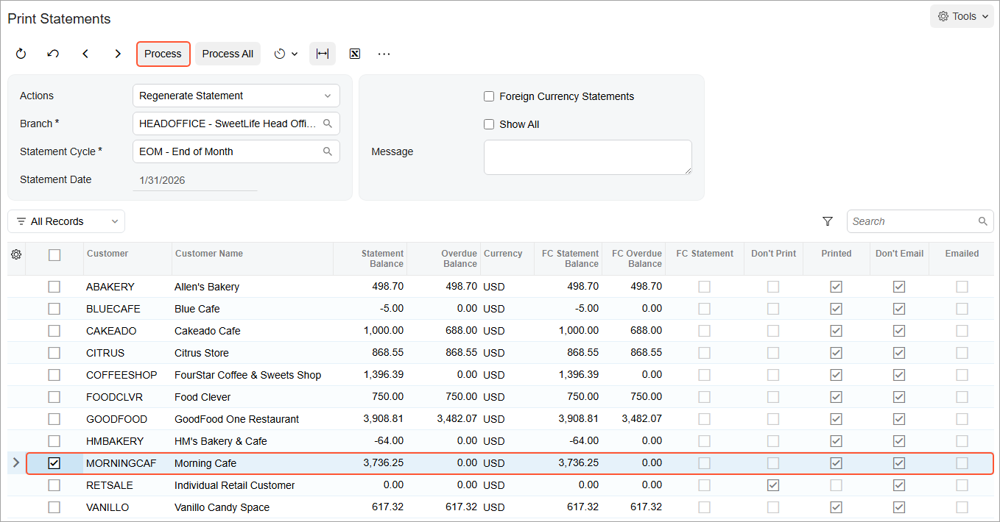

# Regeneration of Statements: Process Activity {#_4bba5990-3835-4ad6-b6fd-39e280fe141e .task}

The following activity will walk you through the process of regenerating customer statements.

## Story {#section_a4d_hjv_vxb .section}

Suppose that after the generation of customer statements, the sales manager of the SweetLife Fruits &amp; Jams company found out that an invoice as of 1/31/2026 for Morning Cafe in the amount of $210 had not been entered into the system.

Acting as the chief accountant of SweetLife, you need to record this invoice and regenerate the customer statement for this customer.

## Configuration Overview {#section_d4d_hjv_vxb .section}

For the purposes of this activity, the following features have been enabled on the [Enable/Disable Features](CS_10_00_00.md) \(CS100000\) form:

-   *Standard Financials*, which provides the standard financial functionality
-   *Multibranch Support*, which supports multiple branches in your instance of Acumatica ERP
-   *Multicompany Support*, which supports multiple companies within one tenant.

On the [Statement Cycles](AR_20_28_00.md) \(AR202800\) form, the *EOM* \(End of Month\) statement cycle has been defined and specified for the customers assigned to the *DEFAULT* customer class \(local customers\).

On the [Customers](AR_30_30_00.md) \(AR303000\) form, the *MORNINGCAF \(Morning Cafe\)* customer has been defined. For this customer, the **Print Statements** check box has been selected in the **Print and Email Settings** section on the **Billing** tab.

On the [Accounts Receivable Preferences](AR_10_10_00.md) \(AR101000\) form, the **Hold Documents on Entry** check box has been selected in the **Data Entry Settings** section. In the **Consolidation Settings** section, *For Each Branch* has been selected in the **Prepare Statements** box.

## Process Overview {#section_i4d_hjv_vxb .section}

In this activity, you will enter an invoice on the [Invoices and Memos](AR_30_10_00.md) \(AR301000\) form. On the [Print Statements](AR_50_35_00.md) \(AR503500\) form, you will regenerate the last statement for this customer and print the statement on the same form.

## System Preparation {#section_k4d_hjv_vxb .section}

To prepare the system, do the following:

1.  Launch the Acumatica ERP website with the *U100* dataset. Sign in as an accountant by using the following credentials:
    -   Username: *johnson*
    -   Password: *123*
2.  In the info area, in the upper-right corner of the top pane of the Acumatica ERP screen, make sure that the business date in your system is set to *1/31/2026*. If a different date is displayed, click the Business Date menu button and select *1/31/2026*. For simplicity, in this activity, you will create and process all documents in the system on this business date.
3.  On the Company and Branch Selection menu, also on the top pane of the Acumatica ERP screen, make sure that the *SweetLife Head Office and Wholesale Center* branch is selected. If it is not selected, click the Company and Branch Selection menu to view the list of branches that you have access to, and then click *SweetLife Head Office and Wholesale Center*.
4.  As a prerequisite activity, make sure that a statement has been prepared for this customer in the needed financial period, as described in [Customer Statements: Process Activity](Finance_Preparing_Customer_Statements_Activity.md).

## Step 1: Creating the Invoice {#section_m4d_hjv_vxb .section}

To create the invoice, do the following:

1.  Open the [Invoices and Memos](AR_30_10_00.md) \(AR301000\) form.

    **Tip:** To open the form for creating a new record, type the form ID in the Search box, and on the Search form, point at the form title and click **New** right of the title.

2.  On the form toolbar, click **Add New Record**, and specify the following settings in the Summary area:
    -   **Type**: *Invoice*
    -   **Customer**: *MORNINGCAF*
    -   **Date**: *1/31/2026* \(inserted by default\)
    -   **Description**: `3 hours of service`
3.  On the **Details** tab, click **Add Row**, and specify the following settings for the added row:
    -   **Branch**: *HEADOFFICE* \(inserted by default\)
    -   **Transaction Descr.**: `3 hours of service`
    -   **Ext. Price**: `210`
4.  On the form toolbar, click **Remove Hold**, and click **Release** to release the invoice.

## Step 2: Regenerating the Customer Statement {#section_p4d_hjv_vxb .section}

To regenerate the last customer statement, do the following:

1.  Open the [Print Statements](AR_50_35_00.md) \(AR503500\) form.
2.  In the **Actions** box, select *Regenerate Statement*.
3.  In the **Statement Cycle** box, verify that *EOM - End of Month* is displayed.
4.  In the **Branch** box, make sure that *HEADOFFICE* is specified.
5.  In the table, review the customer statements. Note the **Statement Balance** for the *MORNINGCAF* customer.

    The selected **Printed** check box means that this statement has been already printed.

6.  Select the unlabeled check box for the *MORNINGCAF* customer statement and click **Process** on the form toolbar, as shown in the following screenshot.

    

7.  In the **Processing** pop-up window, which is opened, click **Close**.

## Step 3: Printing the Statement {#section_s4d_hjv_vxb .section}

To print the regenerated statement, do the following:

1.  While you are still on the [Print Statements](AR_50_35_00.md) \(AR503500\) form, in the **Actions** box, select *Print Statement*.
2.  Select the unlabeled check box for the *MORNINGCAF* statement, and on the form toolbar, click **Process**.

    The statement is printed. Notice that the printed statement contains a note that the statement has recently been updated. The **Amount Due** of the statement has been increased by the amount of the invoice you created in Step 1.

**Parent topic:**[Regenerating Customer Statements](../UserGuide/Finance_Regenerating_Customer_Statements_Mapref.md)

