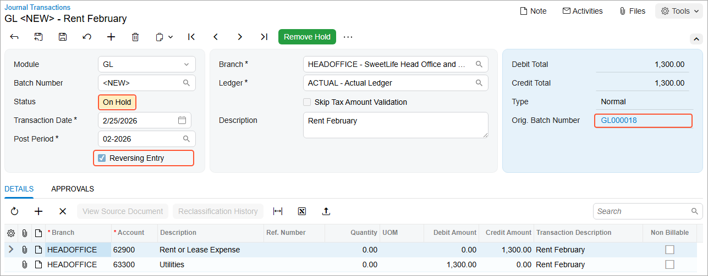

# Reversing Transactions: Process Activity {#_7d96045b-1917-4573-8bb8-6de7c41b77ff .task}

In this activity, you will learn how to reverse a GL batch.

**Attention:** This activity is based on the *U100* dataset. If you are using another dataset or if any system settings have been changed in *U100*, these changes can affect the workflow of the activity and the results of the processing. To avoid issues, restore the *U100* dataset to its initial state.

## Story {#section_jch_mjv_vxb .section}

Suppose that in February 2026, a transaction was posted by mistake for the monthly office rent expense that the SweetLife Fruits &amp; Jams company pays to its landlord.

Acting as a SweetLife accountant, you need to reverse this transaction posted for the SweetLife Head Office and Wholesale Center \(*HEADOFFICE*\) branch.

## Process Overview {#section_mch_mjv_vxb .section}

In this activity, to reverse a batch, you will search for the needed batch on the [Journal Transactions](GL_30_10_00.md) \(GL301000\) form and reverse it. You will then check the ending balance on the [Account Summary](GL_40_10_00.md) \(GL401000\) form and drill down to the [Account Details](GL_40_40_00.md) \(GL404000\) form to make sure that the account balance is now correct.

## System Preparation {#section_och_mjv_vxb .section}

To prepare the system, do the following:

1.  Launch the Acumatica ERP website with the *U100* dataset. Sign in as an accountant by using the following credentials:
    -   Username: *johnson*
    -   Password: *123*
2.  On the Company and Branch Selection menu, also on the top pane of the Acumatica ERP screen, make sure that the *SweetLife Head Office and Wholesale Center* branch is selected. If it is not selected, click the Company and Branch Selection menu to view the list of branches that you have access to, and then click *SweetLife Head Office and Wholesale Center*.

## Step 1: Finding the Batch to be Reversed {#section_qch_mjv_vxb .section}

To find the batch to be reversed, do the following:

1.  Open the Journal Transactions \(GL3010PL\) list of records.
2.  In the table, click the **Transaction Date** column, and in the dialog box that opens, specify the following settings:
    -   **Equals**: Selected
    -   **Value**: *2/25/2026*
3.  Click **Apply**. The system displays the batch dated February 25, 2026.

## Step 2: Reversing the Batch {#section_sch_mjv_vxb .section}

To reverse the batch, do the following:

1.  While you are still on the Journal Transactions \(GL3010PL\) list of records with the needed batch listed, click the link in the **Batch Number** column to open the batch on the [Journal Transactions](GL_30_10_00.md) \(GL301000\) form.
2.  On the More menu \(under **Corrections**\), click **Reverse**.

    The system generates and opens a reversing batch. In the Summary area, notice that the number of the original batch is shown in the **Orig. Batch Number** box, the **Reversing Entry** check box is selected, and the batch's status is *On Hold*, as shown in the following screenshot.

    

3.  On the form toolbar, click **Remove Hold**.
4.  On the form toolbar, click **Release** to release the batch.

## Step 3: Reviewing the Posted Transaction {#section_vch_mjv_vxb .section}

To review the account balance and the posted transactions, do the following:

1.  Open the [Account Summary](GL_40_10_00.md) \(GL401000\) form.
2.  In the **Period** box of the Summary area, select *02-2026*.
3.  In the table, locate the *62900 - Rent or Lease Expense* account and review its ending balance in the **Ending Balance** column.
4.  Click the link in the **Account** column for the *62900* account, and on the [Account Details](GL_40_40_00.md) \(GL404000\) form, which opens, review the list of entries posted to this account.

**Parent topic:**[Processing Reversing Transactions](../UserGuide/Finance_Reversing_Transactions_Mapref.md)

