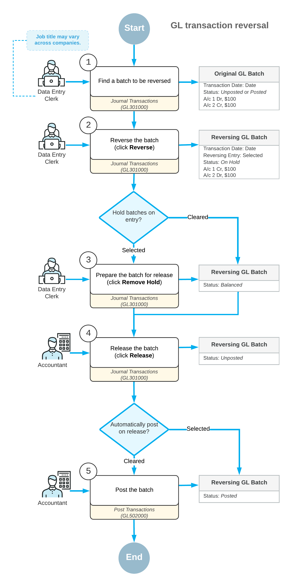

# Reversing Transactions: General Information {#_40b5ea36-6f9a-4fc9-abbf-73e3c4c2bcba .concept}

An incorrect batch with the *On Hold* or *Balanced* status can be corrected or deleted in the system. After a batch has been released, it cannot be corrected or deleted. If a batch with the *Unposted* or *Posted* status is incorrect, you can reverse the batch and enter a correct one.

**Tip:** If the batch was posted to the wrong GL account, subaccount, or branch, to correct it, you can reclassify the batch on the [Reclassify Transactions](GL_50_60_00.md) \(GL506000\) form. For details, see [Reclassifying Transactions: General Information](Finance_Reclassifying_Transactions_GeneralInfo.md). If a part of the batch amount was posted to the wrong GL account, subaccount, or branch, you can split the batch. For details, see [Splitting Transactions: General Information](Finance_Splitting_a_Transaction_GeneralInfo.md).

## Learning Objectives {#section_qzg_mjv_vxb .section}

You will learn how to reverse a GL batch in the system.

## Applicable Scenarios {#section_szg_mjv_vxb .section}

You reverse a batch if some of the details other than GL account, subaccount, or branch were entered incorrectly and the batch has been released.

## Generation of a Reversing Batch {#section_uzg_mjv_vxb .section}

To generate a reversing batch, on the [Journal Transactions](GL_30_10_00.md) \(GL301000\) form, you select the batch that you want to reverse and on the More menu \(under **Corrections**\), you click **Reverse**. The system creates a batch with the transactions reversed—that is, a debit entry is reversed as a credit entry and a credit entry is reversed as a debit entry.

**Attention:** For the reversing batches, the **Reversing Entry** check box is selected in the Summary area of the [Journal Transactions](GL_30_10_00.md) form.

Depending on the setting of the **Hold Batches on Entry** check box on the [General Ledger Preferences](GL_10_20_00.md) \(GL102000\) form, the reversing batch gets one of the following statuses:

-   *Balanced*: If the **Hold Batches on Entry** check box is cleared.
-   *On Hold*: If the **Hold Batches on Entry** check box is selected.

You can then release and post this batch. For details on processing batches, see [GL Transactions: General Information](Finance_Processing_Batch_GeneralInfo.md).

While you are viewing the reversing batch on the [Journal Transactions](GL_30_10_00.md) form, you can quickly view the original batch by clicking the number in the **Orig. Batch Number** box in the Summary area.

You can reverse a batch multiple times. To view the list of the related reversing batches, you click the link in the **Reversing Batches** box of the [Journal Transactions](GL_30_10_00.md) form. The system opens the [GL Reversing Batches](GL_69_00_10.md) \(GL690010\) report with the list of batches and their details.

## Overview of the Reversing Process {#section_b1h_mjv_vxb .section}

The typical processing workflow of reversing batches involves the actions and generated batches shown in the following diagram.

**Parent topic:**[Processing Reversing Transactions](../UserGuide/Finance_Reversing_Transactions_Mapref.md)

