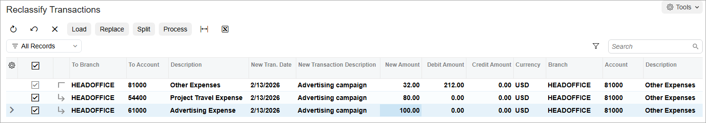

# Splitting Transactions: To Split a GL Transaction {#_afd0415d-6718-4087-ac8f-c4ef8e802085 .task}

In this activity, you will learn how to split a GL transaction into two new transactions.

**Attention:** This activity is based on the *U100* dataset. If you are using another dataset or if any system settings have been changed in *U100*, these changes can affect the workflow of the activity and the results of the processing. To avoid issues, restore the *U100* dataset to its initial state.

## Story {#section_ok3_mjv_vxb .section}

Suppose that on February 13, 2026, a GL batch for $212 was wrongly posted to the *81000 - Other Expenses* account. This account should contain a $32 expense, and the rest of the expenses should be split between two other accounts. The expenses accounted for in this transaction should be the following:

-   Travel expenses: $80
-   Advertising expenses: $100
-   Other expenses: $32

Acting as a SweetLife accountant, you have to split the original transaction, adding two correcting transactions to properly reflect the expenses.

## Process Overview {#section_rk3_mjv_vxb .section}

In this activity, you will find and review the entry to be split on the [Account Details](GL_40_40_00.md) \(GL404000\) form. On the [Reclassify Transactions](GL_50_60_00.md) \(GL506000\) form, you will split the amounts of the original transaction. You will then release the transaction on the [Release Transactions](GL_50_10_00.md) \(GL501000\) form.

## System Preparation {#section_tk3_mjv_vxb .section}

To prepare the system, do the following:

1.  Launch the Acumatica ERP website with the *U100* dataset. Sign in as an accountant by using the following credentials:
    -   Username: *johnson*
    -   Password: *123*
2.  In the info area, in the upper-right corner of the top pane of the Acumatica ERP screen, click the Business Date menu button and select *2/13/2026*. For simplicity, in this activity, you will create and process all documents in the system on this business date.
3.  On the Company and Branch Selection menu, also on the top pane of the Acumatica ERP screen, make sure that the *SweetLife Head Office and Wholesale Center* branch is selected. If it is not selected, click the Company and Branch Selection menu button to view the list of branches that you have access to, and then click *SweetLife Head Office and Wholesale Center*.

## Step 1: Finding the Transaction to be Split {#section_vk3_mjv_vxb .section}

To prepare for splitting the transaction, do the following:

1.  Open the [Account Details](GL_40_40_00.md) \(GL404000\) form.
2.  In the Selection area, specify the following settings:
    -   **Company/Branch**: *HEADOFFICE - SweetLife Head Office and Wholesale Center* \(inserted by default based on the selected branch\)
    -   **Ledger**: *ACTUAL* \(inserted by default\)
    -   **Period Range**: *02-2026*, *02-2026*
    -   **Account**: *81000 - Other Expenses*
3.  In the table, select the unlabeled check box for the transaction dated *2/13/2026* and the debit amount of $212, and on the form toolbar, click **Reclassify** to open the entry related to the account on the [Reclassify Transactions](GL_50_60_00.md) \(GL506000\) form.

## Step 2: Splitting the Transaction {#section_xk3_mjv_vxb .section}

To split the transaction, do the following:

1.  While you are remaining on the [Reclassify Transactions](GL_50_60_00.md) \(GL506000\) form and viewing the entry to be split, click **Split** on the form toolbar.

    The system has added a new line under the line with the original entry.

2.  In the columns of the new line, specify the following values:

    -   **To Account**: *54400 - Project Travel Expense*
    -   **New Amount**: `80`
    Notice that the **New Amount** column for the original line has decreased by the specified amount for the new line and now shows *132.00*.

3.  To enter the other new entry, click **Split** on the form toolbar.
4.  In the columns of the new line, specify the following values:

    -   **To Account**: *61000 - Advertising Expenses*
    -   **New Amount**: `100`
    Notice that the **New Amount** column for the original line has decreased by the sum of the new amounts of the two new lines and now shows *32.00*, as shown in the following screenshot.

    

5.  On the form toolbar, click **Process**.
6.  In the **Processing** pop-up window, which opens, click the **Processed** tab to view the list of batches.

## Step 3: Releasing the Transaction {#section_cl3_mjv_vxb .section}

To release the transaction, do the following:

1.  In the table on the **Processed** tab in the **Processing** pop-up window, click the link in the **Reclass. Batch Number** column to open the reclassification transaction that the system has created.
2.  On the [Journal Transactions](GL_30_10_00.md) \(GL301000\) form, which opens, review the transaction, and click **Remove Hold** on the form toolbar.
3.  On the form toolbar, click **Release** to release the transaction.
4.  In the table, click the link in the **Orig. Batch Nbr.** column to review the original transaction.

    The system has opened the entry and marked the line with the *81000* account as reclassified. The **Remaining Reclass. Amount** column for this line shows the remaining amount of the original entry \(*32.00*\).

**Parent topic:**[Splitting Transactions](../UserGuide/Finance_Splitting_a_Transaction_Mapref.md)

