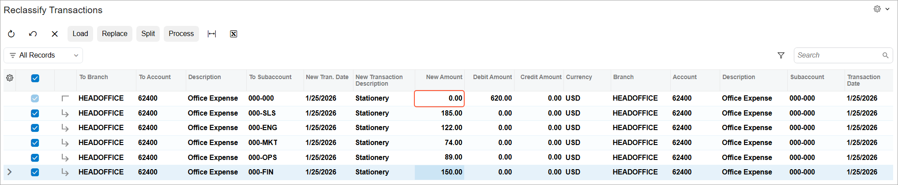

# Splitting Transactions: To Split a Transaction by Subaccounts {#_6fd903fe-3488-4503-9aa8-024151263e66 .task}

In this activity, you will learn how to reclassify a GL transaction and split it from one subaccount to multiple subaccounts.

## Story {#section_sl3_mjv_vxb .section}

Suppose that on January 25, 2026, a GL batch for $620 was posted to the *62400 - Office Expenses* account and to the general *000-000* subaccount. The accountant then decided to split expenses between different departments so that reports would reflect the expense breakdown by departmental subaccounts. The departments in this batch have the following office expenses:

-   Sales department: $185
-   Engineering department: $122
-   Marketing department: $74
-   Operations department: $89
-   Finance department: $150

Acting as a SweetLife accountant, you have to split the original transaction by subaccounts to record the applicable expenses for each department.

## Configuration Overview {#section_vl3_mjv_vxb .section}

In the *U100* dataset, the following tasks have been performed for the purposes of this activity:

-   On the [Companies](CS_10_15_00.md) \(CS101500\) form, the *SWEETLIFE* company has been defined.
-   On the [Branches](CS_10_20_00.md) \(CS102000\) form, the *HEADOFFICE* branch of the *SWEETLIFE* company has been created.
-   On the [Chart of Accounts](GL_20_25_00.md) form, the *62400 - Office Expense* account has been created.
-   On the [Ledgers](GL_20_15_00.md) \(GL201500\) form, the *ACTUAL* ledger has been added.
-   On the [Segmented Keys](CS_20_20_00.md) \(CS202000\) form, the *SUBACCOUNT* segmented key has been created.

## Process Overview {#section_yl3_mjv_vxb .section}

In this activity, you will find the GL transaction to be split on the [Account Details](GL_40_40_00.md) \(GL404000\) form. Then on the [Reclassify Transactions](GL_50_60_00.md) \(GL506000\) form, you will split the amounts of the original transaction. You will then release the transaction on the [Journal Transactions](GL_30_10_00.md) \(GL301000\) form. Finally, you will view the account balances that have been split by subaccounts on the [Account by Subaccount](GL_40_30_00.md) \(GL403000\) form.

## System Preparation {#section_am3_mjv_vxb .section}

Before you begin performing the steps of this activity, do the following:

1.  Launch the Acumatica ERP website with the *U100* dataset preloaded, and sign in as an accountant Nenad Pasic by using the *pasic* username and the *123* password.
2.  In the info area, in the upper-right corner of the top pane of the Acumatica ERP screen, make sure that the business date in your system is set to *1/30/2026*. If a different date is displayed, click the Business Date menu button and select *1/30/2026*. For simplicity, in this activity, you will create and process all documents in the system on this business date.
3.  On the Company and Branch Selection menu on the top pane of the Acumatica ERP screen, make sure that the *SweetLife Head Office and Wholesale Center* branch is selected. If it is not selected, click the Company and Branch Selection menu button to view the list of branches that you have access to, and then click *SweetLife Head Office and Wholesale Center*.
4.  Make sure that the *SUBACCOUNT* segmented key has been modified, as described in [Subaccounts: Implementation Activity](../ImplementationGuide/config_Subaccounts_Implem_Activity.md).

## Step 1: Finding the GL Transaction to be Split {#section_cm3_mjv_vxb .section}

To find the GL transaction to be split, do the following:

1.  Open the [Account Details](GL_40_40_00.md) \(GL404000\) form.
2.  In the Selection area, notice that the following settings are inserted by default:
    -   **Company/Branch**: *HEADOFFICE*
    -   **Ledger**: *ACTUAL*
    -   **Period Range**: *01-2026* to *01-2026*
3.  In the **Account** box, select *62400 - Office Expense*.
4.  In the **Ending Balance** box, notice that the ending balance of the *62400* account is $2,296.00.
5.  In the table, select the unlabeled check box for the line with the debit amount of $620.00.
6.  On the form toolbar, click **Reclassify** to open the [Reclassify Transactions](GL_50_60_00.md) \(GL506000\) form with the line listed.

## Step 2: Splitting the Transaction {#section_em3_mjv_vxb .section}

To split the transaction, perform the following actions:

1.  While remaining on the [Reclassify Transactions](GL_50_60_00.md) \(GL506000\) form, click **Split** on the form toolbar.

    Notice that the system has added a new line under the original line.

2.  In the columns of the new line, specify the following settings:

    -   **To Subaccount**: `000-SLS`

        The *SLS* subaccount segment represents the sales department.

    -   **New Amount**: `185.00`
    Notice that the **New Amount** column for the original line has decreased by the specified amount for the new line \(once you moved the cursor to another field\) and is now *435.00*.

3.  To enter another new entry, click **Split** on the form toolbar.
4.  In the columns of the new line, specify the following settings:

    -   **To Subaccount**: `000-ENG`

        The *ENG* subaccount segment represents the engineering department.

    -   **New Amount**: `122.00`
    Notice that once you moved the cursor to another field, the **New Amount** column for the original line has decreased by the sum of the amounts of the two new lines and is now *313.00*.

5.  By clicking **Split** on the form toolbar and specifying the appropriate settings in the added line, add three more lines with the following settings:

    -   **To Subaccount**: `000-MKT`

        The *MKT* subaccount segment represents the marketing department.

    -   **New Amount**: `74.00`
    -   **To Subaccount**: `000-OPS`

        The *OPS* subaccount segment represents the operations department.

    -   **New Amount**: `89.00`
    -   **To Subaccount**: `000-FIN`

        The *FIN* subaccount segment represents the finance department.

    -   **New Amount**: `150.00`
    Notice that the **New Amount** column for the original line has decreased by the sum of the new amounts of the five new lines and now shows *0.00*, as shown in the following screenshot.

    

6.  On the form toolbar, click **Process**.
7.  In the **Processing** dialog box, which opens, click the **Processed** tab to verify that the batch was generated. Do not close the **Processing** dialog box.

## Step 3: Releasing the Transaction {#section_pm3_mjv_vxb .section}

To release the transaction, do the following:

1.  While you are still viewing the table on the **Processed** tab of the **Processing** dialog box, click the link in the **Reclass. Batch Number** column to open the reclassification transaction that the system has created.
2.  On the [Journal Transactions](GL_30_10_00.md) \(GL301000\) form, which opens, review the transaction, and click **Remove Hold** on the form toolbar.
3.  On the form toolbar, click **Release** to release the batch.

## Step 4: Reviewing the Account Balances by Subaccount {#section_rm3_mjv_vxb .section}

To review the account balances broken down by subaccount, do the following:

1.  Open the [Account by Subaccount](GL_40_30_00.md) \(GL403000\) form.
2.  In the Selection area, notice that the following settings are inserted by default:
    -   **Company/Branch**: *HEADOFFICE*
    -   **Ledger**: *ACTUAL*
    -   **Period**: *01-2026*
3.  In the **Account** box, select *62400 - Office Expense*.

    The system shows the balances broken down by subaccounts. Make sure that the balance of the *000-000* subaccount has been decreased by the amount that you split in Step 2 \($620.00\). The ending balance of the *000-000* subaccount of the *62400* account should be *1,676.00*.

**Parent topic:**[Splitting Transactions](../UserGuide/Finance_Splitting_a_Transaction_Mapref.md)

