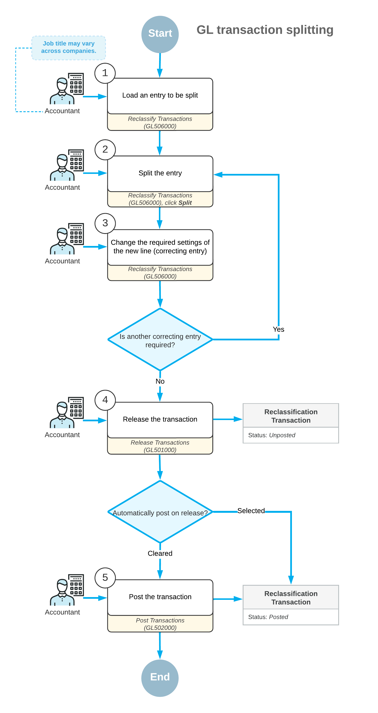

# Splitting Transactions: General Information {#_84a375dc-db01-4d01-a38c-1d72daa550fe .concept}

In Acumatica ERP, splitting a GL transaction involves the creation of a correcting transaction to move a part of the amount of the original transaction in any of the following regards:

-   From one GL account or multiple accounts to another GL account or multiple accounts
-   From one subaccount or multiple subaccounts to another subaccount or multiple subaccounts \(if subaccounts are used in your organization\)
-   From one company branch or multiple branches to another branch or multiple branches

## Learning Objectives {#section_zg3_mjv_vxb .section}

You will learn how to split a transaction that has been posted to the wrong subaccount into multiple correcting transactions.

## Applicable Scenarios {#section_bh3_mjv_vxb .section}

You split a transaction in the following cases:

-   The batch has been posted to the wrong account, and a part of the amount should be posted to at least one other account.
-   The batch has been posted to the wrong branch, and a part of the amount should be posted to at least one other branch.
-   The batch has been posted to the default subaccount \(if subaccounts are used in your system\), but amounts should be split among multiple subaccounts.

## Overview of the Process of Splitting Transactions {#section_dh3_mjv_vxb .section}

On the [Reclassify Transactions](GL_50_60_00.md) \(GL506000\) form, to split a transaction, you need to add new lines that represent the journal entries to which a part of the original journal entry amount will be split. A part of the amount can be transferred to another account, subaccount, or branch \(or more than one of these\).

As a result of the splitting process, the system generates a new transaction of the *Reclassification* type based on the original GL transaction. The *Reclassification* transaction moves the amount or a part of the amount from the wrong GL account, subaccount, or branch \(or more than one of these\) to the required one \(or ones\).

If the amount of the original transaction has not been fully split, after the reclassification batch is released, you can view the remaining amount of the original transaction in the **Remaining Reclass. Amount** column on the [Journal Transactions](GL_30_10_00.md) \(GL301000\) form. You can split or reclassify a transaction with the remaining reclassification amount again.

The following diagram shows the general process of splitting transactions.

## Modification of the Transaction {#section_ih3_mjv_vxb .section}

To split the necessary transaction, you open it on the [Reclassify Transactions](GL_50_60_00.md) \(GL506000\) form. For details, see [Reclassifying Transactions: Initiation of the Reclassification Process](Finance_Reclassifying_Transactions_Initiation.md).

On the [Reclassify Transactions](GL_50_60_00.md) form, you first click the journal entry to be split and then click **Split** on the form toolbar. The system adds a new entry under the original one. The original entry is marked with the  icon, and each new line added during the split process is marked with the  icon. The original entry and each new entry are highlighted in bold during the process of splitting the transaction.

Multiple new entries can be added to split the original entry. In each new line and in the original one, you can modify the values in any of the following columns:

-   **To Account**: The transaction amount will be moved from the originally specified general ledger account \(**Account**\) to the account you specify in this column.
-   **To Subaccount**: The transaction amount will be moved from the originally specified subaccount \(**Subaccount**\) to the subaccount you specify in this column.

    **Attention:** This column is available only if the *Subaccounts* feature is enabled on the [Enable/Disable Features](CS_10_00_00.md) \(CS100000\) form.

-   **To Branch**: The transaction amount will be moved from the originally specified branch to the GL account or subaccount of the branch you specify in this column.

    **Attention:** This column is available only if the *Multibranch Support* feature is enabled on the [Enable/Disable Features](CS_10_00_00.md) form.

By default, these columns contain the values of the original journal entry. For new lines of the splitting group, these columns contain the values of the original journal entry, even if you have changed any of these values of the original entry.

For each new entry, in the **New Amount** column, you specify the amount to be transferred from the original entry to a new one. For the original entry, in this column, the system calculates the remaining amount based on the new amounts of new entries. The total amount of new entries cannot be more than the amount of the original entry.

Negative values can be specified in the **New Amount** column for the new entries. The negative amounts are highlighted in red and increase the amount of the original entry.

To edit the date and description of the transaction, you need to enter new values in the **New Tran. Date** and **New Transaction Description** boxes, respectively. If you edit the date, the new date has to be within the financial period of the original transaction.

The transaction is ready for splitting if the check box is selected in the Included column for the original entry and all the related new entries. The system selects this check box for each new entry when you have changed a value in the **To Account**, **To Subaccount**, or **To Branch** column, and you have specified the amount to be moved to the new entry in the **New Amount** columns.

The system selects this check box for the original entry when you have changed a value in the **To Account**, **To Subaccount**, or **To Branch** column, or the amount has been adjusted according to the changes made for the amounts of the new lines.

In the same reclassification batch, the system includes journal entries that have the same transaction period specified. A separate reclassification batch is generated for each journal entry that has a different transaction period.

**Parent topic:**[Splitting Transactions](../UserGuide/Finance_Splitting_a_Transaction_Mapref.md)

