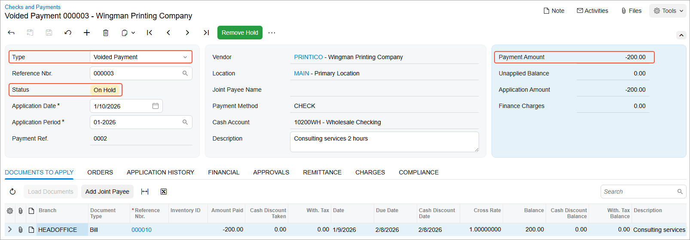

# Voiding Payments: Process Activity {#_238e778f-8c0b-45e4-891e-48067c018943 .task}

The following activity will walk you through the process of voiding a payment.

**Attention:** This activity is based on the *U100* dataset. If you are using another dataset or if any system settings have been changed in *U100*, these changes can affect the workflow of the activity and the results of the processing. To avoid issues, restore the *U100* dataset to its initial state.

## Story {#section_f1k_njv_vxb .section}

Suppose that an AP clerk of the SweetLife Fruits &amp; Jams company made a mistake when entering a payment in the amount of $200 to Wingman Printing Company \(*PRINTICO*\).

Acting as a SweetLife accountant, you have to void the payment to the *PRINTICO* vendor for consulting services.

## Configuration Overview {#section_i1k_njv_vxb .section}

For the purposes of this activity, the following features have been enabled on the [Enable/Disable Features](CS_10_00_00.md) \(CS100000\) form:

-   *Standard Financials*, which provides the standard financial functionality
-   *Multibranch Support*, which supports multiple branches in your instance of Acumatica ERP
-   *Multicompany Support*, which supports multiple companies within one tenant.

On the [Accounts Payable Preferences](AP_10_10_00.md) \(AP101000\) form, the **Hold Documents on Entry** check box has been selected in the **Data Entry Settings** section.

On the [Vendors](AP_30_30_00.md) \(AP303000\) form, the *PRINTICO \(Wingman Printing Company\)* vendor has been defined. This vendor has the *CHECK* payment method specified as the default one.

## Process Overview {#section_m1k_njv_vxb .section}

To void a payment, you will use the [Checks and Payments](AP_30_20_00.md) \(AP302000\) form to find the payment, and then void it.

## System Preparation {#section_o1k_njv_vxb .section}

To prepare the system, do the following:

1.  Launch the Acumatica ERP website, and sign in as an accountant by using the following credentials:
    -   Username: *johnson*
    -   Password: *123*
2.  In the info area, in the upper-right corner of the top pane of the Acumatica ERP screen, make sure that the business date in your system is set to *1/30/2026*. If a different date is displayed, click the Business Date menu button and select *1/30/2026*. For simplicity, in this activity, you will create and process all documents in the system on this business date.
3.  On the Company and Branch Selection menu, also on the top pane of the Acumatica ERP screen, make sure that the *SweetLife Head Office and Wholesale Center* branch is selected. If it is not selected, click the Company and Branch Selection menu to view the list of branches that you have access to, and then click *SweetLife Head Office and Wholesale Center*.

## Step: Voiding a Payment {#section_q1k_njv_vxb .section}

To find and void a payment, do the following:

1.  Open the Checks and Payments \(AP3020PL\) list of records.
2.  If you applied any filters before on this form, click the **Filter Settings** button in the filtering area.
3.  Remove the applied filters by clearing the quick filter boxes.
4.  Find the payment dated *1/10/2026* in the amount of $200 as follows:
    1.  Click the **Payment Date** column header, and in the dialog box that opens, specify the following settings:

        -   **Equals**: Selected
        -   **Value**: *01/10/2026*
        Click **Apply** to close the dialog box.

5.  Click the link in the **Reference Nbr.** column to open the payment on the [Checks and Payments](AP_30_20_00.md) \(AP302000\) form.
6.  On the form toolbar, click **Void**.

    Also on the [Checks and Payments](AP_30_20_00.md) form, the system has created a new document of the *Voided Payment* type that has the *On Hold* status and the *-200* value in the **Payment Amount** box. The voided payment is shown in the following screenshot.

    

7.  On the form toolbar, click **Remove Hold**, and then click **Release** to release the voided payment.
8.  Again open the payment dated 1/10/2026 in the amount of $200.

    Notice that the status is now *Voided*. When a document of the *Voided Payment* type is released, the original payment is assigned the *Voided* status.

**Parent topic:**[Voiding Payments](../UserGuide/Finance_VoidingChecks_Mapref.md)

