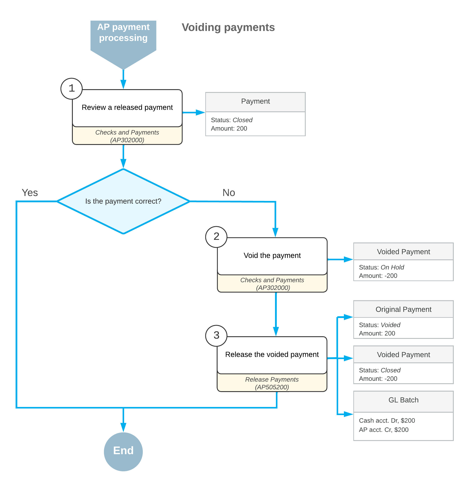

# Voiding Payments: General Information {#_c656d264-c9b3-413c-9452-34ef84f78003 .concept}

You can void an AP payment that was previously released in the accounts payable subledger.

## Learning Objectives {#section_dwj_njv_vxb .section}

In this chapter, you will learn how to void a released payment.

## Applicable Scenarios {#section_gwj_njv_vxb .section}

You void payments when a payment with an error has been already released.

## Process Description {#section_iwj_njv_vxb .section}

You can void a payment on the [Checks and Payments](../Shared/../UserGuide/AP_30_20_00.md) \(AP302000\) form by clicking **Void** on the form toolbar. The system creates a new document of the *Voided Payment* type, which has a negative amount in the **Payment Amount** box to reverse the original transactions on all accounts involved. When this document is posted, all original entries to the general ledger are also reversed.

## Workflow of Payment Voiding {#section_kwj_njv_vxb .section}

The following diagram illustrates the workflow of payment voiding, which is a part of the AP payment processing workflow.

**Parent topic:**[Voiding Payments](../UserGuide/Finance_VoidingChecks_Mapref.md)

