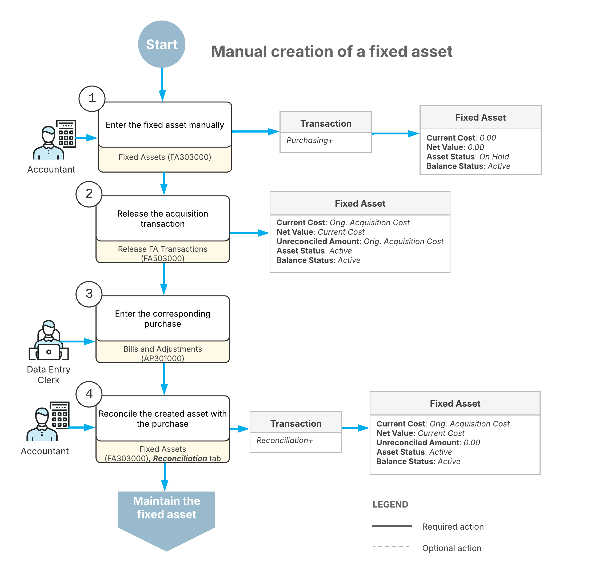

# Fixed Asset Creation: General Information {#_52df52e3-8263-4b36-966c-4f3bd9e9f767 .concept}

You can create a fixed asset by converting an existing purchase into a fixed asset, as described in [Converting Purchases to Fixed Assets](FixedAssets_Converting_Purchase_Mapref.md), or by manually creating the fixed asset record, as described in this chapter.

To enter an individual fixed asset, you use the [Fixed Assets](FA_30_30_00.md) \(FA303000\) form. On the **Reconciliation** tab of this form, you can also reconcile a created asset with any number of purchasing transactions. You can use this form to create fixed assets before the corresponding AP bill is received, and you can migrate the fixed asset data from a legacy system.

## Learning Objectives { .section}

In this chapter, you will learn how to do the following:

-   Reconcile the created fixed asset
-   Create a fixed asset that is under construction
-   Create a fixed asset with multiple units

## Applicable Scenarios { .section}

You create a fixed asset manually if you have more than one transaction for a fixed asset or the needed transactions have not been entered in the system yet \(for example, if the AP bill has not yet been received\). When you create the fixed asset manually, the system generates a *Purchasing+* transaction. Later, after the needed transactions are processed in the system, you have to reconcile the cost of the created asset with the appropriate GL entries.

You create a fixed asset that is under construction if the asset does not require depreciation until the construction is complete and does not need to have a **Placed-in-Service Date** specified on the [Fixed Assets](FA_30_30_00.md) \(FA303000\) form.

## Entry of a Fixed Asset { .section}

To enter assets one at a time, you use the [Fixed Assets](FA_30_30_00.md) \(FA303000\) form, the primary data entry form for the fixed asset functional area, and enter all pertinent information. For a new asset, you specify at least the following settings:

-   The asset class. Once you select a class, the system fills in the fixed asset settings that have been specified for the class such as the property type, asset type, useful life, depreciation book or books, and GL accounts that can be used for an asset to be created. You can change most of the default settings.
-   The acquisition information, such as the receipt date, the original acquisition cost, and the quantity of units in the asset.
-   The start date of the depreciation \(for a depreciable asset\) or the placed-in-service date \(for a non-depreciable asset\).
-   The department to which the asset belongs.

**Attention:** You can change the acquisition cost of the asset only before you release the purchasing transaction, so that the data on the **Balance** tab of the [Fixed Assets](FA_30_30_00.md) form will be updated correctly. When the purchasing transaction is released, the data is posted to the books and cannot be modified even though the **Orig. Acquisition Cost** box on the **General** tab of the form is available for editing.

When you enter a fixed asset, the system creates a *Purchasing +* transaction. The cost of the asset is recorded as an unreconciled amount, which you can view on the **Reconciliation** tab of the [Fixed Assets](FA_30_30_00.md) form. You can later reconcile the acquisition cost of the asset with the financial documents documenting the asset’s acquisition. For details, see [Fixed Asset Troubleshooting: General Information](FixedAssets_Troubleshooting_GeneralInfo.md).

For more information about transaction types, see [Types of Fixed Asset Transactions](FA__con_Transaction_Types.md).

## Entry of a Non-Depreciable Fixed Asset { .section}

Non-depreciable assets are assets that cannot be depreciated—that is, assets that do not lose their value over their useful time. Land and most intangible assets are considered non-depreciable assets because they have an unlimited useful life.

When you create a non-depreciable fixed asset by using the [Fixed Assets](FA_30_30_00.md) \(FA303000\) form or a non-depreciable fixed asset class by using the [Fixed Asset Classes](FA_20_10_00.md) \(FA201000\) form, you need to clear the **Depreciable** check box so that users will not be required to fill in the **Useful Life, Years** box.

After saving an asset and releasing the *Purchasing +* transaction, you can perform any common operation with a non-depreciable asset, such as disposing of it, splitting it, transferring it, and creating additions and deductions. However, depreciation will not be calculated for such an asset.

## Entry of a Fixed Asset Under Construction {#_1c51afc8-ee74-43f1-ae7a-f4d8b6389f60 .section}

Fixed assets under construction are those that do not require depreciation until the construction is complete and that do not need to have a **Placed-in-Service Date** specified on the **General** tab \(**Asset Summary** section\) of the [Fixed Assets](FA_30_30_00.md) \(FA303000\) form. The cost of assets under construction is recorded in a dedicated asset account. While an asset is under construction, you can process cost additions and deductions, as well as perform other fixed asset operations, except for depreciation.

To create an asset under construction, you perform the following general steps:

1.  You make sure that at least one fixed asset class has been created with the **Under Construction** check box selected on the [Fixed Asset Classes](FA_20_10_00.md) \(FA201000\) form. For more details, see [Fixed Assets: To Create Fixed Asset Classes](../ImplementationGuide/config_FixedAssets_Implem_Activity_FixedAsset_Classes.md).
2.  On the [Fixed Assets](FA_30_30_00.md) form, you create a fixed asset assigned to a fixed asset class for assets that are under construction. For more details, see [Fixed Asset Creation: To Create an Asset Under Construction](FixedAssets_Adding_Fixed_Asset_To_Create_Under_Constr_Asset.md).

    Optionally, you can specify the **Placed-in-Service Date** for this asset. The **Placed-in-Service Date** box is available for editing and can be left empty for a fixed asset associated with an under-construction asset class. If the **Placed-in-Service Date** box is empty, the asset can be transferred only to another under-construction asset class.

    If an addition has been made to a fixed asset under construction, the **Placed-in-Service Date** must have a period that is the same as or later than that of the latest addition to the asset. You cannot transfer the asset in a period that is earlier than the period of the latest addition. For details about additions to assets, see [Additions to Assets: General Information](FixedAssets_Making_Additions_GeneralInfo.md). For details about asset transfers, see [Asset Transfers: General Information](FixedAssets_Transfers_GeneralInfo.md).

When the construction of the fixed asset has been completed, you do the following:

1.  Specify the **Placed-in-Service Date** for the fixed asset on the [Fixed Assets](FA_30_30_00.md) form, if it has not been specified.
2.  On the [Transfer Assets](FA_50_70_00.md) \(FA507000\) form, transfer the asset to a fixed asset class that is not used for under-construction assets, as described in [Asset Transfers: Process Activity](FixedAssets_Transfers_Process_Activity.md). This process will post the following entry, transferring the asset cost to the Fixed Assets account.

    |GL Account|Debit|Credit|
    |----------|-----|------|
    |Fixed Assets|Asset cost|00.00|
    |Fixed Assets Under Construction|00.00|Asset cost|

    For details about asset transfers, see [Asset Transfers: General Information](FixedAssets_Transfers_GeneralInfo.md).

3.  Start depreciating the fixed asset on the [Calculate Depreciation](FA_50_20_00.md) \(FA502000\) form by selecting *Depreciate* in the **Action** box of the Summary area, selecting the needed asset, and clicking **Process** on the form toolbar. For more details, see [Asset Depreciation: To Depreciate Assets](FixedAssets_Depreciation_To_Perform_Depreciation.md).

## Entry of a Fixed Asset with Multiple Units {#section_gxt_cwm_nj .section}

A fixed asset may contain more than one unit. You can specify the quantity of units when you create the record for the asset.

Later, you can split the asset \(if, for example, you want to dispose of part of the asset\). For more information, see [Splitting of Assets: General Information](FixedAssets_Splitting_GeneralInfo.md).

## Workflow of Fixed Asset Creation { .section}

The following diagram shows the manual creation of a fixed asset.

As the diagram shows, manually creating a fixed asset involves these steps:

1.  If a corresponding AP bill or journal transaction has not been entered in the system yet, you create the fixed asset manually on the [Fixed Assets](FA_30_30_00.md) \(FA303000\) form. When you create the fixed asset manually, the system generates a *Purchasing+* transaction that records the asset acquisition.
2.  On the [Release FA Transactions](FA_50_30_00.md) \(FA503000\) form, you release the acquisition transaction.
3.  You record the purchased fixed asset by creating one of the following:
    -   An AP bill on the [Bills and Adjustments](AP_30_10_00.md) \(AP301000\) form for the purchased asset
    -   A GL transaction on the [Journal Transactions](GL_30_10_00.md) \(GL301000\) form to directly enter a purchase transaction
4.  On the **Reconciliation** tab of the [Fixed Assets](FA_30_30_00.md) form, you reconcile the cost of the created asset with the appropriate GL entries. During reconciliation, the system generates a *Reconciliation+* transaction. When you create fixed assets manually, you can change any of their settings before you release the acquisition transaction.

## Maintenance of Fixed Assets with Multiple Base Currencies Enabled in the System { .section}

The fixed asset functionality does not support documents in a foreign currency; documents are processed only in the base currency. If the *Multiple Base Currencies* feature is enabled on the [Enable/Disable Features](CS_10_00_00.md) \(CS100000\) form, on all fixed asset-related forms that produce GL transactions, the system verifies that the branches specified in a transaction have the same base currency. You can review the currency of amounts and total amounts in all fixed asset transactions on multiple data entry forms and reports.

On the [Fixed Assets](FA_30_30_00.md) \(FA303000\) form, if you change the branch of the asset in the **Branch** box on the **General** tab and no *Purchasing+* transaction has been released for the asset, the system will insert the base currency of the selected branch in the **Currency** box.

You cannot change the asset's branch to a branch in a different currency if any of the following conditions is met:

-   If the asset has produced at least one GL transaction with the *Purchasing+* transaction type
-   If a user created the asset by clicking **Split** on the More menu of the [Fixed Assets](FA_30_30_00.md) form, even if no GL transaction was generated
-   If the asset was created on the [Convert Purchases to Assets](FA_50_45_00.md) \(FA504500\) form, even if no GL transaction has been generated yet
-   If a reconciliation transaction has been created for the asset
-   If the asset was migrated

## Deletion of an Asset { .section}

You can delete a fixed asset from the system if it does not have any transactions associated with it. If transactions were made but were not released, you can first delete the transactions and then delete the fixed asset.

When you delete an asset, the asset record is completely removed from the system and the system can later reuse the asset ID.

**Parent topic:**[Creating Fixed Assets](../UserGuide/FixedAssets_Adding_Fixed_Asset_Mapref.md)

