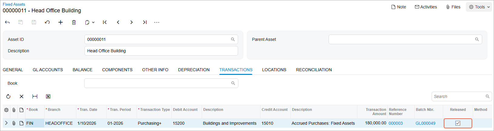
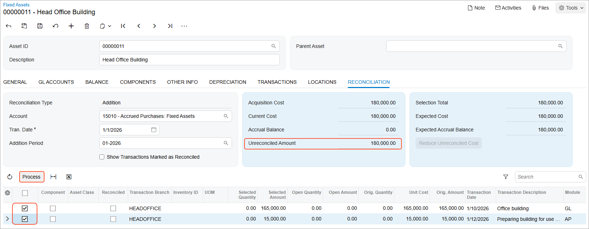
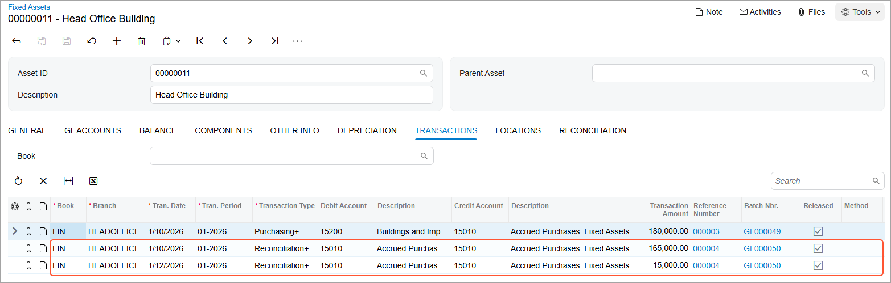

# Fixed Asset Creation: To Create and Reconcile an Asset {#_3388c822-381b-4c49-b562-97873ebd4a04 .task}

The following activity will walk you through the process of manually creating and reconciling a fixed asset.

## Story { .section}

Suppose that on January 10, 2026, SweetLife Fruits &amp; Jams invested in an office building for its Head Office, which it purchased for $165,000. However, at the time of purchase, the building was not ready for use. To prepare the building, SweetLife paid $15,000 to the Frontsource Ltd. company. After the work was completed, the building was ready to be placed in use on February 15, 2026.

Acting as a SweetLife accountant, you need to manually create a fixed asset for the office building and reconcile the acquisition cost of the asset with the appropriate financial transactions for the asset acquisition \(the $165,000 GL entry and the $15,000 AP bill\).

## Configuration Overview {#section_tz4_djx_cnb .section}

In the *U100* dataset, the following tasks have been performed to support this activity:

-   On the [Enable/Disable Features](CS_10_00_00.md) \(CS100000\) form, the *Fixed Asset Management* feature has been enabled.
-   On the [Chart of Accounts](GL_20_25_00.md) \(GL202500\) form, the needed GL accounts have been created.
-   On the [Vendors](AP_30_30_00.md) \(AP303000\) form, the *FRONTSRC* vendor has been created.
-   On the [Fixed Assets Preferences](FA_10_10_00.md) \(FA101000\) form, the **Automatically Release Acquisition Transactions** check box has been cleared. With this check box cleared, acquisition transactions are created with the *On Hold* status. You will have to release these transactions manually on the [Release FA Transactions](FA_50_30_00.md) \(FA503000\) form.

## Process Overview { .section}

In this activity, you will first update the fixed asset preferences on the [Fixed Assets Preferences](FA_10_10_00.md) \(FA101000\) form. On the [Bills and Adjustments](AP_30_10_00.md) \(AP301000\) form, you will create an AP bill for the vendor that prepared the acquired building. On the [Fixed Assets](FA_30_30_00.md) \(FA303000\) form, you will create the *BUILDING* asset and reconcile it with two GL transactions on the **Reconciliation** tab.

## System Preparation { .section}

Before you begin creating a fixed asset, do the following:

1.  Launch the Acumatica ERP website with the *U100* dataset preloaded, and sign in as an accountant by using the *johnson* username and the *123* password.
2.  In the info area, in the upper-right corner of the top pane of the Acumatica ERP screen, click the Business Date menu button, and select *1/12/2026* on the calendar.
3.  In the company to which you are signed in, be sure that you have implemented the fixed asset functionality by performing the following prerequisite activities: [Fixed Assets: To Set Up the System for Fixed Asset Management](../ImplementationGuide/config_FixedAssets_Implem_Activity_System.md), [Fixed Assets: To Configure the Fixed Asset Functionality](../ImplementationGuide/config_FixedAssets_Implem_Activity_FixedAssets_Subledger.md), and [Fixed Assets: To Create Fixed Asset Classes](../ImplementationGuide/config_FixedAssets_Implem_Activity_FixedAsset_Classes.md).
4.  Be sure that you have performed the [Conversion of a Purchase: To Convert a Purchase to an Asset](FixedAssets_Converting_Purchase_To_Convert_to_Asset.md) prerequisite activity to create a purchasing transaction for the building.
5.  On the Company and Branch Selection menu on the top pane of the Acumatica ERP screen, select the *SweetLife Head Office and Wholesale Center* branch.

## Step 1: Updating the Fixed Asset Preferences { .section}

To update the fixed asset preferences, do the following:

1.  Open the [Fixed Assets Preferences](FA_10_10_00.md) \(FA101000\) form.
2.  In the **Posting Settings** section, select the **Automatically Release Acquisition Transactions** check box to make the system automatically release the acquisition transactions that you will create later.
3.  On the form toolbar, click **Save** to save your changes.

## Step 2: Creating an AP Bill { .section}

To create an AP bill for the building preparation, do the following:

1.  On the [Bills and Adjustments](AP_30_10_00.md) \(AP301000\) form, add a new record.
2.  In the Summary area, specify the following settings for the AP bill:
    -   **Type**: *Bill*
    -   **Vendor**: *FRONTSRC*
    -   **Date**: *1/12/2026* \(inserted automatically\)
    -   **Post Period**: *01-2026* \(inserted automatically\)
    -   **Description**: `Preparing building for use (materials and work)`
3.  On the **Details** tab, click **Add Row** on the table toolbar, and specify the following settings in the added row:
    -   **Branch**: *HEADOFFICE* \(inserted automatically\)
    -   **Transaction Descr.**: `Preparing building for use (materials and work)`
    -   **Ext. Cost**: `15000`
    -   **Account**: *15010 \(Accrued Purchases: Fixed Assets\)*
4.  On the form toolbar, click **Save**.
5.  On the form toolbar, click **Remove Hold**, and click **Release** to release the AP bill.

## Step 3: Creating a Fixed Asset { .section}

To create the *BUILDING* fixed asset, do the following:

1.  On the [Fixed Assets](FA_30_30_00.md) \(FA303000\) form, add a new record.
2.  In the Summary area, specify `Head Office Building` in the **Description** box.
3.  On the **General** tab, specify the following settings:

    -   **Asset Class**: *BUILDING*
    -   **Asset Type**: *BUILDING* \(inserted automatically based on the fixed asset class settings\)
    -   **Useful Life, Years**: *39.0000* \(inserted automatically based on the fixed asset class settings\)
    -   **Receipt Date**: *1/10/2026*
    -   **Placed-in-Service Date**: *2/15/2026*
    -   **Orig. Acquisition Cost**: `180000`
    -   **Branch**: *HEADOFFICE* \(the current branch is inserted by default\)
    -   **Department**: *ADMIN*
    You can change any asset setting except for the state of the **Tangible** check box until the acquisition transaction is released.

4.  On the form toolbar, click **Save** to save the asset.

    The system has generated the acquisition transaction and saved it with the *Balanced* status. \(You can review the transaction on the **Transactions** tab.\)

5.  Review the **Balance** tab. Notice that the system has inserted the depreciation method \(*Straight-Line*\) and averaging convention \(*Mid Period*\), which it has copied from the settings of the fixed asset class.

    **Depr. From Period** is the period when the asset has been placed in service and starting from which the asset will be depreciated. By default, this period is calculated by using the **Placed-in-Service Date** according to the book calendar. You can change the **Depr. From** date and the **Placed-in-Service Date** before the first depreciation transaction is generated for the asset. The **Depr. to Period** is the last period for which depreciation is calculated for the asset.

6.  On the form toolbar, click **Remove Hold** to remove the fixed asset from hold, and save it.
7.  Review the **Transactions** tab, shown in the following screenshot. Because you have configured the system to automatically release acquisition transactions, the system automatically released the acquisition transaction when you released the asset from hold and saved your changes.

    

    The GL accounts to be used in transactions were copied from the fixed asset class when the asset was created. You can review the GL accounts specified for the asset on the **GL Accounts** tab of the [Fixed Assets](FA_30_30_00.md) form. The Fixed Asset account can be changed for a fixed asset with the *Active* status before a *Purchasing+* transaction is released; the Accumulated Depreciation account can be changed for an asset before the first *Depreciation+* transaction is released. Also, income and expense accounts can be changed for an asset at any time.

## Step 4: Reconciling the Created Fixed Asset { .section}

To reconcile the created fixed asset, do the following:

1.  While you are still viewing the fixed asset on the [Fixed Assets](FA_30_30_00.md) \(FA303000\) form, go to the **Reconciliation** tab.
2.  In the **Account** box, make sure that *15010 \(Accrued Purchases: Fixed Assets\)* is selected.
3.  In the table, select the unlabeled check boxes in the rows with **Orig. Amount** values of *165,000.00* and *15,000.00*, as shown in the following screenshot.
4.  On the table toolbar, click **Process** to generate the reconciliation transactions.

    

5.  On the form toolbar, click **Save** to save the created reconciliation transactions, and review them on the **Transactions** tab \(see the screenshot below\).

    The generated *Reconciliation+* transactions were automatically released because the **Automatically Release Acquisition Transactions** check box \(which is selected\) also applies to the reconciliation transactions that correspond to asset acquisition. The **Batch. Nbr.** box displays the number of the corresponding GL batch.

    

6.  On the **Reconciliation** tab, review the **Unreconciled Amount**. It is now *0.00*—that is, the full amount of the asset has been reconciled.

    **Tip:** If the amount of the received bill is less than the acquisition cost of the fixed asset, you could click the **Reduce Unreconciled Cost** button on this tab to decrease the asset's cost on the unreconciled amount. If you clicked the button, the system would generate the *Purchasing–* transaction, which sets the cost of the fixed asset to the reconciled amount.

**Parent topic:**[Creating Fixed Assets](../UserGuide/FixedAssets_Adding_Fixed_Asset_Mapref.md)

